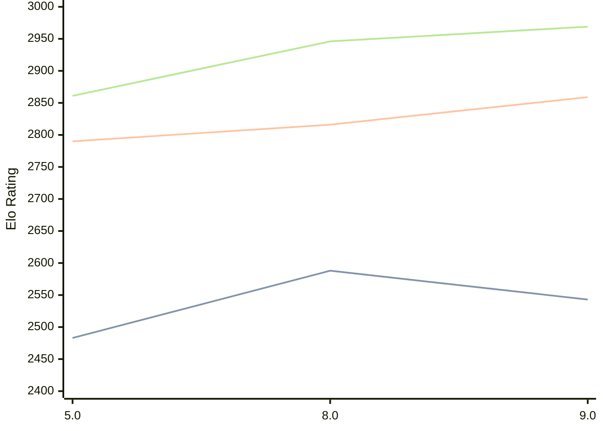

# Engine: 4kc

Author: Gediminas Masaitis

Home: https://github.com/GediminasMasaitis/4k-dot-c

## Elo Ratings

| Version | Published | STC 8.0+0.08s  | LTC 60.0+0.60s | VLTC 2m24s+1.12s | Comment |
| --- | --- | --- | --- | --- | --- |
| 9.0 | 2026-06-06 | 2543(-45) | 2859(+43) | 2969(+23) |  |
| 8.0 | 2026-03-10 | 2588(+105) | 2816(+26) | 2946(+85) |  |
| 5.0 | 2025-10-30 | 2483 | 2790 | 2861 |  |
 | | | cElo (∆ prev) | cElo (∆ prev) | cElo (∆ prev) | 

<a href="https://github.com/computer-chess-index/cci/issues/new?template=submit-version.yml&title=[VERSION]+4kc+<version>&body=###%20Engine%20name%0A4kc%0A%0A###%20Version%0A9.0" target="_blank">Submit new version</a>

 Test Conditions:

GUI/CLI: <a href=https://github.com/cutechess/cutechess target="_blank">Cute-Chess</a> 
Elo Calculation: <a href=https://www.remi-coulom.fr/Bayesian-Elo/ target="_blank">Bayesian-Elo</a> 
CPU: Intel(R) Core(TM) i5-7500T 2.70GHz 
Opening book: 8_moves_v3 
\* STC: 8.0+0.08s, LTC: 60.0+0.60s, VLTC: 2m24s+1.12s

 Lists:
Ratings: <a href=https://github.com/computer-chess-index/cci/blob/main/lists/CCIRatings.csv target="_blank">Complete list</a>

Generated: 2026-09-11 04:35:09

## Ratings Verlauf

## Detailed Evaluation Results

| Version | Time Control | Elo  | Range +/- | Matches | Score | Average Opponent Elo | Draws |
| --- | --- | --- | --- | --- | --- | --- | --- |
| 9.0 | VLTC (2m24s+1.12s) | 2969 | 27 | 410 | 49% | 2975 | 40% |
| 9.0 | LTC (60.0+0.60s) | 2859 | 26 | 432 | 51% | 2853 | 43% |
| 9.0 | STC (8.0+0.08s) | 2543 | 25 | 538 | 51% | 2534 | 34% |
| --- | --- | --- | --- | --- | --- | --- | --- |
| 8.0 | VLTC (2m24s+1.12s) | 2946 | 28 | 402 | 52% | 2924 | 39% |
| 8.0 | LTC (60.0+0.60s) | 2816 | 29 | 374 | 51% | 2808 | 40% |
| 8.0 | STC (8.0+0.08s) | 2588 | 27 | 456 | 50% | 2581 | 33% |
| --- | --- | --- | --- | --- | --- | --- | --- |
| 5.0 | VLTC (2m24s+1.12s) | 2861 | 32 | 296 | 49% | 2873 | 39% |
| 5.0 | LTC (60.0+0.60s) | 2790 | 31 | 324 | 48% | 2805 | 37% |
| 5.0 | STC (8.0+0.08s) | 2483 | 30 | 396 | 51% | 2477 | 25% |
| --- | --- | --- | --- | --- | --- | --- | --- |