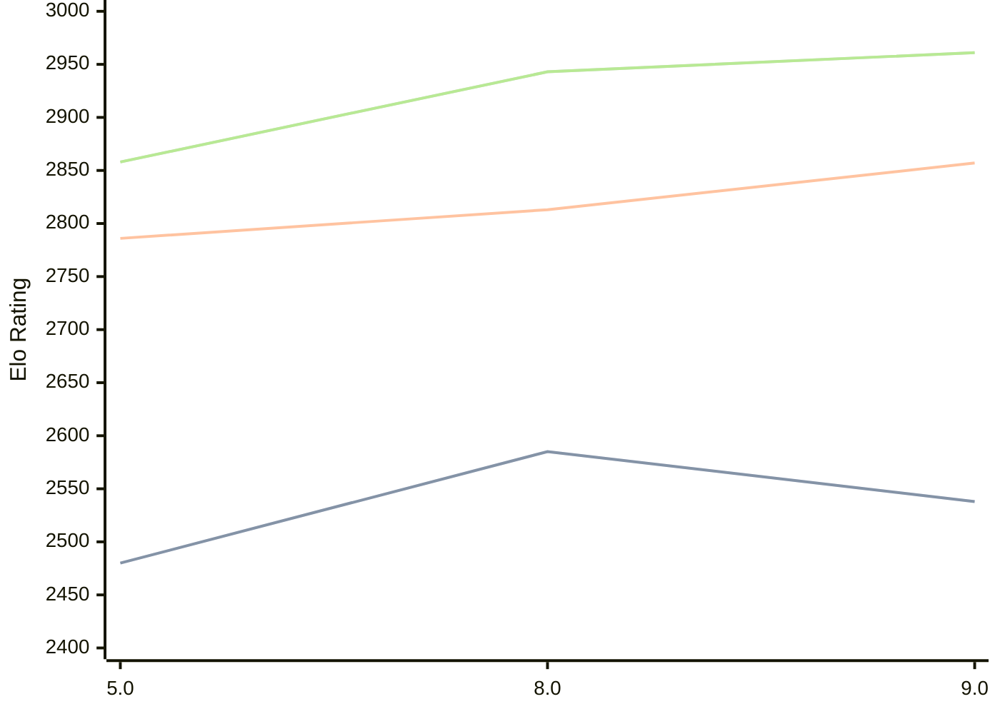

# Engine: 4kc

Author: Gediminas Masaitis

Home: https://github.com/GediminasMasaitis/4k-dot-c

## Elo Ratings

| Version | Published | STC 8.0+0.08s  | LTC 60.0+0.60s | VLTC 2m24s+1.12s | Comment |
| --- | --- | --- | --- | --- | --- |
| 9.0 | 2026-06-06 | 2538(-47) | 2857(+44) | 2961(+18) |  |
| 8.0 | 2026-03-10 | 2585(+105) | 2813(+27) | 2943(+85) |  |
| 5.0 | 2025-10-30 | 2480 | 2786 | 2858 |  |
 | | | cElo (∆ prev) | cElo (∆ prev) | cElo (∆ prev) | 

<a href="https://github.com/computer-chess-index/cci/issues/new?template=submit-version.yml&title=[VERSION]+4kc+<version>&body=###%20Engine%20name%0A4kc%0A%0A###%20Version%0A9.0" target="_blank">Submit new version</a>

 Test Conditions:

GUI/CLI: <a href=https://github.com/cutechess/cutechess target="_blank">Cute-Chess</a> 
Elo Calculation: <a href=https://www.remi-coulom.fr/Bayesian-Elo/ target="_blank">Bayesian-Elo</a> 
CPU: Intel(R) Core(TM) i5-7500T 2.70GHz 
Opening book: 8_moves_v3 
\* STC: 8.0+0.08s, LTC: 60.0+0.60s, VLTC: 2m24s+1.12s

 Lists:
Ratings: <a href=https://github.com/computer-chess-index/cci/blob/main/lists/CCIRatings.csv target="_blank">Complete list</a>

Generated: 2026-08-28 06:22:03

## Ratings Verlauf

## Detailed Evaluation Results

| Version | Time Control | Elo  | Range +/- | Matches | Score | Average Opponent Elo | Draws |
| --- | --- | --- | --- | --- | --- | --- | --- |
| 9.0 | VLTC (2m24s+1.12s) | 2961 | 28 | 386 | 49% | 2971 | 40% |
| 9.0 | LTC (60.0+0.60s) | 2857 | 27 | 412 | 51% | 2850 | 42% |
| 9.0 | STC (8.0+0.08s) | 2538 | 25 | 506 | 51% | 2529 | 34% |
| --- | --- | --- | --- | --- | --- | --- | --- |
| 8.0 | VLTC (2m24s+1.12s) | 2943 | 28 | 402 | 52% | 2921 | 39% |
| 8.0 | LTC (60.0+0.60s) | 2813 | 29 | 374 | 51% | 2804 | 40% |
| 8.0 | STC (8.0+0.08s) | 2585 | 27 | 456 | 50% | 2579 | 33% |
| --- | --- | --- | --- | --- | --- | --- | --- |
| 5.0 | VLTC (2m24s+1.12s) | 2858 | 32 | 296 | 49% | 2870 | 39% |
| 5.0 | LTC (60.0+0.60s) | 2786 | 31 | 324 | 48% | 2801 | 37% |
| 5.0 | STC (8.0+0.08s) | 2480 | 30 | 396 | 51% | 2475 | 25% |
| --- | --- | --- | --- | --- | --- | --- | --- |