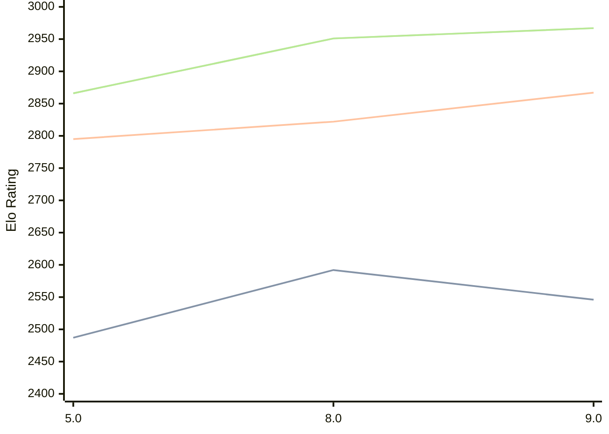

# Engine: 4kc

Author: Gediminas Masaitis

Home: https://github.com/GediminasMasaitis/4k-dot-c

## Elo Ratings

| Version | Published | STC 8.0+0.08s  | LTC 60.0+0.60s | VLTC 2m24s+1.12s | Comment |
| --- | --- | --- | --- | --- | --- |
| 9.0 | 2026-06-06 | 2546(-46) | 2867(+45) | 2967(+16) |  |
| 8.0 | 2026-03-10 | 2592(+105) | 2822(+27) | 2951(+85) |  |
| 5.0 | 2025-10-30 | 2487 | 2795 | 2866 |  |
 | | | cElo (∆ prev) | cElo (∆ prev) | cElo (∆ prev) | 

<a href="https://github.com/computer-chess-index/cci/issues/new?template=submit-version.yml&title=[VERSION]+4kc+<version>&body=###%20Engine%20name%0A4kc%0A%0A###%20Version%0A9.0" target="_blank">Submit new version</a>

 Test Conditions:

GUI/CLI: <a href=https://github.com/cutechess/cutechess target="_blank">Cute-Chess</a> 
Elo Calculation: <a href=https://www.remi-coulom.fr/Bayesian-Elo/ target="_blank">Bayesian-Elo</a> 
CPU: Intel(R) Core(TM) i5-7500T 2.70GHz 
Opening book: 8_moves_v3 
\* STC: 8.0+0.08s, LTC: 60.0+0.60s, VLTC: 2m24s+1.12s

 Lists:
Ratings: <a href=https://github.com/computer-chess-index/cci/blob/main/lists/CCIRatings.csv target="_blank">Complete list</a>

Generated: 2026-09-26 04:35:12

## Ratings Verlauf

## Detailed Evaluation Results

| Version | Time Control | Elo  | Range +/- | Matches | Score | Average Opponent Elo | Draws |
| --- | --- | --- | --- | --- | --- | --- | --- |
| 9.0 | VLTC (2m24s+1.12s) | 2967 | 27 | 432 | 48% | 2982 | 40% |
| 9.0 | LTC (60.0+0.60s) | 2867 | 26 | 446 | 51% | 2857 | 42% |
| 9.0 | STC (8.0+0.08s) | 2546 | 24 | 554 | 51% | 2542 | 33% |
| --- | --- | --- | --- | --- | --- | --- | --- |
| 8.0 | VLTC (2m24s+1.12s) | 2951 | 28 | 402 | 52% | 2930 | 39% |
| 8.0 | LTC (60.0+0.60s) | 2822 | 29 | 374 | 51% | 2812 | 40% |
| 8.0 | STC (8.0+0.08s) | 2592 | 27 | 456 | 50% | 2585 | 33% |
| --- | --- | --- | --- | --- | --- | --- | --- |
| 5.0 | VLTC (2m24s+1.12s) | 2866 | 32 | 296 | 49% | 2878 | 39% |
| 5.0 | LTC (60.0+0.60s) | 2795 | 31 | 324 | 48% | 2809 | 37% |
| 5.0 | STC (8.0+0.08s) | 2487 | 30 | 396 | 51% | 2481 | 25% |
| --- | --- | --- | --- | --- | --- | --- | --- |