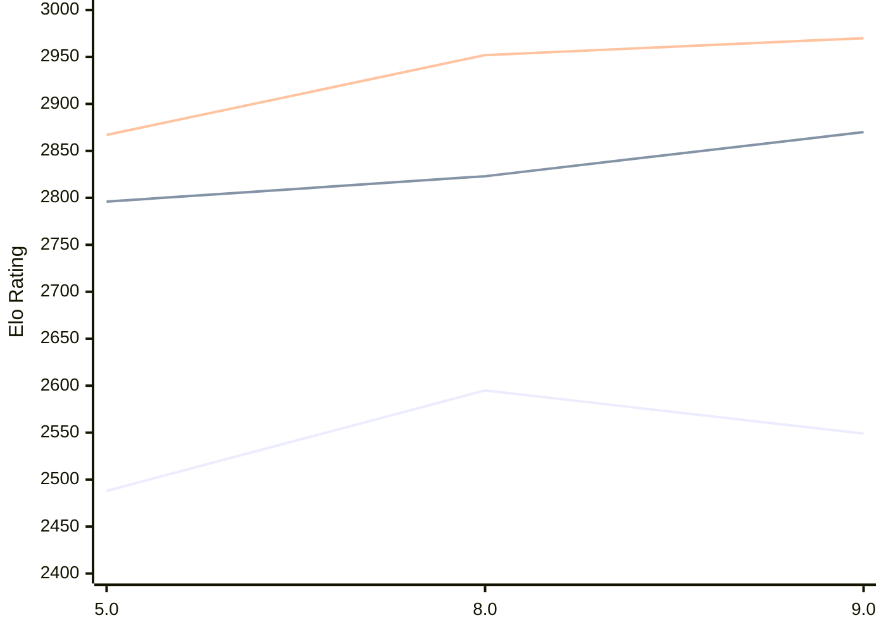

# Engine: 4kc

Author: Gediminas Masaitis

Home: https://github.com/GediminasMasaitis/4k-dot-c

## Elo Ratings E1 (Ultra 7 265T (1.50 GHz) - E-Core)

| Version | Published | STC 8.0+0.08s  | LTC 60.0+0.60s | VLTC 2m24s+1.12s | Comment |
| --- | --- | --- | --- | --- | --- |
| 9.0 | 2026-06-06 | 2522 | 2881 | 2969 |  |
 | | | cElo (∆ prev) | cElo (∆ prev) | cElo (∆ prev) | 

## Elo Ratings P1 (Ultra 7 265T (1.50 GHz) - P-Core)

| Version | Published | STC 8.0+0.08s  | LTC 60.0+0.60s | VLTC 2m24s+1.12s | Comment |
| --- | --- | --- | --- | --- | --- |
| 9.0 | 2026-06-06 | 2558 | 2954 | 3071 |  |
 | | | cElo (∆ prev) | cElo (∆ prev) | cElo (∆ prev) | 

## Elo Ratings T1 (i5-7500T 2.70GHz)

| Version | Published | STC 8.0+0.08s  | LTC 60.0+0.60s | VLTC 2m24s+1.12s | Comment |
| --- | --- | --- | --- | --- | --- |
| 9.0 | 2026-06-06 | 2549(-46) | 2870(+47) | 2970(+18) |  |
| 8.0 | 2026-03-10 | 2595(+107) | 2823(+27) | 2952(+85) |  |
| 5.0 | 2025-10-30 | 2488 | 2796 | 2867 |  |
 | | | cElo (∆ prev) | cElo (∆ prev) | cElo (∆ prev) | 

<a href="https://github.com/computer-chess-index/cci/issues/new?template=submit-version.yml&title=[VERSION]+4kc+<version>&body=###%20Engine%20name%0A4kc%0A%0A###%20Version%0A9.0" target="_blank">Submit new version</a>

 Test Conditions:

GUI/CLI: <a href=https://github.com/cutechess/cutechess target="_blank">Cute-Chess</a> 
Elo Calculation: <a href=https://www.remi-coulom.fr/Bayesian-Elo/ target="_blank">Bayesian-Elo</a> 
CPU for P1: Intel(R) Core(TM) Ultra 7 265T (1.50 GHz) - P-Core 
CPU for E1: Intel(R) Core(TM) Ultra 7 265T (1.50 GHz) - E-Core 
CPU for T1: Intel(R) Core(TM) i5-7500T 2.70GHz 
Opening book: 8_moves_v3 
\* STC: 8.0+0.08s, LTC: 60.0+0.60s, VLTC: 2m24s+1.12s

 Lists:
Ratings: <a href=https://github.com/computer-chess-index/cci/blob/main/lists/CCIRatings.csv target="_blank">Complete list</a>

Generated: 2026-10-21 04:35:11

## Ratings Verlauf T1

```mermaid
%%{init: {"theme":"base","themeVariables":{"seriesColors:['#a3a3a3','#222221','#faa371']}}}%%
xychart-beta
  x-axis ["5.0", "8.0", "9.0"]
  y-axis "Elo Rating" 2400 --> 3000
  line "T1: STC (8.0+0.08s)" [2488, 2595, 2549]
  line "T1: LTC (60.0+0.60s)" [2796, 2823, 2870]
  line "T1: VLTC (2m24s+1.12s)" [2867, 2952, 2970]
```

## Detailed Evaluation Results

| Version | Time Control | Variant | Elo  | Range +/- | Matches | Score | Average Opponent Elo | Draws |
| --- | --- |--- | --- | --- | --- | --- | --- | --- |
| 9.0 | VLTC (2m24s+1.12s) | T1 | 2970 | 27 | 436 | 49% | 2984 | 40% |
|  |  | P1 | 3071 | 35 | 256 | 49% | 3070 | 37% |
|  |  | E1 | 2969 | 31 | 330 | 50% | 2950 | 37% |
|  | LTC (60.0+0.60s) | P1 | 2954 | 38 | 244 | 51% | 2915 | 31% |
|  |  | E1 | 2881 | 33 | 324 | 54% | 2808 | 31% |
|  |  | T1 | 2870 | 26 | 450 | 51% | 2858 | 42% |
|  | STC (8.0+0.08s) | P1 | 2558 | 41 | 194 | 47% | 2584 | 32% |
|  |  | E1 | 2522 | 35 | 276 | 46% | 2565 | 29% |
|  |  | T1 | 2549 | 24 | 562 | 51% | 2545 | 33% |
| --- | --- |--- | --- | --- | --- | --- | --- | --- |
| 8.0 | VLTC (2m24s+1.12s) | T1 | 2952 | 28 | 402 | 52% | 2931 | 39% |
|  | LTC (60.0+0.60s) | T1 | 2823 | 29 | 374 | 51% | 2813 | 40% |
|  | STC (8.0+0.08s) | T1 | 2595 | 27 | 456 | 50% | 2588 | 33% |
| --- | --- |--- | --- | --- | --- | --- | --- | --- |
| 5.0 | VLTC (2m24s+1.12s) | T1 | 2867 | 32 | 296 | 49% | 2880 | 39% |
|  | LTC (60.0+0.60s) | T1 | 2796 | 31 | 324 | 48% | 2811 | 37% |
|  | STC (8.0+0.08s) | T1 | 2488 | 30 | 396 | 51% | 2483 | 25% |