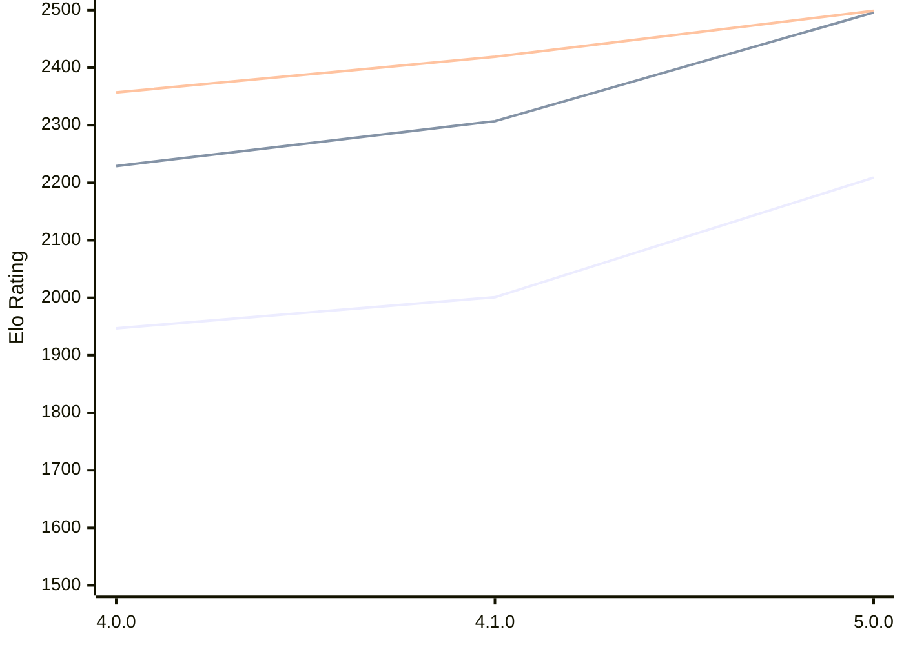

# Engine: Aconcagua

Author: Tarifa Gabriel

Home: https://github.com/gabtar/aconcagua

## Ratings nach Version

| Version | Published | STC 8.0+0.08s  | LTC 60.0+0.60s | VLTC 2m24s+1.12s | Comment |
| --- | --- | --- | --- | --- | --- |
| 5.0.0 | 2026-01-25 | 2209(+208) | 2496(+189) | 2499(+80) |  |
| 4.1.0 | 2025-12-14 | 2001(+54) | 2307(+78) | 2419(+62) |  |
| 4.0.0 | 2025-11-09 | 1947(new) | 2229(new) | 2357(new) |  |
| 3.4.0 | 2025-10-04 |  |  |  |  |
| 3.3.0 | 2025-09-14 |  |  |  |  |
| 3.2.0 | 2025-08-31 |  |  |  |  |
| 3.1.0 | 2025-08-16 |  |  |  |  |
| 3.0.0 | 2025-07-20 |  |  |  |  |
| 2.1.0 | 2025-06-28 |  |  |  |  |
| 2.0.0 | 2025-05-31 |  |  |  |  |
| 1.1.0 | 2025-05-17 |  |  |  |  |
 | | | cElo (∆ prev) | cElo (∆ prev) | cElo (∆ prev) | 

 Test Conditions:

GUI/CLI: <a href=https://github.com/cutechess/cutechess target="_blank">Cute-Chess</a> 
Elo Calculation: <a href=https://www.remi-coulom.fr/Bayesian-Elo/ target="_blank">Bayesian-Elo</a> 
CPU: Intel(R) Core(TM) i5-7500T 2.70GHz 
Opening book: 8_moves_v3 
\* STC: 8.0+0.08s, LTC: 60.0+0.60s, VLTC: 2m24s+1.12s

 Lists:
Ratings: <a href=https://github.com/computer-chess-index/cci/blob/main/lists/CCIRatings.csv target="_blank">Complete list</a>

Generated: 2026-02-10 22:40:39

## Ratings Verlauf

⬜ STC (8.0+0.08s) &nbsp;&nbsp; ⬛ LTC (60.0+0.60s) &nbsp;&nbsp; 🟧 VLTC (2m24s+1.12s)

