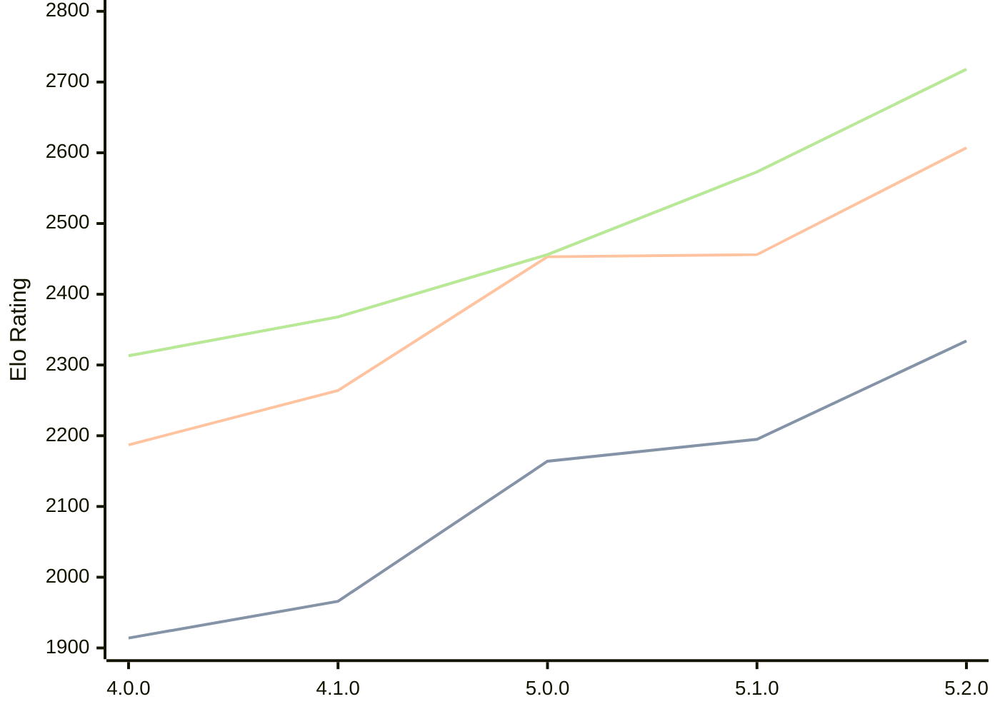

# Engine: Aconcagua

Author: Tarifa Gabriel

Home: https://github.com/gabtar/aconcagua

## Elo Ratings

| Version | Published | STC 8.0+0.08s  | LTC 60.0+0.60s | VLTC 2m24s+1.12s | Comment |
| --- | --- | --- | --- | --- | --- |
| 5.2.0 | 2026-05-31 | 2334(+139) | 2607(+151) | 2718(+145) |  |
| 5.1.0 | 2026-03-01 | 2195(+31) | 2456(+3) | 2573(+117) |  |
| 5.0.0 | 2026-01-25 | 2164(+198) | 2453(+189) | 2456(+88) |  |
| 4.1.0 | 2025-12-14 | 1966(+52) | 2264(+77) | 2368(+55) |  |
| 4.0.0 | 2025-11-09 | 1914 | 2187 | 2313 |  |
 | | | cElo (∆ prev) | cElo (∆ prev) | cElo (∆ prev) | 

<a href="https://github.com/computer-chess-index/cci/issues/new?template=submit-version.yml&title=[VERSION]+Aconcagua+<version>&body=###%20Engine%20name%0AAconcagua%0A%0A###%20Version%0A5.2.0" target="_blank">Submit new version</a>

 Test Conditions:

GUI/CLI: <a href=https://github.com/cutechess/cutechess target="_blank">Cute-Chess</a> 
Elo Calculation: <a href=https://www.remi-coulom.fr/Bayesian-Elo/ target="_blank">Bayesian-Elo</a> 
CPU: Intel(R) Core(TM) i5-7500T 2.70GHz 
Opening book: 8_moves_v3 
\* STC: 8.0+0.08s, LTC: 60.0+0.60s, VLTC: 2m24s+1.12s

 Lists:
Ratings: <a href=https://github.com/computer-chess-index/cci/blob/main/lists/CCIRatings.csv target="_blank">Complete list</a>

Generated: 2026-09-26 04:35:17

## Ratings Verlauf

## Detailed Evaluation Results

| Version | Time Control | Elo  | Range +/- | Matches | Score | Average Opponent Elo | Draws |
| --- | --- | --- | --- | --- | --- | --- | --- |
| 5.2.0 | VLTC (2m24s+1.12s) | 2718 | 29 | 362 | 53% | 2692 | 37% |
| 5.2.0 | LTC (60.0+0.60s) | 2607 | 26 | 482 | 53% | 2581 | 33% |
| 5.2.0 | STC (8.0+0.08s) | 2334 | 29 | 410 | 47% | 2363 | 27% |
| --- | --- | --- | --- | --- | --- | --- | --- |
| 5.1.0 | VLTC (2m24s+1.12s) | 2573 | 27 | 428 | 50% | 2579 | 38% |
| 5.1.0 | LTC (60.0+0.60s) | 2456 | 29 | 376 | 51% | 2444 | 34% |
| 5.1.0 | STC (8.0+0.08s) | 2195 | 27 | 468 | 49% | 2195 | 27% |
| --- | --- | --- | --- | --- | --- | --- | --- |
| 5.0.0 | VLTC (2m24s+1.12s) | 2456 | 42 | 196 | 51% | 2448 | 22% |
| 5.0.0 | LTC (60.0+0.60s) | 2453 | 37 | 246 | 49% | 2457 | 26% |
| 5.0.0 | STC (8.0+0.08s) | 2164 | 34 | 290 | 50% | 2167 | 25% |
| --- | --- | --- | --- | --- | --- | --- | --- |
| 4.1.0 | VLTC (2m24s+1.12s) | 2368 | 40 | 214 | 50% | 2373 | 27% |
| 4.1.0 | LTC (60.0+0.60s) | 2264 | 40 | 222 | 51% | 2248 | 23% |
| 4.1.0 | STC (8.0+0.08s) | 1966 | 33 | 312 | 47% | 1991 | 23% |
| --- | --- | --- | --- | --- | --- | --- | --- |
| 4.0.0 | VLTC (2m24s+1.12s) | 2313 | 46 | 172 | 41% | 2421 | 28% |
| 4.0.0 | LTC (60.0+0.60s) | 2187 | 55 | 116 | 47% | 2215 | 23% |
| 4.0.0 | STC (8.0+0.08s) | 1914 | 62 | 92 | 47% | 1940 | 21% |
| --- | --- | --- | --- | --- | --- | --- | --- |