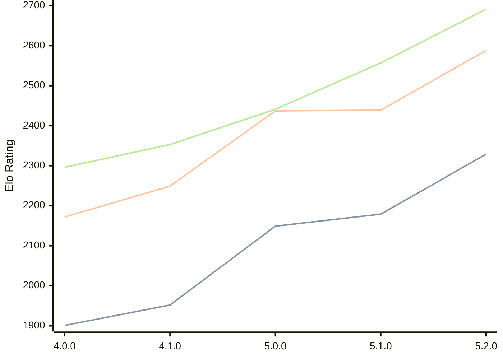

# Engine: Aconcagua

Author: Tarifa Gabriel

Home: https://github.com/gabtar/aconcagua

## Elo Ratings

| Version | Published | STC 8.0+0.08s  | LTC 60.0+0.60s | VLTC 2m24s+1.12s | Comment |
| --- | --- | --- | --- | --- | --- |
| 5.2.0 | 2026-05-31 | 2329(+150) | 2588(+149) | 2691(+134) |  |
| 5.1.0 | 2026-03-01 | 2179(+30) | 2439(+2) | 2557(+116) |  |
| 5.0.0 | 2026-01-25 | 2149(+197) | 2437(+188) | 2441(+88) |  |
| 4.1.0 | 2025-12-14 | 1952(+51) | 2249(+77) | 2353(+57) |  |
| 4.0.0 | 2025-11-09 | 1901 | 2172 | 2296 |  |
 | | | cElo (∆ prev) | cElo (∆ prev) | cElo (∆ prev) | 

<a href="https://github.com/computer-chess-index/cci/issues/new?template=submit-version.yml&title=[VERSION]+Aconcagua+<version>&body=###%20Engine%20name%0AAconcagua%0A%0A###%20Version%0A5.2.0" target="_blank">Submit new version</a>

 Test Conditions:

GUI/CLI: <a href=https://github.com/cutechess/cutechess target="_blank">Cute-Chess</a> 
Elo Calculation: <a href=https://www.remi-coulom.fr/Bayesian-Elo/ target="_blank">Bayesian-Elo</a> 
CPU: Intel(R) Core(TM) i5-7500T 2.70GHz 
Opening book: 8_moves_v3 
\* STC: 8.0+0.08s, LTC: 60.0+0.60s, VLTC: 2m24s+1.12s

 Lists:
Ratings: <a href=https://github.com/computer-chess-index/cci/blob/main/lists/CCIRatings.csv target="_blank">Complete list</a>

Generated: 2026-08-17 06:22:06

## Ratings Verlauf

⬛ STC (8.0+0.08s) &nbsp;&nbsp; 🟧 LTC (60.0+0.60s) &nbsp;&nbsp; 🟩 VLTC (2m24s+1.12s)

dark mode: 🟩STC (8.0+0.08s) 🟧LTC (60.0+0.60s) ⬜VLTC (2m24s+1.12s)

## Detailed Evaluation Results

| Version | Time Control | Elo  | Range +/- | Matches | Score | Average Opponent Elo | Draws |
| --- | --- | --- | --- | --- | --- | --- | --- |
| 5.2.0 | VLTC (2m24s+1.12s) | 2691 | 31 | 326 | 52% | 2674 | 39% |
| 5.2.0 | LTC (60.0+0.60s) | 2588 | 28 | 426 | 53% | 2558 | 32% |
| 5.2.0 | STC (8.0+0.08s) | 2329 | 31 | 360 | 48% | 2346 | 28% |
| --- | --- | --- | --- | --- | --- | --- | --- |
| 5.1.0 | VLTC (2m24s+1.12s) | 2557 | 27 | 428 | 50% | 2561 | 38% |
| 5.1.0 | LTC (60.0+0.60s) | 2439 | 29 | 376 | 51% | 2427 | 34% |
| 5.1.0 | STC (8.0+0.08s) | 2179 | 27 | 468 | 49% | 2180 | 27% |
| --- | --- | --- | --- | --- | --- | --- | --- |
| 5.0.0 | VLTC (2m24s+1.12s) | 2441 | 42 | 196 | 51% | 2433 | 22% |
| 5.0.0 | LTC (60.0+0.60s) | 2437 | 37 | 246 | 49% | 2442 | 26% |
| 5.0.0 | STC (8.0+0.08s) | 2149 | 34 | 290 | 50% | 2152 | 25% |
| --- | --- | --- | --- | --- | --- | --- | --- |
| 4.1.0 | VLTC (2m24s+1.12s) | 2353 | 40 | 214 | 50% | 2358 | 27% |
| 4.1.0 | LTC (60.0+0.60s) | 2249 | 40 | 222 | 51% | 2233 | 23% |
| 4.1.0 | STC (8.0+0.08s) | 1952 | 33 | 312 | 47% | 1978 | 23% |
| --- | --- | --- | --- | --- | --- | --- | --- |
| 4.0.0 | VLTC (2m24s+1.12s) | 2296 | 46 | 172 | 41% | 2404 | 28% |
| 4.0.0 | LTC (60.0+0.60s) | 2172 | 55 | 116 | 47% | 2201 | 23% |
| 4.0.0 | STC (8.0+0.08s) | 1901 | 62 | 92 | 47% | 1928 | 21% |
| --- | --- | --- | --- | --- | --- | --- | --- |