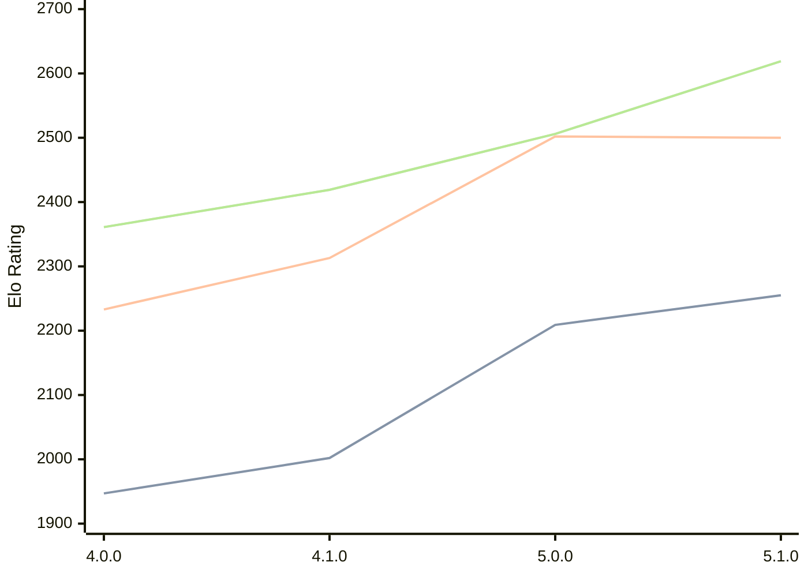

# Engine: Aconcagua

Author: Tarifa Gabriel

Home: https://github.com/gabtar/aconcagua

## Elo Ratings

| Version | Published | STC 8.0+0.08s  | LTC 60.0+0.60s | VLTC 2m24s+1.12s | Comment |
| --- | --- | --- | --- | --- | --- |
| 5.1.0 | 2026-03-01 | 2255(+46) | 2500(-2) | 2619(+113) |  |
| 5.0.0 | 2026-01-25 | 2209(+207) | 2502(+189) | 2506(+87) |  |
| 4.1.0 | 2025-12-14 | 2002(+55) | 2313(+80) | 2419(+58) |  |
| 4.0.0 | 2025-11-09 | 1947(+new) | 2233(+new) | 2361(+new) |  |
| 3.4.0 | 2025-10-04 |  |  |  |  |
| 3.3.0 | 2025-09-14 |  |  |  |  |
| 3.2.0 | 2025-08-31 |  |  |  |  |
| 3.1.0 | 2025-08-16 |  |  |  |  |
| 3.0.0 | 2025-07-20 |  |  |  |  |
| 2.1.0 | 2025-06-28 |  |  |  |  |
| 2.0.0 | 2025-05-31 |  |  |  |  |
| 1.1.0 | 2025-05-17 |  |  |  |  |
| 1.0.0 | 2025-05-17 |  |  |  |  |
 | | | cElo (∆ prev) | cElo (∆ prev) | cElo (∆ prev) | 

<a href="https://github.com/computer-chess-index/cci/issues/new?template=submit-version.yml&title=[VERSION]+Aconcagua+<version>&body=###%20Engine%20name%0AAconcagua%0A%0A###%20Version%0A5.1.0" target="_blank">Submit new version</a>

 Test Conditions:

GUI/CLI: <a href=https://github.com/cutechess/cutechess target="_blank">Cute-Chess</a> 
Elo Calculation: <a href=https://www.remi-coulom.fr/Bayesian-Elo/ target="_blank">Bayesian-Elo</a> 
CPU: Intel(R) Core(TM) i5-7500T 2.70GHz 
Opening book: 8_moves_v3 
\* STC: 8.0+0.08s, LTC: 60.0+0.60s, VLTC: 2m24s+1.12s

 Lists:
Ratings: <a href=https://github.com/computer-chess-index/cci/blob/main/lists/CCIRatings.csv target="_blank">Complete list</a>

Generated: 2026-05-17 06:22:07

## Ratings Verlauf

⬛ STC (8.0+0.08s) &nbsp;&nbsp; 🟧 LTC (60.0+0.60s) &nbsp;&nbsp; 🟩 VLTC (2m24s+1.12s)

dark mode: 🟩STC (8.0+0.08s) 🟧LTC (60.0+0.60s) ⬜VLTC (2m24s+1.12s)

## Detailed Evaluation Results

| Version | Time Control | Elo  | Range +/- | Matches | Score | Average Opponent Elo | Draws |
| --- | --- | --- | --- | --- | --- | --- | --- |
| 5.1.0 | VLTC (2m24s+1.12s) | 2619 | 27 | 420 | 49% | 2624 | 39% |
| 5.1.0 | LTC (60.0+0.60s) | 2500 | 30 | 364 | 51% | 2492 | 34% |
| 5.1.0 | STC (8.0+0.08s) | 2255 | 28 | 436 | 50% | 2253 | 27% |
| --- | --- | --- | --- | --- | --- | --- | --- |
| 5.0.0 | VLTC (2m24s+1.12s) | 2506 | 42 | 196 | 51% | 2498 | 22% |
| 5.0.0 | LTC (60.0+0.60s) | 2502 | 37 | 246 | 49% | 2507 | 26% |
| 5.0.0 | STC (8.0+0.08s) | 2209 | 34 | 290 | 50% | 2211 | 25% |
| --- | --- | --- | --- | --- | --- | --- | --- |
| 4.1.0 | VLTC (2m24s+1.12s) | 2419 | 40 | 214 | 50% | 2425 | 27% |
| 4.1.0 | LTC (60.0+0.60s) | 2313 | 40 | 222 | 51% | 2295 | 23% |
| 4.1.0 | STC (8.0+0.08s) | 2002 | 33 | 312 | 47% | 2028 | 23% |
| --- | --- | --- | --- | --- | --- | --- | --- |
| 4.0.0 | VLTC (2m24s+1.12s) | 2361 | 46 | 172 | 41% | 2469 | 28% |
| 4.0.0 | LTC (60.0+0.60s) | 2233 | 55 | 116 | 47% | 2260 | 23% |
| 4.0.0 | STC (8.0+0.08s) | 1947 | 62 | 92 | 47% | 1974 | 21% |
| --- | --- | --- | --- | --- | --- | --- | --- |