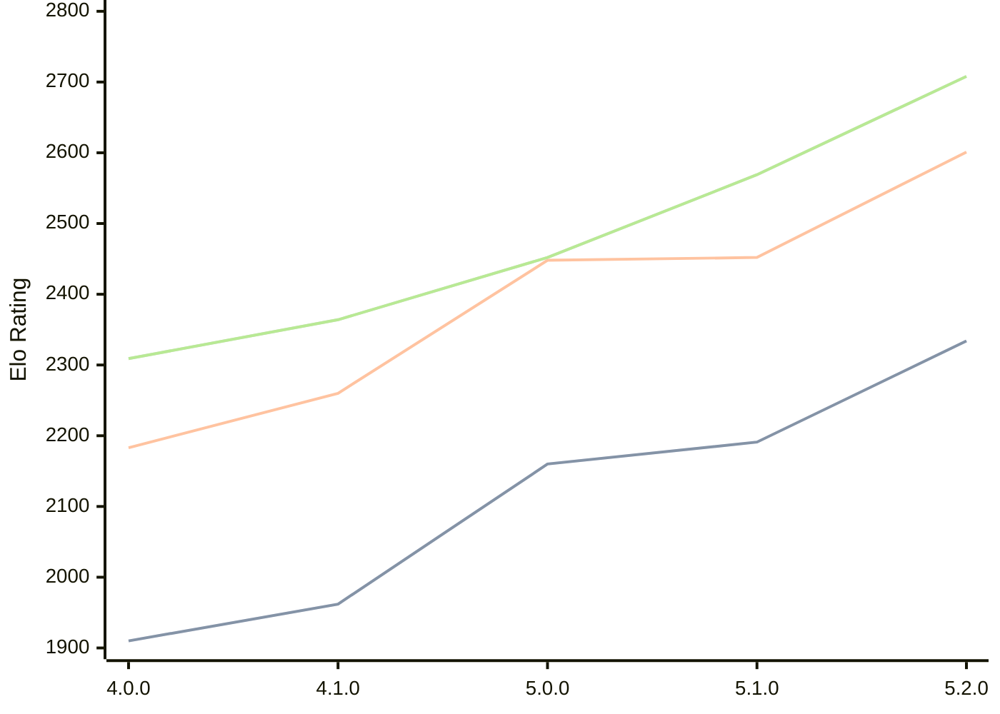

# Engine: Aconcagua

Author: Tarifa Gabriel

Home: https://github.com/gabtar/aconcagua

## Elo Ratings

| Version | Published | STC 8.0+0.08s  | LTC 60.0+0.60s | VLTC 2m24s+1.12s | Comment |
| --- | --- | --- | --- | --- | --- |
| 5.2.0 | 2026-05-31 | 2334(+143) | 2601(+149) | 2708(+139) |  |
| 5.1.0 | 2026-03-01 | 2191(+31) | 2452(+4) | 2569(+117) |  |
| 5.0.0 | 2026-01-25 | 2160(+198) | 2448(+188) | 2452(+88) |  |
| 4.1.0 | 2025-12-14 | 1962(+52) | 2260(+77) | 2364(+55) |  |
| 4.0.0 | 2025-11-09 | 1910 | 2183 | 2309 |  |
 | | | cElo (∆ prev) | cElo (∆ prev) | cElo (∆ prev) | 

<a href="https://github.com/computer-chess-index/cci/issues/new?template=submit-version.yml&title=[VERSION]+Aconcagua+<version>&body=###%20Engine%20name%0AAconcagua%0A%0A###%20Version%0A5.2.0" target="_blank">Submit new version</a>

 Test Conditions:

GUI/CLI: <a href=https://github.com/cutechess/cutechess target="_blank">Cute-Chess</a> 
Elo Calculation: <a href=https://www.remi-coulom.fr/Bayesian-Elo/ target="_blank">Bayesian-Elo</a> 
CPU: Intel(R) Core(TM) i5-7500T 2.70GHz 
Opening book: 8_moves_v3 
\* STC: 8.0+0.08s, LTC: 60.0+0.60s, VLTC: 2m24s+1.12s

 Lists:
Ratings: <a href=https://github.com/computer-chess-index/cci/blob/main/lists/CCIRatings.csv target="_blank">Complete list</a>

Generated: 2026-09-06 06:21:41

## Ratings Verlauf

## Detailed Evaluation Results

| Version | Time Control | Elo  | Range +/- | Matches | Score | Average Opponent Elo | Draws |
| --- | --- | --- | --- | --- | --- | --- | --- |
| 5.2.0 | VLTC (2m24s+1.12s) | 2708 | 30 | 350 | 53% | 2685 | 38% |
| 5.2.0 | LTC (60.0+0.60s) | 2601 | 26 | 466 | 53% | 2574 | 33% |
| 5.2.0 | STC (8.0+0.08s) | 2334 | 29 | 394 | 47% | 2360 | 27% |
| --- | --- | --- | --- | --- | --- | --- | --- |
| 5.1.0 | VLTC (2m24s+1.12s) | 2569 | 27 | 428 | 50% | 2573 | 38% |
| 5.1.0 | LTC (60.0+0.60s) | 2452 | 29 | 376 | 51% | 2439 | 34% |
| 5.1.0 | STC (8.0+0.08s) | 2191 | 27 | 468 | 49% | 2191 | 27% |
| --- | --- | --- | --- | --- | --- | --- | --- |
| 5.0.0 | VLTC (2m24s+1.12s) | 2452 | 42 | 196 | 51% | 2444 | 22% |
| 5.0.0 | LTC (60.0+0.60s) | 2448 | 37 | 246 | 49% | 2453 | 26% |
| 5.0.0 | STC (8.0+0.08s) | 2160 | 34 | 290 | 50% | 2163 | 25% |
| --- | --- | --- | --- | --- | --- | --- | --- |
| 4.1.0 | VLTC (2m24s+1.12s) | 2364 | 40 | 214 | 50% | 2369 | 27% |
| 4.1.0 | LTC (60.0+0.60s) | 2260 | 40 | 222 | 51% | 2244 | 23% |
| 4.1.0 | STC (8.0+0.08s) | 1962 | 33 | 312 | 47% | 1987 | 23% |
| --- | --- | --- | --- | --- | --- | --- | --- |
| 4.0.0 | VLTC (2m24s+1.12s) | 2309 | 46 | 172 | 41% | 2417 | 28% |
| 4.0.0 | LTC (60.0+0.60s) | 2183 | 55 | 116 | 47% | 2211 | 23% |
| 4.0.0 | STC (8.0+0.08s) | 1910 | 62 | 92 | 47% | 1936 | 21% |
| --- | --- | --- | --- | --- | --- | --- | --- |