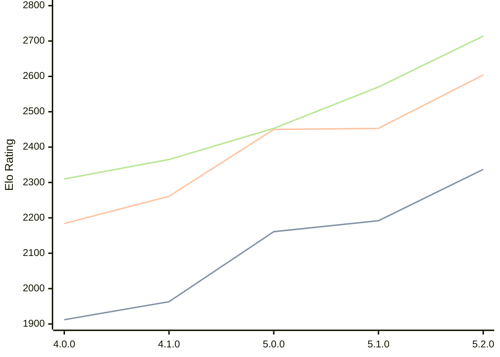

# Engine: Aconcagua

Author: Tarifa Gabriel

Home: https://github.com/gabtar/aconcagua

## Elo Ratings

| Version | Published | STC 8.0+0.08s  | LTC 60.0+0.60s | VLTC 2m24s+1.12s | Comment |
| --- | --- | --- | --- | --- | --- |
| 5.2.0 | 2026-05-31 | 2337(+145) | 2604(+151) | 2714(+144) |  |
| 5.1.0 | 2026-03-01 | 2192(+31) | 2453(+3) | 2570(+117) |  |
| 5.0.0 | 2026-01-25 | 2161(+198) | 2450(+189) | 2453(+88) |  |
| 4.1.0 | 2025-12-14 | 1963(+51) | 2261(+77) | 2365(+55) |  |
| 4.0.0 | 2025-11-09 | 1912 | 2184 | 2310 |  |
 | | | cElo (∆ prev) | cElo (∆ prev) | cElo (∆ prev) | 

<a href="https://github.com/computer-chess-index/cci/issues/new?template=submit-version.yml&title=[VERSION]+Aconcagua+<version>&body=###%20Engine%20name%0AAconcagua%0A%0A###%20Version%0A5.2.0" target="_blank">Submit new version</a>

 Test Conditions:

GUI/CLI: <a href=https://github.com/cutechess/cutechess target="_blank">Cute-Chess</a> 
Elo Calculation: <a href=https://www.remi-coulom.fr/Bayesian-Elo/ target="_blank">Bayesian-Elo</a> 
CPU: Intel(R) Core(TM) i5-7500T 2.70GHz 
Opening book: 8_moves_v3 
\* STC: 8.0+0.08s, LTC: 60.0+0.60s, VLTC: 2m24s+1.12s

 Lists:
Ratings: <a href=https://github.com/computer-chess-index/cci/blob/main/lists/CCIRatings.csv target="_blank">Complete list</a>

Generated: 2026-09-16 04:35:18

## Ratings Verlauf

## Detailed Evaluation Results

| Version | Time Control | Elo  | Range +/- | Matches | Score | Average Opponent Elo | Draws |
| --- | --- | --- | --- | --- | --- | --- | --- |
| 5.2.0 | VLTC (2m24s+1.12s) | 2714 | 29 | 362 | 53% | 2688 | 37% |
| 5.2.0 | LTC (60.0+0.60s) | 2604 | 26 | 482 | 53% | 2579 | 33% |
| 5.2.0 | STC (8.0+0.08s) | 2337 | 29 | 406 | 48% | 2361 | 27% |
| --- | --- | --- | --- | --- | --- | --- | --- |
| 5.1.0 | VLTC (2m24s+1.12s) | 2570 | 27 | 428 | 50% | 2576 | 38% |
| 5.1.0 | LTC (60.0+0.60s) | 2453 | 29 | 376 | 51% | 2441 | 34% |
| 5.1.0 | STC (8.0+0.08s) | 2192 | 27 | 468 | 49% | 2192 | 27% |
| --- | --- | --- | --- | --- | --- | --- | --- |
| 5.0.0 | VLTC (2m24s+1.12s) | 2453 | 42 | 196 | 51% | 2445 | 22% |
| 5.0.0 | LTC (60.0+0.60s) | 2450 | 37 | 246 | 49% | 2454 | 26% |
| 5.0.0 | STC (8.0+0.08s) | 2161 | 34 | 290 | 50% | 2164 | 25% |
| --- | --- | --- | --- | --- | --- | --- | --- |
| 4.1.0 | VLTC (2m24s+1.12s) | 2365 | 40 | 214 | 50% | 2372 | 27% |
| 4.1.0 | LTC (60.0+0.60s) | 2261 | 40 | 222 | 51% | 2245 | 23% |
| 4.1.0 | STC (8.0+0.08s) | 1963 | 33 | 312 | 47% | 1989 | 23% |
| --- | --- | --- | --- | --- | --- | --- | --- |
| 4.0.0 | VLTC (2m24s+1.12s) | 2310 | 46 | 172 | 41% | 2418 | 28% |
| 4.0.0 | LTC (60.0+0.60s) | 2184 | 55 | 116 | 47% | 2213 | 23% |
| 4.0.0 | STC (8.0+0.08s) | 1912 | 62 | 92 | 47% | 1937 | 21% |
| --- | --- | --- | --- | --- | --- | --- | --- |