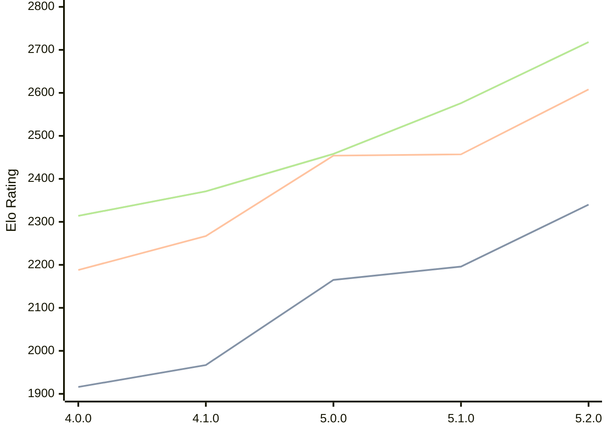

# Engine: Aconcagua

Author: Tarifa Gabriel

Home: https://github.com/gabtar/aconcagua

## Elo Ratings

| Version | Published | STC 8.0+0.08s  | LTC 60.0+0.60s | VLTC 2m24s+1.12s | Comment |
| --- | --- | --- | --- | --- | --- |
| 5.2.0 | 2026-05-31 | 2340(+144) | 2608(+151) | 2718(+142) |  |
| 5.1.0 | 2026-03-01 | 2196(+31) | 2457(+3) | 2576(+118) |  |
| 5.0.0 | 2026-01-25 | 2165(+198) | 2454(+187) | 2458(+87) |  |
| 4.1.0 | 2025-12-14 | 1967(+51) | 2267(+79) | 2371(+57) |  |
| 4.0.0 | 2025-11-09 | 1916 | 2188 | 2314 |  |
 | | | cElo (∆ prev) | cElo (∆ prev) | cElo (∆ prev) | 

<a href="https://github.com/computer-chess-index/cci/issues/new?template=submit-version.yml&title=[VERSION]+Aconcagua+<version>&body=###%20Engine%20name%0AAconcagua%0A%0A###%20Version%0A5.2.0" target="_blank">Submit new version</a>

 Test Conditions:

GUI/CLI: <a href=https://github.com/cutechess/cutechess target="_blank">Cute-Chess</a> 
Elo Calculation: <a href=https://www.remi-coulom.fr/Bayesian-Elo/ target="_blank">Bayesian-Elo</a> 
CPU: Intel(R) Core(TM) i5-7500T 2.70GHz 
Opening book: 8_moves_v3 
\* STC: 8.0+0.08s, LTC: 60.0+0.60s, VLTC: 2m24s+1.12s

 Lists:
Ratings: <a href=https://github.com/computer-chess-index/cci/blob/main/lists/CCIRatings.csv target="_blank">Complete list</a>

Generated: 2026-10-09 04:35:13

## Ratings Verlauf

```mermaid
%%{init: {"theme":"base","themeVariables":{"seriesColors:['#a3a3a3','#222221','#faa371']}}}%%
xychart-beta
  x-axis ["4.0.0", "4.1.0", "5.0.0", "5.1.0", "5.2.0"]
  y-axis "Elo Rating" 1900 --> 2800
  line "" [1916, 1967, 2165, 2196, 2340]
  line "STC (8.0+0.08s)" [1916, 1967, 2165, 2196, 2340]
  line "LTC (60.0+0.60s)" [2188, 2267, 2454, 2457, 2608]
  line "" [2314, 2371, 2458, 2576, 2718]
  line "VLTC (2m24s+1.12s)" [2314, 2371, 2458, 2576, 2718]
```

## Detailed Evaluation Results

| Version | Time Control | Elo  | Range +/- | Matches | Score | Average Opponent Elo | Draws |
| --- | --- | --- | --- | --- | --- | --- | --- |
| 5.2.0 | VLTC (2m24s+1.12s) | 2718 | 29 | 366 | 53% | 2692 | 37% |
| 5.2.0 | LTC (60.0+0.60s) | 2608 | 26 | 482 | 53% | 2583 | 33% |
| 5.2.0 | STC (8.0+0.08s) | 2340 | 29 | 414 | 48% | 2364 | 27% |
| --- | --- | --- | --- | --- | --- | --- | --- |
| 5.1.0 | VLTC (2m24s+1.12s) | 2576 | 27 | 428 | 50% | 2580 | 38% |
| 5.1.0 | LTC (60.0+0.60s) | 2457 | 29 | 376 | 51% | 2445 | 34% |
| 5.1.0 | STC (8.0+0.08s) | 2196 | 27 | 468 | 49% | 2198 | 27% |
| --- | --- | --- | --- | --- | --- | --- | --- |
| 5.0.0 | VLTC (2m24s+1.12s) | 2458 | 42 | 196 | 51% | 2450 | 22% |
| 5.0.0 | LTC (60.0+0.60s) | 2454 | 37 | 246 | 49% | 2460 | 26% |
| 5.0.0 | STC (8.0+0.08s) | 2165 | 34 | 290 | 50% | 2168 | 25% |
| --- | --- | --- | --- | --- | --- | --- | --- |
| 4.1.0 | VLTC (2m24s+1.12s) | 2371 | 40 | 214 | 50% | 2376 | 27% |
| 4.1.0 | LTC (60.0+0.60s) | 2267 | 40 | 222 | 51% | 2249 | 23% |
| 4.1.0 | STC (8.0+0.08s) | 1967 | 33 | 312 | 47% | 1993 | 23% |
| --- | --- | --- | --- | --- | --- | --- | --- |
| 4.0.0 | VLTC (2m24s+1.12s) | 2314 | 46 | 172 | 41% | 2422 | 28% |
| 4.0.0 | LTC (60.0+0.60s) | 2188 | 55 | 116 | 47% | 2217 | 23% |
| 4.0.0 | STC (8.0+0.08s) | 1916 | 62 | 92 | 47% | 1941 | 21% |
| --- | --- | --- | --- | --- | --- | --- | --- |