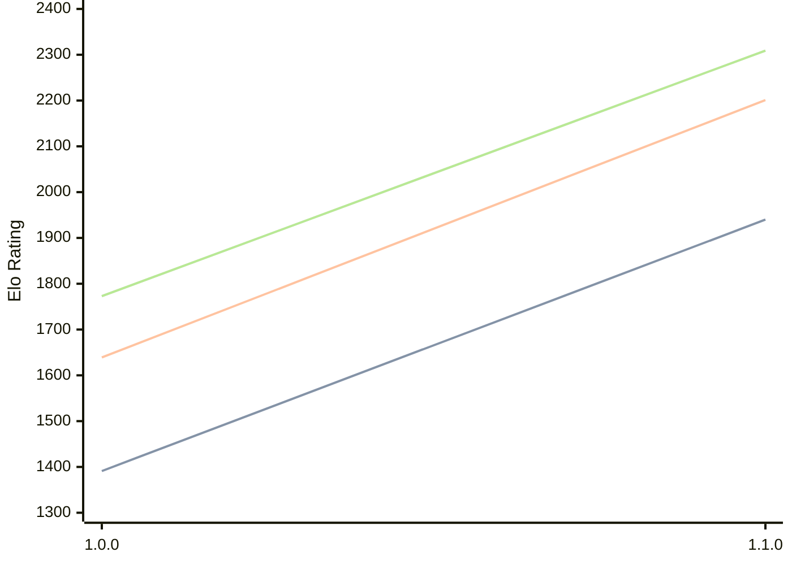

# Engine: Akerbeltz

Author: Julen Aristondo

Home: https://github.com/neluj/Akerbeltz

## Elo Ratings

| Version | Published | STC 8.0+0.08s  | LTC 60.0+0.60s | VLTC 2m24s+1.12s | Comment |
| --- | --- | --- | --- | --- | --- |
| 1.1.0 | 2026-04-14 | 1940(+549) | 2201(+562) | 2309(+536) |  |
| 1.0.0 | 2025-12-31 | 1391 | 1639 | 1773 |  |
 | | | cElo (∆ prev) | cElo (∆ prev) | cElo (∆ prev) | 

<a href="https://github.com/computer-chess-index/cci/issues/new?template=submit-version.yml&title=[VERSION]+Akerbeltz+<version>&body=###%20Engine%20name%0AAkerbeltz%0A%0A###%20Version%0A1.1.0" target="_blank">Submit new version</a>

 Test Conditions:

GUI/CLI: <a href=https://github.com/cutechess/cutechess target="_blank">Cute-Chess</a> 
Elo Calculation: <a href=https://www.remi-coulom.fr/Bayesian-Elo/ target="_blank">Bayesian-Elo</a> 
CPU: Intel(R) Core(TM) i5-7500T 2.70GHz 
Opening book: 8_moves_v3 
\* STC: 8.0+0.08s, LTC: 60.0+0.60s, VLTC: 2m24s+1.12s

 Lists:
Ratings: <a href=https://github.com/computer-chess-index/cci/blob/main/lists/CCIRatings.csv target="_blank">Complete list</a>

Generated: 2026-10-08 04:35:21

## Ratings Verlauf

```mermaid
%%{init: {"theme":"base","themeVariables":{"seriesColors:['#a3a3a3','#222221','#faa371']}}}%%
xychart-beta
  x-axis ["1.0.0", "1.1.0"]
  y-axis "Elo Rating" 1300 --> 2400
  line "" [1391, 1940]
  line "STC (8.0+0.08s)" [1391, 1940]
  line "LTC (60.0+0.60s)" [1639, 2201]
  line "" [1773, 2309]
  line "VLTC (2m24s+1.12s)" [1773, 2309]
```

## Detailed Evaluation Results

| Version | Time Control | Elo  | Range +/- | Matches | Score | Average Opponent Elo | Draws |
| --- | --- | --- | --- | --- | --- | --- | --- |
| 1.1.0 | VLTC (2m24s+1.12s) | 2309 | 26 | 520 | 51% | 2307 | 21% |
| 1.1.0 | LTC (60.0+0.60s) | 2201 | 27 | 496 | 48% | 2217 | 23% |
| 1.1.0 | STC (8.0+0.08s) | 1940 | 25 | 588 | 48% | 1966 | 21% |
| --- | --- | --- | --- | --- | --- | --- | --- |
| 1.0.0 | VLTC (2m24s+1.12s) | 1773 | 41 | 230 | 41% | 1905 | 22% |
| 1.0.0 | LTC (60.0+0.60s) | 1639 | 48 | 164 | 43% | 1732 | 21% |
| 1.0.0 | STC (8.0+0.08s) | 1391 | 45 | 184 | 40% | 1513 | 29% |
| --- | --- | --- | --- | --- | --- | --- | --- |