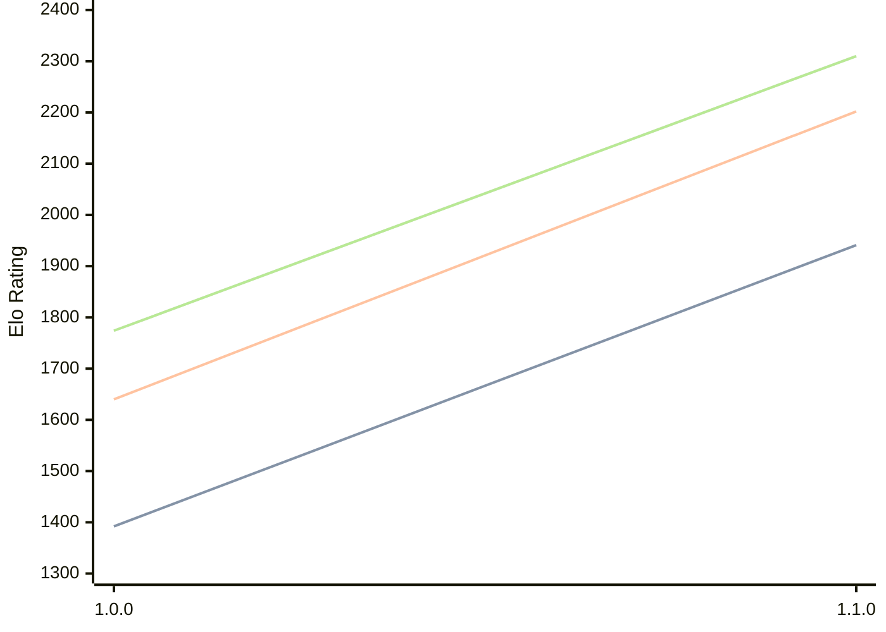

# Engine: Akerbeltz

Author: Julen Aristondo

Home: https://github.com/neluj/Akerbeltz

## Elo Ratings E1

| Version | Published | STC 8.0+0.08s  | LTC 60.0+0.60s | VLTC 2m24s+1.12s | Comment |
| --- | --- | --- | --- | --- | --- |
| 1.1.0 | 2026-04-14 | 1823 | 2095 | 2210 |  |
 | | | cElo (∆ prev) | cElo (∆ prev) | cElo (∆ prev) | 

## Elo Ratings P1

| Version | Published | STC 8.0+0.08s  | LTC 60.0+0.60s | VLTC 2m24s+1.12s | Comment |
| --- | --- | --- | --- | --- | --- |
| 1.1.0 | 2026-04-14 | 2001 | 2279 | 2403 |  |
 | | | cElo (∆ prev) | cElo (∆ prev) | cElo (∆ prev) | 

## Elo Ratings T1

| Version | Published | STC 8.0+0.08s  | LTC 60.0+0.60s | VLTC 2m24s+1.12s | Comment |
| --- | --- | --- | --- | --- | --- |
| 1.1.0 | 2026-04-14 | 1941(+549) | 2202(+562) | 2310(+536) |  |
| 1.0.0 | 2025-12-31 | 1392 | 1640 | 1774 |  |
 | | | cElo (∆ prev) | cElo (∆ prev) | cElo (∆ prev) | 

<a href="https://github.com/computer-chess-index/cci/issues/new?template=submit-version.yml&title=[VERSION]+Akerbeltz+<version>&body=###%20Engine%20name%0AAkerbeltz%0A%0A###%20Version%0A1.1.0" target="_blank">Submit new version</a>

 Test Conditions:

GUI/CLI: <a href=https://github.com/cutechess/cutechess target="_blank">Cute-Chess</a> 
Elo Calculation: <a href=https://www.remi-coulom.fr/Bayesian-Elo/ target="_blank">Bayesian-Elo</a> 
CPU for P1: Intel(R) Core(TM) Ultra 7 265T (1.50 GHz) - P-Core 
CPU for E1: Intel(R) Core(TM) Ultra 7 265T (1.50 GHz) - E-Core 
CPU for T1: Intel(R) Core(TM) i5-7500T 2.70GHz 
Opening book: 8_moves_v3 
\* STC: 8.0+0.08s, LTC: 60.0+0.60s, VLTC: 2m24s+1.12s

 Lists:
Ratings: <a href=https://github.com/computer-chess-index/cci/blob/main/lists/CCIRatings.csv target="_blank">Complete list</a>

Generated: 2026-10-10 04:35:22

## Ratings Verlauf

```mermaid
%%{init: {"theme":"base","themeVariables":{"seriesColors:['#a3a3a3','#222221','#faa371']}}}%%
xychart-beta
  x-axis ["1.0.0", "1.1.0"]
  y-axis "Elo Rating" 1300 --> 2400
  line "" [1392, 1941]
  line "STC (8.0+0.08s)" [1392, 1941]
  line "LTC (60.0+0.60s)" [1640, 2202]
  line "" [1774, 2310]
  line "VLTC (2m24s+1.12s)" [1774, 2310]
```

## Detailed Evaluation Results

| Version | Time Control | Elo  | Range +/- | Matches | Score | Average Opponent Elo | Draws |
| --- | --- | --- | --- | --- | --- | --- | --- |
| 1.1.0 | VLTC (2m24s+1.12s) | 2210 | 43 | 196 | 48% | 2244 | 23% |
| 1.1.0 | VLTC (2m24s+1.12s) | 2310 | 26 | 520 | 51% | 2309 | 21% |
| 1.1.0 | VLTC (2m24s+1.12s) | 2403 | 47 | 164 | 54% | 2377 | 23% |
| 1.1.0 | LTC (60.0+0.60s) | 2095 | 43 | 208 | 50% | 2117 | 15% |
| 1.1.0 | LTC (60.0+0.60s) | 2202 | 27 | 496 | 48% | 2218 | 23% |
| 1.1.0 | LTC (60.0+0.60s) | 2279 | 59 | 112 | 47% | 2358 | 20% |
| 1.1.0 | STC (8.0+0.08s) | 1823 | 42 | 206 | 48% | 1875 | 23% |
| --- | --- | --- | --- | --- | --- | --- | --- |
| 1.1.0 | STC (8.0+0.08s) | 1941 | 25 | 588 | 48% | 1967 | 21% |
| --- | --- | --- | --- | --- | --- | --- | --- |
| 1.1.0 | STC (8.0+0.08s) | 2001 | 49 | 150 | 51% | 1994 | 19% |
| --- | --- | --- | --- | --- | --- | --- | --- |
| 1.0.0 | VLTC (2m24s+1.12s) | 1774 | 41 | 230 | 41% | 1906 | 22% |
| 1.0.0 | LTC (60.0+0.60s) | 1640 | 48 | 164 | 43% | 1733 | 21% |
| 1.0.0 | STC (8.0+0.08s) | 1392 | 45 | 184 | 40% | 1516 | 29% |
| --- | --- | --- | --- | --- | --- | --- | --- |