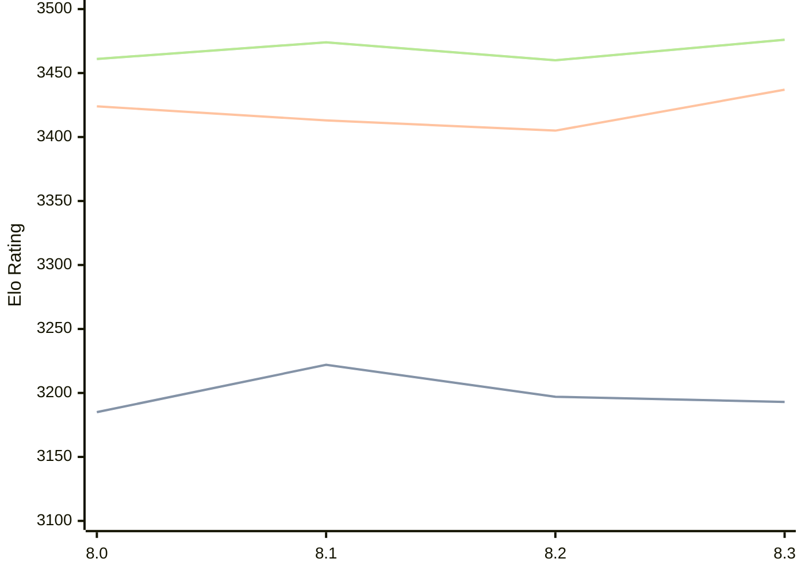

# Engine: Alexander

Author: Andrea Manzo

Home: https://github.com/amchess/Alexander

## Elo Ratings

| Version | Published | STC 8.0+0.08s  | LTC 60.0+0.60s | VLTC 2m24s+1.12s | Comment |
| --- | --- | --- | --- | --- | --- |
| 8.3 | 2026-04-01 | 3193(-4) | 3437(+32) | 3476(+16) |  |
| 8.2 | 2026-03-23 | 3197(-25) | 3405(-8) | 3460(-14) |  |
| 8.1 | 2026-03-16 | 3222(+37) | 3413(-11) | 3474(+13) |  |
| 8.0 | 2026-03-10 | 3185(+new) | 3424(+new) | 3461(+new) |  |
| 7.0 | 2025-10-20 |  |  |  |  |
| 6.1 | 2025-10-07 |  |  |  |  |
| 6.0 | 2025-09-20 |  |  |  |  |
| 5.0 | 2025-02-14 |  |  |  |  |
| 4.1 | 2025-02-07 |  |  |  |  |
| 4.0 | 2025-01-17 |  |  |  |  |
| 3.1 | 2024-11-11 |  |  |  |  |
| 3.0 | 2024-10-24 |  |  |  |  |
| Santiago | 2024-10-17 |  |  |  |  |
| 2.0 | 2024-09-19 |  |  |  |  |
| 1.3 | 2024-05-03 |  |  |  |  |
| 1.2 | 2024-04-19 |  |  |  |  |
| 1.1 | 2024-04-11 |  |  |  |  |
| 1.0 | 2024-03-30 |  |  |  |  |
 | | | cElo (∆ prev) | cElo (∆ prev) | cElo (∆ prev) | 

<a href="https://github.com/computer-chess-index/cci/issues/new?template=submit-version.yml&title=[VERSION]+Alexander+<version>&body=###%20Engine%20name%0AAlexander%0A%0A###%20Version%0A8.3" target="_blank">Submit new version</a>

 Test Conditions:

GUI/CLI: <a href=https://github.com/cutechess/cutechess target="_blank">Cute-Chess</a> 
Elo Calculation: <a href=https://www.remi-coulom.fr/Bayesian-Elo/ target="_blank">Bayesian-Elo</a> 
CPU: Intel(R) Core(TM) i5-7500T 2.70GHz 
Opening book: 8_moves_v3 
\* STC: 8.0+0.08s, LTC: 60.0+0.60s, VLTC: 2m24s+1.12s

 Lists:
Ratings: <a href=https://github.com/computer-chess-index/cci/blob/main/lists/CCIRatings.csv target="_blank">Complete list</a>

Generated: 2026-05-04 06:22:14

## Ratings Verlauf

⬛ STC (8.0+0.08s) &nbsp;&nbsp; 🟧 LTC (60.0+0.60s) &nbsp;&nbsp; 🟩 VLTC (2m24s+1.12s)

dark mode: 🟩STC (8.0+0.08s) 🟧LTC (60.0+0.60s) ⬜VLTC (2m24s+1.12s)

## Detailed Evaluation Results

| Version | Time Control | Elo  | Range +/- | Matches | Score | Average Opponent Elo | Draws |
| --- | --- | --- | --- | --- | --- | --- | --- |
| 8.3 | VLTC (2m24s+1.12s) | 3476 | 26 | 382 | 49% | 3482 | 70% |
| 8.3 | LTC (60.0+0.60s) | 3437 | 28 | 342 | 49% | 3445 | 65% |
| 8.3 | STC (8.0+0.08s) | 3193 | 29 | 360 | 51% | 3187 | 46% |
| --- | --- | --- | --- | --- | --- | --- | --- |
| 8.2 | VLTC (2m24s+1.12s) | 3460 | 26 | 380 | 49% | 3468 | 70% |
| 8.2 | LTC (60.0+0.60s) | 3405 | 31 | 284 | 50% | 3403 | 62% |
| 8.2 | STC (8.0+0.08s) | 3197 | 27 | 396 | 48% | 3210 | 44% |
| --- | --- | --- | --- | --- | --- | --- | --- |
| 8.1 | VLTC (2m24s+1.12s) | 3474 | 28 | 324 | 49% | 3478 | 64% |
| 8.1 | LTC (60.0+0.60s) | 3413 | 30 | 290 | 51% | 3407 | 66% |
| 8.1 | STC (8.0+0.08s) | 3222 | 31 | 302 | 49% | 3231 | 44% |
| --- | --- | --- | --- | --- | --- | --- | --- |
| 8.0 | VLTC (2m24s+1.12s) | 3461 | 28 | 308 | 50% | 3459 | 72% |
| 8.0 | LTC (60.0+0.60s) | 3424 | 28 | 332 | 50% | 3422 | 63% |
| 8.0 | STC (8.0+0.08s) | 3185 | 31 | 300 | 49% | 3190 | 47% |
| --- | --- | --- | --- | --- | --- | --- | --- |