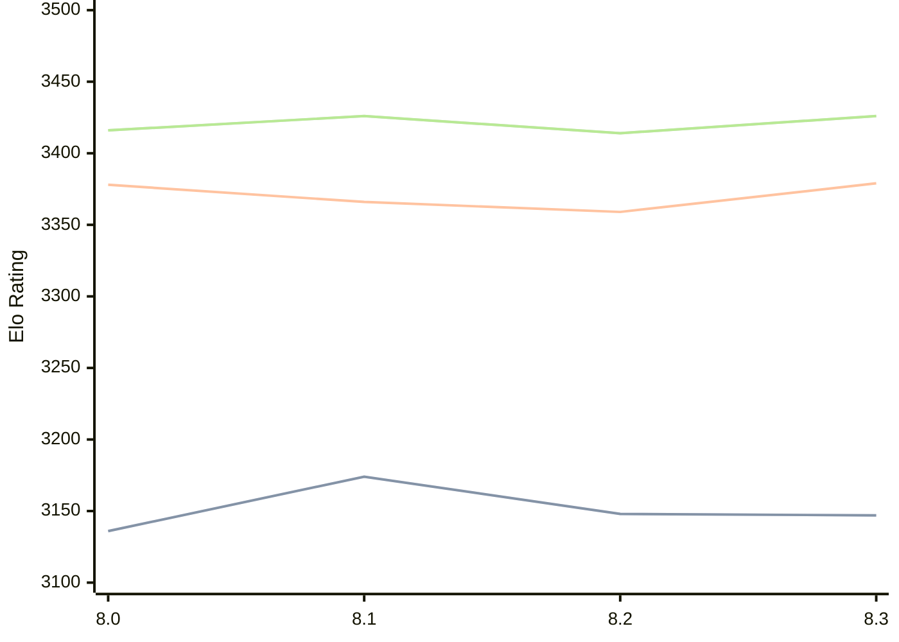

# Engine: Alexander

Author: Andrea Manzo

Home: https://github.com/amchess/Alexander

## Elo Ratings

| Version | Published | STC 8.0+0.08s  | LTC 60.0+0.60s | VLTC 2m24s+1.12s | Comment |
| --- | --- | --- | --- | --- | --- |
| 8.3 | 2026-04-01 | 3147(-1) | 3379(+20) | 3426(+12) |  |
| 8.2 | 2026-03-23 | 3148(-26) | 3359(-7) | 3414(-12) |  |
| 8.1 | 2026-03-16 | 3174(+38) | 3366(-12) | 3426(+10) |  |
| 8.0 | 2026-03-10 | 3136 | 3378 | 3416 |  |
 | | | cElo (∆ prev) | cElo (∆ prev) | cElo (∆ prev) | 

<a href="https://github.com/computer-chess-index/cci/issues/new?template=submit-version.yml&title=[VERSION]+Alexander+<version>&body=###%20Engine%20name%0AAlexander%0A%0A###%20Version%0A8.3" target="_blank">Submit new version</a>

 Test Conditions:

GUI/CLI: <a href=https://github.com/cutechess/cutechess target="_blank">Cute-Chess</a> 
Elo Calculation: <a href=https://www.remi-coulom.fr/Bayesian-Elo/ target="_blank">Bayesian-Elo</a> 
CPU: Intel(R) Core(TM) i5-7500T 2.70GHz 
Opening book: 8_moves_v3 
\* STC: 8.0+0.08s, LTC: 60.0+0.60s, VLTC: 2m24s+1.12s

 Lists:
Ratings: <a href=https://github.com/computer-chess-index/cci/blob/main/lists/CCIRatings.csv target="_blank">Complete list</a>

Generated: 2026-08-24 06:22:15

## Ratings Verlauf

⬛ STC (8.0+0.08s) &nbsp;&nbsp; 🟧 LTC (60.0+0.60s) &nbsp;&nbsp; 🟩 VLTC (2m24s+1.12s)

dark mode: 🟩STC (8.0+0.08s) 🟧LTC (60.0+0.60s) ⬜VLTC (2m24s+1.12s)

## Detailed Evaluation Results

| Version | Time Control | Elo  | Range +/- | Matches | Score | Average Opponent Elo | Draws |
| --- | --- | --- | --- | --- | --- | --- | --- |
| 8.3 | VLTC (2m24s+1.12s) | 3426 | 22 | 514 | 49% | 3433 | 68% |
| 8.3 | LTC (60.0+0.60s) | 3379 | 23 | 494 | 48% | 3391 | 67% |
| 8.3 | STC (8.0+0.08s) | 3147 | 25 | 464 | 51% | 3136 | 48% |
| --- | --- | --- | --- | --- | --- | --- | --- |
| 8.2 | VLTC (2m24s+1.12s) | 3414 | 26 | 380 | 49% | 3422 | 70% |
| 8.2 | LTC (60.0+0.60s) | 3359 | 31 | 284 | 50% | 3357 | 62% |
| 8.2 | STC (8.0+0.08s) | 3148 | 27 | 396 | 48% | 3162 | 44% |
| --- | --- | --- | --- | --- | --- | --- | --- |
| 8.1 | VLTC (2m24s+1.12s) | 3426 | 28 | 324 | 49% | 3432 | 64% |
| 8.1 | LTC (60.0+0.60s) | 3366 | 30 | 290 | 51% | 3360 | 66% |
| 8.1 | STC (8.0+0.08s) | 3174 | 31 | 302 | 49% | 3182 | 44% |
| --- | --- | --- | --- | --- | --- | --- | --- |
| 8.0 | VLTC (2m24s+1.12s) | 3416 | 28 | 308 | 50% | 3413 | 72% |
| 8.0 | LTC (60.0+0.60s) | 3378 | 28 | 332 | 50% | 3376 | 63% |
| 8.0 | STC (8.0+0.08s) | 3136 | 31 | 300 | 49% | 3141 | 47% |
| --- | --- | --- | --- | --- | --- | --- | --- |