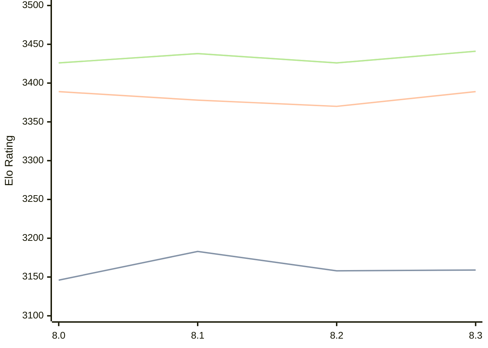

# Engine: Alexander

Author: Andrea Manzo

Home: https://github.com/amchess/Alexander

## Elo Ratings

| Version | Published | STC 8.0+0.08s  | LTC 60.0+0.60s | VLTC 2m24s+1.12s | Comment |
| --- | --- | --- | --- | --- | --- |
| 8.3 | 2026-04-01 | 3159(+1) | 3389(+19) | 3441(+15) |  |
| 8.2 | 2026-03-23 | 3158(-25) | 3370(-8) | 3426(-12) |  |
| 8.1 | 2026-03-16 | 3183(+37) | 3378(-11) | 3438(+12) |  |
| 8.0 | 2026-03-10 | 3146 | 3389 | 3426 |  |
 | | | cElo (∆ prev) | cElo (∆ prev) | cElo (∆ prev) | 

<a href="https://github.com/computer-chess-index/cci/issues/new?template=submit-version.yml&title=[VERSION]+Alexander+<version>&body=###%20Engine%20name%0AAlexander%0A%0A###%20Version%0A8.3" target="_blank">Submit new version</a>

 Test Conditions:

GUI/CLI: <a href=https://github.com/cutechess/cutechess target="_blank">Cute-Chess</a> 
Elo Calculation: <a href=https://www.remi-coulom.fr/Bayesian-Elo/ target="_blank">Bayesian-Elo</a> 
CPU: Intel(R) Core(TM) i5-7500T 2.70GHz 
Opening book: 8_moves_v3 
\* STC: 8.0+0.08s, LTC: 60.0+0.60s, VLTC: 2m24s+1.12s

 Lists:
Ratings: <a href=https://github.com/computer-chess-index/cci/blob/main/lists/CCIRatings.csv target="_blank">Complete list</a>

Generated: 2026-09-25 04:35:26

## Ratings Verlauf

## Detailed Evaluation Results

| Version | Time Control | Elo  | Range +/- | Matches | Score | Average Opponent Elo | Draws |
| --- | --- | --- | --- | --- | --- | --- | --- |
| 8.3 | VLTC (2m24s+1.12s) | 3441 | 22 | 530 | 49% | 3445 | 68% |
| 8.3 | LTC (60.0+0.60s) | 3389 | 23 | 510 | 48% | 3402 | 66% |
| 8.3 | STC (8.0+0.08s) | 3159 | 24 | 496 | 52% | 3146 | 48% |
| --- | --- | --- | --- | --- | --- | --- | --- |
| 8.2 | VLTC (2m24s+1.12s) | 3426 | 26 | 380 | 49% | 3433 | 70% |
| 8.2 | LTC (60.0+0.60s) | 3370 | 31 | 284 | 50% | 3368 | 62% |
| 8.2 | STC (8.0+0.08s) | 3158 | 27 | 396 | 48% | 3171 | 44% |
| --- | --- | --- | --- | --- | --- | --- | --- |
| 8.1 | VLTC (2m24s+1.12s) | 3438 | 28 | 324 | 49% | 3443 | 64% |
| 8.1 | LTC (60.0+0.60s) | 3378 | 30 | 290 | 51% | 3372 | 66% |
| 8.1 | STC (8.0+0.08s) | 3183 | 31 | 302 | 49% | 3191 | 44% |
| --- | --- | --- | --- | --- | --- | --- | --- |
| 8.0 | VLTC (2m24s+1.12s) | 3426 | 28 | 308 | 50% | 3424 | 72% |
| 8.0 | LTC (60.0+0.60s) | 3389 | 28 | 332 | 50% | 3387 | 63% |
| 8.0 | STC (8.0+0.08s) | 3146 | 31 | 300 | 49% | 3151 | 47% |
| --- | --- | --- | --- | --- | --- | --- | --- |