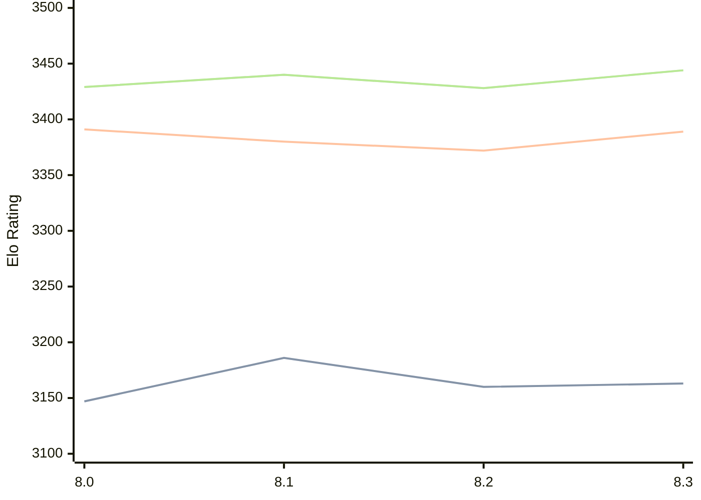

# Engine: Alexander

Author: Andrea Manzo

Home: https://github.com/amchess/Alexander

## Elo Ratings E1

| Version | Published | STC 8.0+0.08s  | LTC 60.0+0.60s | VLTC 2m24s+1.12s | Comment |
| --- | --- | --- | --- | --- | --- |
| 8.3 | 2026-04-01 | 2844 | 3124 | 3241 |  |
 | | | cElo (∆ prev) | cElo (∆ prev) | cElo (∆ prev) | 

## Elo Ratings P1

| Version | Published | STC 8.0+0.08s  | LTC 60.0+0.60s | VLTC 2m24s+1.12s | Comment |
| --- | --- | --- | --- | --- | --- |
| 8.3 | 2026-04-01 | 3141 | 3324 | 3349 |  |
 | | | cElo (∆ prev) | cElo (∆ prev) | cElo (∆ prev) | 

## Elo Ratings T1

| Version | Published | STC 8.0+0.08s  | LTC 60.0+0.60s | VLTC 2m24s+1.12s | Comment |
| --- | --- | --- | --- | --- | --- |
| 8.3 | 2026-04-01 | 3163(+3) | 3389(+17) | 3444(+16) |  |
| 8.2 | 2026-03-23 | 3160(-26) | 3372(-8) | 3428(-12) |  |
| 8.1 | 2026-03-16 | 3186(+39) | 3380(-11) | 3440(+11) |  |
| 8.0 | 2026-03-10 | 3147 | 3391 | 3429 |  |
 | | | cElo (∆ prev) | cElo (∆ prev) | cElo (∆ prev) | 

<a href="https://github.com/computer-chess-index/cci/issues/new?template=submit-version.yml&title=[VERSION]+Alexander+<version>&body=###%20Engine%20name%0AAlexander%0A%0A###%20Version%0A8.3" target="_blank">Submit new version</a>

 Test Conditions:

GUI/CLI: <a href=https://github.com/cutechess/cutechess target="_blank">Cute-Chess</a> 
Elo Calculation: <a href=https://www.remi-coulom.fr/Bayesian-Elo/ target="_blank">Bayesian-Elo</a> 
CPU for P1: Intel(R) Core(TM) Ultra 7 265T (1.50 GHz) - P-Core 
CPU for E1: Intel(R) Core(TM) Ultra 7 265T (1.50 GHz) - E-Core 
CPU for T1: Intel(R) Core(TM) i5-7500T 2.70GHz 
Opening book: 8_moves_v3 
\* STC: 8.0+0.08s, LTC: 60.0+0.60s, VLTC: 2m24s+1.12s

 Lists:
Ratings: <a href=https://github.com/computer-chess-index/cci/blob/main/lists/CCIRatings.csv target="_blank">Complete list</a>

Generated: 2026-10-10 04:35:27

## Ratings Verlauf

```mermaid
%%{init: {"theme":"base","themeVariables":{"seriesColors:['#a3a3a3','#222221','#faa371']}}}%%
xychart-beta
  x-axis ["8.0", "8.1", "8.2", "8.3"]
  y-axis "Elo Rating" 3100 --> 3500
  line "" [3147, 3186, 3160, 3163]
  line "STC (8.0+0.08s)" [3147, 3186, 3160, 3163]
  line "LTC (60.0+0.60s)" [3391, 3380, 3372, 3389]
  line "" [3429, 3440, 3428, 3444]
  line "VLTC (2m24s+1.12s)" [3429, 3440, 3428, 3444]
```

## Detailed Evaluation Results

| Version | Time Control | Elo  | Range +/- | Matches | Score | Average Opponent Elo | Draws |
| --- | --- | --- | --- | --- | --- | --- | --- |
| 8.3 | VLTC (2m24s+1.12s) | 3444 | 22 | 534 | 50% | 3447 | 68% |
| 8.3 | VLTC (2m24s+1.12s) | 3349 | 39 | 224 | 60% | 3248 | 32% |
| 8.3 | VLTC (2m24s+1.12s) | 3241 | 40 | 208 | 54% | 3173 | 31% |
| 8.3 | LTC (60.0+0.60s) | 3389 | 22 | 514 | 48% | 3403 | 66% |
| 8.3 | LTC (60.0+0.60s) | 3324 | 45 | 172 | 56% | 3198 | 32% |
| 8.3 | LTC (60.0+0.60s) | 3124 | 41 | 220 | 57% | 3017 | 26% |
| 8.3 | STC (8.0+0.08s) | 3163 | 24 | 500 | 52% | 3148 | 48% |
| --- | --- | --- | --- | --- | --- | --- | --- |
| 8.3 | STC (8.0+0.08s) | 3141 | 35 | 276 | 41% | 3229 | 30% |
| --- | --- | --- | --- | --- | --- | --- | --- |
| 8.3 | STC (8.0+0.08s) | 2844 | 34 | 310 | 38% | 2955 | 28% |
| --- | --- | --- | --- | --- | --- | --- | --- |
| 8.2 | VLTC (2m24s+1.12s) | 3428 | 26 | 380 | 49% | 3436 | 70% |
| 8.2 | LTC (60.0+0.60s) | 3372 | 31 | 284 | 50% | 3371 | 62% |
| 8.2 | STC (8.0+0.08s) | 3160 | 27 | 396 | 48% | 3174 | 44% |
| --- | --- | --- | --- | --- | --- | --- | --- |
| 8.1 | VLTC (2m24s+1.12s) | 3440 | 28 | 324 | 49% | 3445 | 64% |
| 8.1 | LTC (60.0+0.60s) | 3380 | 30 | 290 | 51% | 3374 | 66% |
| 8.1 | STC (8.0+0.08s) | 3186 | 31 | 302 | 49% | 3194 | 44% |
| --- | --- | --- | --- | --- | --- | --- | --- |
| 8.0 | VLTC (2m24s+1.12s) | 3429 | 28 | 308 | 50% | 3426 | 72% |
| 8.0 | LTC (60.0+0.60s) | 3391 | 28 | 332 | 50% | 3390 | 63% |
| 8.0 | STC (8.0+0.08s) | 3147 | 31 | 300 | 49% | 3152 | 47% |
| --- | --- | --- | --- | --- | --- | --- | --- |