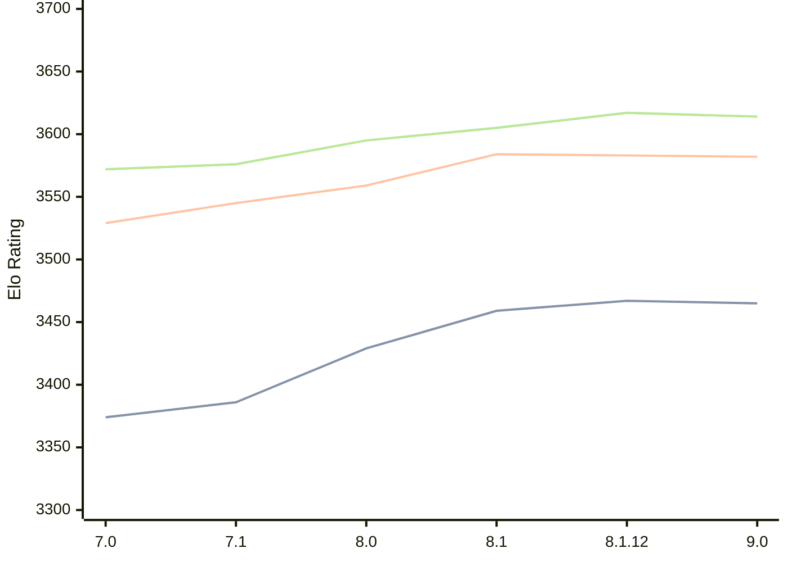

# Engine: Alexandria

Author: PGG106

Home: https://github.com/PGG106/Alexandria

## Ratings nach Version

| Version | Published | STC 8.0+0.08s  | LTC 60.0+0.60s | VLTC 2m24s+1.12s | Comment |
| --- | --- | --- | --- | --- | --- |
| 9.0 | 2026-02-27 | 3465(-2) | 3582(-1) | 3614(-3) |  |
| 8.1.12 | 2025-11-09 | 3467(+8) | 3583(-1) | 3617(+12) |  |
| 8.1 | 2025-08-16 | 3459(+30) | 3584(+25) | 3605(+10) |  |
| 8.0 | 2025-03-03 | 3429(+43) | 3559(+14) | 3595(+19) |  |
| 7.1 | 2024-10-26 | 3386(+12) | 3545(+16) | 3576(+4) |  |
| 7.0 | 2024-05-25 | 3374(+new) | 3529(+new) | 3572(+new) |  |
| 6.1.0 | 2024-03-24 |  |  |  |  |
| 6.0.0 | 2024-02-01 |  |  |  |  |
| 5.1.0 | 2023-11-29 |  |  |  |  |
| 5.0.0 | 2023-09-24 |  |  |  |  |
| 4.0.0 | 2023-07-28 |  |  |  |  |
| 3.5.0 | 2023-02-12 |  |  |  |  |
| 3.1.0 | 2022-12-06 |  |  |  |  |
| 3.0.2 | 2022-11-20 |  |  |  |  |
| 3.0.1 | 2022-11-10 |  |  |  |  |
| 2.4.0 | 2022-08-27 |  |  |  |  |
| 2.3.2 | 2022-08-10 |  |  |  |  |
| 2.3.1 | 2022-07-24 |  |  |  |  |
| 2.3.0 | 2022-07-13 |  |  |  |  |
| 2.2.0 | 2022-06-28 |  |  |  |  |
| 2.1.0 | 2022-06-19 |  |  |  |  |
| 2.0.0 | 2022-06-18 |  |  |  |  |
| 1.1.0 | 2022-06-10 |  |  |  |  |
| 1.0.0 | 2022-06-03 |  |  |  |  |
| 0.9.0 | 2022-05-30 |  |  |  |  |
 | | | cElo (∆ prev) | cElo (∆ prev) | cElo (∆ prev) | 

<a href="https://github.com/computer-chess-index/cci/issues/new?template=submit-version.yml&title=[VERSION]+Alexandria+<version>&body=###%20Engine%20name%0AAlexandria%0A%0A###%20Version%0A9.0" target="_blank">Submit new version</a>

 Test Conditions:

GUI/CLI: <a href=https://github.com/cutechess/cutechess target="_blank">Cute-Chess</a> 
Elo Calculation: <a href=https://www.remi-coulom.fr/Bayesian-Elo/ target="_blank">Bayesian-Elo</a> 
CPU: Intel(R) Core(TM) i5-7500T 2.70GHz 
Opening book: 8_moves_v3 
\* STC: 8.0+0.08s, LTC: 60.0+0.60s, VLTC: 2m24s+1.12s

 Lists:
Ratings: <a href=https://github.com/computer-chess-index/cci/blob/main/lists/CCIRatings.csv target="_blank">Complete list</a>

Generated: 2026-04-30 06:22:14

## Ratings Verlauf

⬛ STC (8.0+0.08s) &nbsp;&nbsp; 🟧 LTC (60.0+0.60s) &nbsp;&nbsp; 🟩 VLTC (2m24s+1.12s)

dark mode: 🟩STC (8.0+0.08s) 🟧LTC (60.0+0.60s) ⬜VLTC (2m24s+1.12s)

