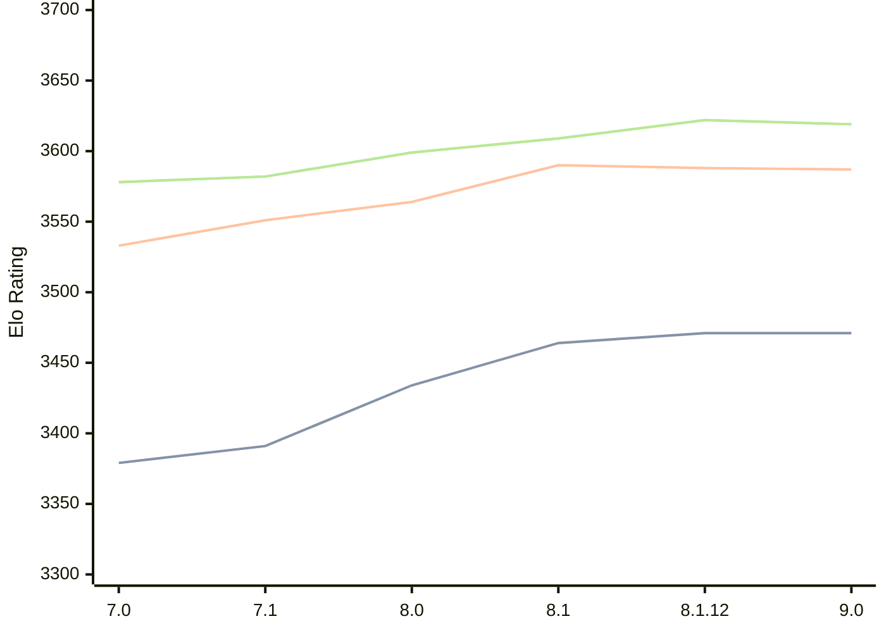

# Engine: Alexandria

Author: PGG106

Home: https://github.com/PGG106/Alexandria

## Elo Ratings

| Version | Published | STC 8.0+0.08s  | LTC 60.0+0.60s | VLTC 2m24s+1.12s | Comment |
| --- | --- | --- | --- | --- | --- |
| 9.0 | 2026-02-27 | 3471(0) | 3587(-1) | 3619(-3) |  |
| 8.1.12 | 2025-11-09 | 3471(+7) | 3588(-2) | 3622(+13) |  |
| 8.1 | 2025-08-16 | 3464(+30) | 3590(+26) | 3609(+10) |  |
| 8.0 | 2025-03-03 | 3434(+43) | 3564(+13) | 3599(+17) |  |
| 7.1 | 2024-10-26 | 3391(+12) | 3551(+18) | 3582(+4) |  |
| 7.0 | 2024-05-25 | 3379(+new) | 3533(+new) | 3578(+new) |  |
| 6.1.0 | 2024-03-24 |  |  |  |  |
| 6.0.0 | 2024-02-01 |  |  |  |  |
| 5.1.0 | 2023-11-29 |  |  |  |  |
| 5.0.0 | 2023-09-24 |  |  |  |  |
| 4.0.0 | 2023-07-28 |  |  |  |  |
| 3.5.0 | 2023-02-12 |  |  |  |  |
| 3.1.0 | 2022-12-06 |  |  |  |  |
| 3.0.2 | 2022-11-20 |  |  |  |  |
| 3.0.1 | 2022-11-10 |  |  |  |  |
| 2.4.0 | 2022-08-27 |  |  |  |  |
| 2.3.2 | 2022-08-10 |  |  |  |  |
| 2.3.1 | 2022-07-24 |  |  |  |  |
| 2.3.0 | 2022-07-13 |  |  |  |  |
| 2.2.0 | 2022-06-28 |  |  |  |  |
| 2.1.0 | 2022-06-19 |  |  |  |  |
| 2.0.0 | 2022-06-18 |  |  |  |  |
| 1.1.0 | 2022-06-10 |  |  |  |  |
| 1.0.0 | 2022-06-03 |  |  |  |  |
| 0.9.0 | 2022-05-30 |  |  |  |  |
 | | | cElo (∆ prev) | cElo (∆ prev) | cElo (∆ prev) | 

<a href="https://github.com/computer-chess-index/cci/issues/new?template=submit-version.yml&title=[VERSION]+Alexandria+<version>&body=###%20Engine%20name%0AAlexandria%0A%0A###%20Version%0A9.0" target="_blank">Submit new version</a>

 Test Conditions:

GUI/CLI: <a href=https://github.com/cutechess/cutechess target="_blank">Cute-Chess</a> 
Elo Calculation: <a href=https://www.remi-coulom.fr/Bayesian-Elo/ target="_blank">Bayesian-Elo</a> 
CPU: Intel(R) Core(TM) i5-7500T 2.70GHz 
Opening book: 8_moves_v3 
\* STC: 8.0+0.08s, LTC: 60.0+0.60s, VLTC: 2m24s+1.12s

 Lists:
Ratings: <a href=https://github.com/computer-chess-index/cci/blob/main/lists/CCIRatings.csv target="_blank">Complete list</a>

Generated: 2026-05-03 08:10:32

## Ratings Verlauf

⬛ STC (8.0+0.08s) &nbsp;&nbsp; 🟧 LTC (60.0+0.60s) &nbsp;&nbsp; 🟩 VLTC (2m24s+1.12s)

dark mode: 🟩STC (8.0+0.08s) 🟧LTC (60.0+0.60s) ⬜VLTC (2m24s+1.12s)

## Detailed Evaluation Results

| Version | Time Control | Elo  | Range +/- | Matches | Score | Average Opponent Elo | Draws |
| --- | --- | --- | --- | --- | --- | --- | --- |
| 9.0 | VLTC (2m24s+1.12s) | 3619 | 32 | 226 | 52% | 3603 | 87% |
| 9.0 | LTC (60.0+0.60s) | 3587 | 27 | 316 | 50% | 3583 | 91% |
| 9.0 | STC (8.0+0.08s) | 3471 | 23 | 448 | 50% | 3468 | 76% |
| --- | --- | --- | --- | --- | --- | --- | --- |
| 8.1.12 | VLTC (2m24s+1.12s) | 3622 | 34 | 202 | 51% | 3614 | 87% |
| 8.1.12 | LTC (60.0+0.60s) | 3588 | 30 | 256 | 49% | 3594 | 89% |
| 8.1.12 | STC (8.0+0.08s) | 3471 | 26 | 360 | 50% | 3470 | 77% |
| --- | --- | --- | --- | --- | --- | --- | --- |
| 8.1 | VLTC (2m24s+1.12s) | 3609 | 31 | 240 | 50% | 3609 | 90% |
| 8.1 | LTC (60.0+0.60s) | 3590 | 27 | 304 | 50% | 3588 | 89% |
| 8.1 | STC (8.0+0.08s) | 3464 | 26 | 348 | 50% | 3463 | 76% |
| --- | --- | --- | --- | --- | --- | --- | --- |
| 8.0 | VLTC (2m24s+1.12s) | 3599 | 26 | 348 | 51% | 3591 | 87% |
| 8.0 | LTC (60.0+0.60s) | 3564 | 23 | 428 | 50% | 3567 | 86% |
| 8.0 | STC (8.0+0.08s) | 3434 | 24 | 440 | 50% | 3436 | 75% |
| --- | --- | --- | --- | --- | --- | --- | --- |
| 7.1 | VLTC (2m24s+1.12s) | 3582 | 19 | 648 | 51% | 3575 | 87% |
| 7.1 | LTC (60.0+0.60s) | 3551 | 16 | 868 | 50% | 3552 | 83% |
| 7.1 | STC (8.0+0.08s) | 3391 | 16 | 964 | 50% | 3394 | 73% |
| --- | --- | --- | --- | --- | --- | --- | --- |
| 7.0 | VLTC (2m24s+1.12s) | 3578 | 30 | 268 | 56% | 3499 | 84% |
| 7.0 | LTC (60.0+0.60s) | 3533 | 33 | 212 | 51% | 3526 | 83% |
| 7.0 | STC (8.0+0.08s) | 3379 | 32 | 244 | 52% | 3360 | 68% |
| --- | --- | --- | --- | --- | --- | --- | --- |