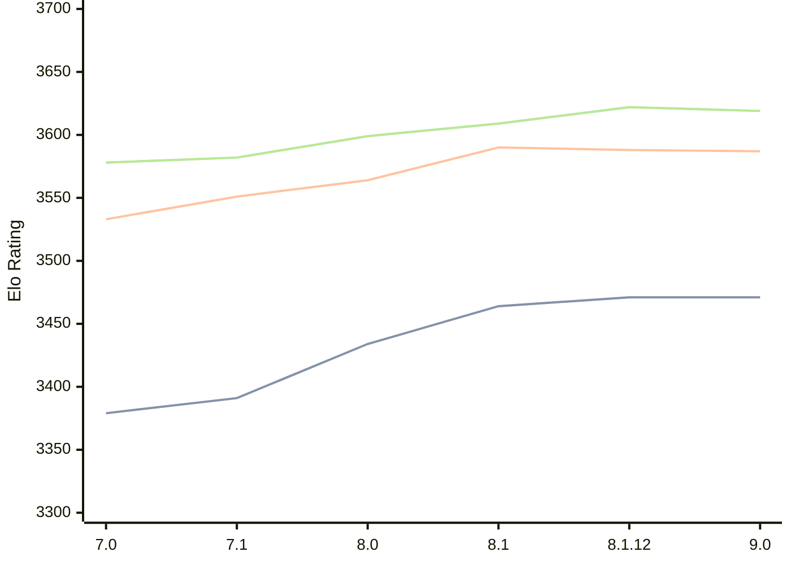

# Engine: Alexandria

Author: PGG106

Home: https://github.com/PGG106/Alexandria

## Elo Ratings

| Version | Published | STC 8.0+0.08s  | LTC 60.0+0.60s | VLTC 2m24s+1.12s | Comment |
| --- | --- | --- | --- | --- | --- |
| 9.0 | 2026-02-27 | 3471(0) | 3587(-1) | 3619(-3) |  |
| 8.1.12 | 2025-11-09 | 3471(+7) | 3588(-2) | 3622(+13) |  |
| 8.1 | 2025-08-16 | 3464(+30) | 3590(+26) | 3609(+10) |  |
| 8.0 | 2025-03-03 | 3434(+43) | 3564(+13) | 3599(+17) |  |
| 7.1 | 2024-10-26 | 3391(+12) | 3551(+18) | 3582(+4) |  |
| 7.0 | 2024-05-25 | 3379(+new) | 3533(+new) | 3578(+new) |  |
| 6.1.0 | 2024-03-24 |  |  |  |  |
| 6.0.0 | 2024-02-01 |  |  |  |  |
| 5.1.0 | 2023-11-29 |  |  |  |  |
| 5.0.0 | 2023-09-24 |  |  |  |  |
| 4.0.0 | 2023-07-28 |  |  |  |  |
| 3.5.0 | 2023-02-12 |  |  |  |  |
| 3.1.0 | 2022-12-06 |  |  |  |  |
| 3.0.2 | 2022-11-20 |  |  |  |  |
| 3.0.1 | 2022-11-10 |  |  |  |  |
| 2.4.0 | 2022-08-27 |  |  |  |  |
| 2.3.2 | 2022-08-10 |  |  |  |  |
| 2.3.1 | 2022-07-24 |  |  |  |  |
| 2.3.0 | 2022-07-13 |  |  |  |  |
| 2.2.0 | 2022-06-28 |  |  |  |  |
| 2.1.0 | 2022-06-19 |  |  |  |  |
| 2.0.0 | 2022-06-18 |  |  |  |  |
| 1.1.0 | 2022-06-10 |  |  |  |  |
| 1.0.0 | 2022-06-03 |  |  |  |  |
| 0.9.0 | 2022-05-30 |  |  |  |  |
 | | | cElo (∆ prev) | cElo (∆ prev) | cElo (∆ prev) | 

<a href="https://github.com/computer-chess-index/cci/issues/new?template=submit-version.yml&title=[VERSION]+Alexandria+<version>&body=###%20Engine%20name%0AAlexandria%0A%0A###%20Version%0A9.0" target="_blank">Submit new version</a>

 Test Conditions:

GUI/CLI: <a href=https://github.com/cutechess/cutechess target="_blank">Cute-Chess</a> 
Elo Calculation: <a href=https://www.remi-coulom.fr/Bayesian-Elo/ target="_blank">Bayesian-Elo</a> 
CPU: Intel(R) Core(TM) i5-7500T 2.70GHz 
Opening book: 8_moves_v3 
\* STC: 8.0+0.08s, LTC: 60.0+0.60s, VLTC: 2m24s+1.12s

 Lists:
Ratings: <a href=https://github.com/computer-chess-index/cci/blob/main/lists/CCIRatings.csv target="_blank">Complete list</a>

Generated: 2026-05-03 08:06:54

## Ratings Verlauf

⬛ STC (8.0+0.08s) &nbsp;&nbsp; 🟧 LTC (60.0+0.60s) &nbsp;&nbsp; 🟩 VLTC (2m24s+1.12s)

dark mode: 🟩STC (8.0+0.08s) 🟧LTC (60.0+0.60s) ⬜VLTC (2m24s+1.12s)

## Detailed Evaluation Results

| Version | Time Control | Elo  | Range +/- | Matches | Score | Average Opponent Elo | Draws |
| --- | --- | --- | --- | --- | --- | --- | --- |
| 9.0 | VLTC (2m24s+1.12s) | 3619 | 32 | 226 | 52% | 3603 | 87% |
| 9.0 | D1 | 574 | 41 | 220 | 49% | 628 | 40% |
| 9.0 | D10 | 3154 | 28 | 340 | 49% | 3160 | 60% |
| 9.0 | D11 | 3270 | 28 | 334 | 50% | 3267 | 66% |
| 9.0 | D12 | 3336 | 27 | 328 | 50% | 3339 | 75% |
| 9.0 | D13 | 3387 | 26 | 360 | 49% | 3393 | 74% |
| 9.0 | D14 | 3428 | 25 | 378 | 50% | 3426 | 77% |
| 9.0 | D15 | 3487 | 26 | 368 | 50% | 3484 | 77% |
| 9.0 | D16 | 3506 | 25 | 380 | 49% | 3509 | 81% |
| 9.0 | D17 | 3514 | 24 | 396 | 50% | 3517 | 83% |
| 9.0 | D18 | 3544 | 26 | 360 | 50% | 3545 | 79% |
| 9.0 | D19 | 3565 | 24 | 396 | 50% | 3565 | 90% |
| 9.0 | D2 | 759 | 39 | 240 | 56% | 690 | 47% |
| 9.0 | D20 | 3587 | 26 | 352 | 51% | 3580 | 87% |
| 9.0 | D21 | 3587 | 26 | 336 | 50% | 3587 | 89% |
| 9.0 | D22 | 3605 | 27 | 300 | 50% | 3602 | 91% |
| 9.0 | D23 | 3613 | 31 | 232 | 51% | 3607 | 92% |
| 9.0 | D24 | 3626 | 35 | 184 | 52% | 3611 | 91% |
| 9.0 | D25 | 3625 | 36 | 176 | 52% | 3614 | 92% |
| 9.0 | D3 | 971 | 35 | 260 | 49% | 976 | 39% |
| 9.0 | D4 | 1299 | 33 | 264 | 45% | 1338 | 49% |
| 9.0 | D5 | 1565 | 28 | 380 | 44% | 1607 | 52% |
| 9.0 | D6 | 1993 | 27 | 420 | 45% | 2030 | 49% |
| 9.0 | D7 | 2433 | 27 | 410 | 50% | 2438 | 50% |
| 9.0 | D8 | 2815 | 29 | 346 | 49% | 2819 | 49% |
| 9.0 | D9 | 2992 | 29 | 340 | 52% | 2973 | 49% |
| 9.0 | S10 | 3494 | 28 | 296 | 51% | 3488 | 83% |
| 9.0 | S40 | 3579 | 30 | 252 | 51% | 3576 | 89% |
| 9.0 | LTC (60.0+0.60s) | 3587 | 27 | 316 | 50% | 3583 | 91% |
| 9.0 | STC (8.0+0.08s) | 3471 | 23 | 448 | 50% | 3468 | 76% |
| --- | --- | --- | --- | --- | --- | --- | --- |
| 8.1.12 | VLTC (2m24s+1.12s) | 3622 | 34 | 202 | 51% | 3614 | 87% |
| 8.1.12 | D1 | 799 | 44 | 200 | 55% | 755 | 19% |
| 8.1.12 | D10 | 3125 | 26 | 406 | 50% | 3124 | 58% |
| 8.1.12 | D11 | 3244 | 25 | 420 | 52% | 3231 | 59% |
| 8.1.12 | D12 | 3289 | 26 | 370 | 50% | 3290 | 67% |
| 8.1.12 | D13 | 3352 | 26 | 361 | 51% | 3343 | 70% |
| 8.1.12 | D14 | 3403 | 24 | 412 | 51% | 3397 | 74% |
| 8.1.12 | D15 | 3443 | 23 | 460 | 50% | 3441 | 76% |
| 8.1.12 | D16 | 3468 | 24 | 402 | 51% | 3464 | 81% |
| 8.1.12 | D17 | 3490 | 26 | 340 | 50% | 3491 | 80% |
| 8.1.12 | D18 | 3514 | 25 | 386 | 51% | 3509 | 81% |
| 8.1.12 | D19 | 3529 | 23 | 446 | 50% | 3526 | 80% |
| 8.1.12 | D2 | 1175 | 37 | 280 | 49% | 1180 | 11% |
| 8.1.12 | D20 | 3552 | 22 | 500 | 50% | 3556 | 85% |
| 8.1.12 | D21 | 3568 | 24 | 412 | 50% | 3567 | 87% |
| 8.1.12 | D22 | 3579 | 25 | 368 | 50% | 3580 | 93% |
| 8.1.12 | D23 | 3600 | 27 | 314 | 50% | 3598 | 89% |
| 8.1.12 | D24 | 3594 | 27 | 312 | 51% | 3590 | 89% |
| 8.1.12 | D25 | 3610 | 27 | 296 | 51% | 3605 | 92% |
| 8.1.12 | D3 | 1235 | 38 | 276 | 52% | 1214 | 11% |
| 8.1.12 | D4 | 1577 | 38 | 264 | 50% | 1580 | 14% |
| 8.1.12 | D5 | 1763 | 32 | 362 | 50% | 1760 | 20% |
| 8.1.12 | D6 | 2184 | 34 | 304 | 51% | 2178 | 26% |
| 8.1.12 | D7 | 2560 | 30 | 372 | 52% | 2537 | 31% |
| 8.1.12 | D8 | 2820 | 29 | 368 | 54% | 2782 | 39% |
| 8.1.12 | D9 | 2993 | 29 | 360 | 52% | 2978 | 46% |
| 8.1.12 | S10 | 3486 | 27 | 328 | 49% | 3491 | 77% |
| 8.1.12 | S40 | 3578 | 29 | 284 | 52% | 3561 | 83% |
| 8.1.12 | LTC (60.0+0.60s) | 3588 | 30 | 256 | 49% | 3594 | 89% |
| 8.1.12 | STC (8.0+0.08s) | 3471 | 26 | 360 | 50% | 3470 | 77% |
| --- | --- | --- | --- | --- | --- | --- | --- |
| 8.1 | VLTC (2m24s+1.12s) | 3609 | 31 | 240 | 50% | 3609 | 90% |
| 8.1 | D1 | 829 | 36 | 288 | 55% | 761 | 24% |
| 8.1 | D10 | 3120 | 27 | 376 | 49% | 3125 | 53% |
| 8.1 | D11 | 3217 | 29 | 324 | 50% | 3217 | 59% |
| 8.1 | D12 | 3286 | 28 | 344 | 50% | 3282 | 63% |
| 8.1 | D13 | 3345 | 28 | 336 | 51% | 3341 | 67% |
| 8.1 | D14 | 3371 | 28 | 328 | 49% | 3379 | 73% |
| 8.1 | D15 | 3447 | 27 | 324 | 50% | 3445 | 81% |
| 8.1 | D16 | 3471 | 27 | 336 | 49% | 3474 | 77% |
| 8.1 | D17 | 3492 | 27 | 336 | 51% | 3487 | 79% |
| 8.1 | D18 | 3518 | 27 | 328 | 50% | 3518 | 79% |
| 8.1 | D19 | 3541 | 27 | 324 | 50% | 3541 | 86% |
| 8.1 | D2 | 1137 | 33 | 336 | 51% | 1129 | 16% |
| 8.1 | D20 | 3564 | 26 | 348 | 49% | 3571 | 86% |
| 8.1 | D21 | 3565 | 26 | 320 | 51% | 3559 | 92% |
| 8.1 | D22 | 3586 | 29 | 272 | 50% | 3584 | 90% |
| 8.1 | D23 | 3588 | 28 | 296 | 52% | 3578 | 87% |
| 8.1 | D24 | 3600 | 28 | 284 | 50% | 3600 | 88% |
| 8.1 | D25 | 3602 | 28 | 280 | 50% | 3600 | 89% |
| 8.1 | D3 | 1215 | 33 | 356 | 52% | 1196 | 13% |
| 8.1 | D4 | 1486 | 35 | 304 | 50% | 1482 | 12% |
| 8.1 | D5 | 1712 | 35 | 288 | 50% | 1713 | 23% |
| 8.1 | D6 | 2115 | 34 | 308 | 52% | 2095 | 23% |
| 8.1 | D7 | 2476 | 31 | 331 | 50% | 2477 | 31% |
| 8.1 | D8 | 2803 | 30 | 348 | 53% | 2776 | 41% |
| 8.1 | D9 | 2958 | 30 | 312 | 53% | 2935 | 51% |
| 8.1 | S10 | 3487 | 27 | 336 | 50% | 3490 | 78% |
| 8.1 | S40 | 3540 | 28 | 292 | 50% | 3541 | 86% |
| 8.1 | LTC (60.0+0.60s) | 3590 | 27 | 304 | 50% | 3588 | 89% |
| 8.1 | STC (8.0+0.08s) | 3464 | 26 | 348 | 50% | 3463 | 76% |
| --- | --- | --- | --- | --- | --- | --- | --- |
| 8.0 | VLTC (2m24s+1.12s) | 3599 | 26 | 348 | 51% | 3591 | 87% |
| 8.0 | D1 | 851 | 38 | 296 | 52% | 806 | 17% |
| 8.0 | D10 | 3031 | 27 | 400 | 52% | 3016 | 55% |
| 8.0 | D11 | 3144 | 26 | 392 | 51% | 3137 | 61% |
| 8.0 | D12 | 3208 | 26 | 384 | 51% | 3206 | 66% |
| 8.0 | D13 | 3306 | 25 | 420 | 50% | 3305 | 69% |
| 8.0 | D14 | 3375 | 23 | 456 | 50% | 3372 | 71% |
| 8.0 | D15 | 3409 | 24 | 412 | 50% | 3407 | 77% |
| 8.0 | D16 | 3441 | 24 | 424 | 50% | 3440 | 79% |
| 8.0 | D17 | 3495 | 23 | 452 | 51% | 3490 | 82% |
| 8.0 | D18 | 3513 | 23 | 442 | 49% | 3518 | 83% |
| 8.0 | D19 | 3507 | 23 | 448 | 51% | 3502 | 85% |
| 8.0 | D2 | 1116 | 31 | 396 | 50% | 1119 | 16% |
| 8.0 | D20 | 3542 | 22 | 460 | 49% | 3549 | 87% |
| 8.0 | D21 | 3552 | 23 | 460 | 51% | 3546 | 85% |
| 8.0 | D22 | 3582 | 23 | 428 | 50% | 3579 | 85% |
| 8.0 | D23 | 3586 | 23 | 412 | 50% | 3583 | 91% |
| 8.0 | D24 | 3590 | 24 | 400 | 51% | 3583 | 90% |
| 8.0 | D25 | 3610 | 29 | 272 | 52% | 3598 | 91% |
| 8.0 | D3 | 1187 | 31 | 388 | 51% | 1183 | 13% |
| 8.0 | D4 | 1450 | 31 | 400 | 50% | 1447 | 16% |
| 8.0 | D5 | 1632 | 30 | 392 | 49% | 1639 | 21% |
| 8.0 | D6 | 1920 | 30 | 384 | 49% | 1922 | 27% |
| 8.0 | D7 | 2325 | 30 | 384 | 52% | 2306 | 25% |
| 8.0 | D8 | 2628 | 29 | 380 | 51% | 2624 | 41% |
| 8.0 | D9 | 2871 | 28 | 384 | 51% | 2867 | 47% |
| 8.0 | S10 | 3447 | 24 | 424 | 51% | 3441 | 74% |
| 8.0 | S40 | 3546 | 24 | 416 | 50% | 3546 | 86% |
| 8.0 | LTC (60.0+0.60s) | 3564 | 23 | 428 | 50% | 3567 | 86% |
| 8.0 | STC (8.0+0.08s) | 3434 | 24 | 440 | 50% | 3436 | 75% |
| --- | --- | --- | --- | --- | --- | --- | --- |
| 7.1 | VLTC (2m24s+1.12s) | 3582 | 19 | 648 | 51% | 3575 | 87% |
| 7.1 | D1 | 879 | 26 | 592 | 53% | 825 | 19% |
| 7.1 | D10 | 2827 | 20 | 736 | 49% | 2832 | 42% |
| 7.1 | D11 | 3038 | 18 | 884 | 46% | 3077 | 51% |
| 7.1 | D12 | 3125 | 19 | 784 | 50% | 3128 | 59% |
| 7.1 | D13 | 3222 | 17 | 924 | 48% | 3240 | 64% |
| 7.1 | D14 | 3289 | 18 | 780 | 50% | 3290 | 68% |
| 7.1 | D15 | 3362 | 17 | 848 | 50% | 3359 | 68% |
| 7.1 | D16 | 3386 | 17 | 840 | 50% | 3386 | 70% |
| 7.1 | D17 | 3420 | 17 | 840 | 50% | 3422 | 78% |
| 7.1 | D18 | 3464 | 17 | 827 | 50% | 3465 | 80% |
| 7.1 | D19 | 3487 | 17 | 852 | 51% | 3482 | 79% |
| 7.1 | D2 | 1088 | 21 | 856 | 46% | 1142 | 14% |
| 7.1 | D20 | 3514 | 17 | 840 | 50% | 3514 | 83% |
| 7.1 | D21 | 3524 | 17 | 832 | 50% | 3524 | 81% |
| 7.1 | D22 | 3538 | 17 | 764 | 50% | 3540 | 85% |
| 7.1 | D23 | 3553 | 17 | 768 | 51% | 3551 | 87% |
| 7.1 | D3 | 1080 | 21 | 868 | 47% | 1123 | 14% |
| 7.1 | D4 | 1261 | 21 | 852 | 50% | 1270 | 13% |
| 7.1 | D5 | 1501 | 23 | 728 | 50% | 1509 | 18% |
| 7.1 | D6 | 1748 | 22 | 764 | 50% | 1758 | 22% |
| 7.1 | D7 | 1987 | 22 | 752 | 50% | 1995 | 26% |
| 7.1 | D8 | 2340 | 22 | 692 | 50% | 2340 | 26% |
| 7.1 | D9 | 2624 | 20 | 764 | 50% | 2624 | 40% |
| 7.1 | S10 | 3429 | 17 | 904 | 50% | 3426 | 74% |
| 7.1 | S40 | 3536 | 16 | 904 | 50% | 3536 | 85% |
| 7.1 | LTC (60.0+0.60s) | 3551 | 16 | 868 | 50% | 3552 | 83% |
| 7.1 | STC (8.0+0.08s) | 3391 | 16 | 964 | 50% | 3394 | 73% |
| --- | --- | --- | --- | --- | --- | --- | --- |
| 7.0 | VLTC (2m24s+1.12s) | 3578 | 30 | 268 | 56% | 3499 | 84% |
| 7.0 | D1 | 1056 | 18 | 1204 | 48% | 1079 | 17% |
| 7.0 | D10 | 2797 | 18 | 924 | 50% | 2797 | 49% |
| 7.0 | D11 | 2940 | 17 | 991 | 49% | 2947 | 51% |
| 7.0 | D12 | 3071 | 15 | 1140 | 51% | 3065 | 60% |
| 7.0 | D13 | 3182 | 16 | 1004 | 50% | 3182 | 62% |
| 7.0 | D14 | 3235 | 16 | 1016 | 51% | 3186 | 64% |
| 7.0 | D15 | 3275 | 16 | 1060 | 51% | 3267 | 67% |
| 7.0 | D16 | 3340 | 14 | 1212 | 51% | 3330 | 71% |
| 7.0 | D17 | 3374 | 17 | 908 | 49% | 3378 | 74% |
| 7.0 | D18 | 3411 | 15 | 1095 | 50% | 3414 | 78% |
| 7.0 | D19 | 3433 | 15 | 1033 | 50% | 3434 | 80% |
| 7.0 | D2 | 1366 | 21 | 840 | 52% | 1346 | 18% |
| 7.0 | D20 | 3460 | 16 | 924 | 51% | 3456 | 81% |
| 7.0 | D21 | 3490 | 16 | 886 | 48% | 3506 | 82% |
| 7.0 | D22 | 3499 | 19 | 660 | 50% | 3499 | 83% |
| 7.0 | D23 | 3513 | 19 | 664 | 51% | 3502 | 83% |
| 7.0 | D3 | 1532 | 18 | 1116 | 52% | 1508 | 15% |
| 7.0 | D4 | 1694 | 19 | 972 | 50% | 1700 | 21% |
| 7.0 | D5 | 1848 | 18 | 1056 | 52% | 1827 | 23% |
| 7.0 | D6 | 1994 | 19 | 964 | 51% | 1986 | 24% |
| 7.0 | D7 | 2147 | 20 | 873 | 50% | 2147 | 28% |
| 7.0 | D8 | 2368 | 19 | 904 | 50% | 2372 | 28% |
| 7.0 | D9 | 2607 | 18 | 956 | 49% | 2619 | 36% |
| 7.0 | S10 | 3393 | 35 | 200 | 51% | 3389 | 75% |
| 7.0 | S40 | 3506 | 38 | 169 | 50% | 3507 | 76% |
| 7.0 | LTC (60.0+0.60s) | 3533 | 33 | 212 | 51% | 3526 | 83% |
| 7.0 | STC (8.0+0.08s) | 3379 | 32 | 244 | 52% | 3360 | 68% |
| --- | --- | --- | --- | --- | --- | --- | --- |
| 6.1.0 |  |  |  |  |  |  |  |
| 6.0.0 |  |  |  |  |  |  |  |
| 5.1.0 |  |  |  |  |  |  |  |
| 5.0.0 |  |  |  |  |  |  |  |
| 4.0.0 |  |  |  |  |  |  |  |
| 3.5.0 |  |  |  |  |  |  |  |
| 3.1.0 |  |  |  |  |  |  |  |
| 3.0.2 |  |  |  |  |  |  |  |
| 3.0.1 |  |  |  |  |  |  |  |
| 2.4.0 |  |  |  |  |  |  |  |
| 2.3.2 |  |  |  |  |  |  |  |
| 2.3.1 |  |  |  |  |  |  |  |
| 2.3.0 |  |  |  |  |  |  |  |
| 2.2.0 |  |  |  |  |  |  |  |
| 2.1.0 |  |  |  |  |  |  |  |
| 2.0.0 |  |  |  |  |  |  |  |
| 1.1.0 |  |  |  |  |  |  |  |
| 1.0.0 |  |  |  |  |  |  |  |
| 0.9.0 |  |  |  |  |  |  |  |