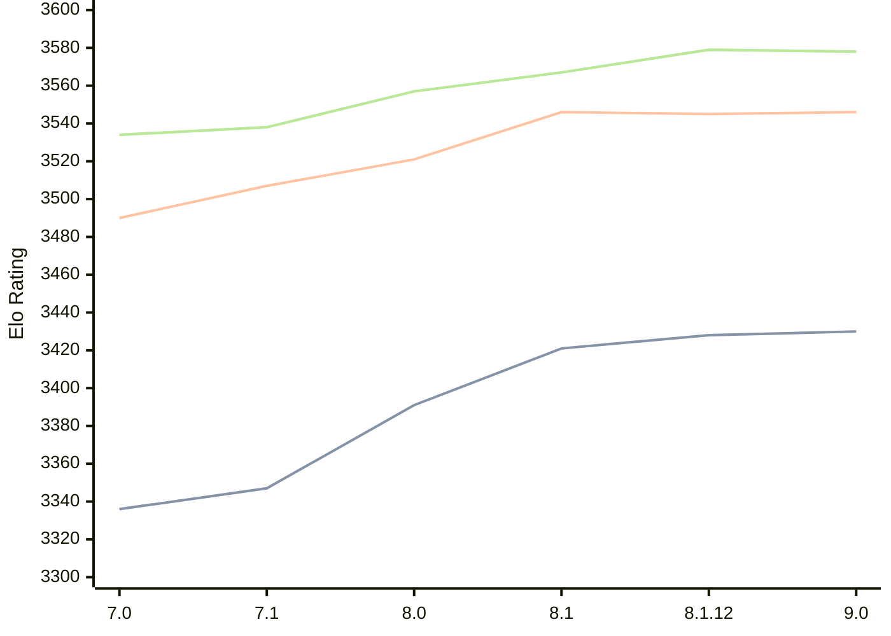

# Engine: Alexandria

Author: PGG106

Home: https://github.com/PGG106/Alexandria

## Elo Ratings

| Version | Published | STC 8.0+0.08s  | LTC 60.0+0.60s | VLTC 2m24s+1.12s | Comment |
| --- | --- | --- | --- | --- | --- |
| 9.0 | 2026-02-27 | 3430(+2) | 3546(+1) | 3578(-1) |  |
| 8.1.12 | 2025-11-09 | 3428(+7) | 3545(-1) | 3579(+12) |  |
| 8.1 | 2025-08-16 | 3421(+30) | 3546(+25) | 3567(+10) |  |
| 8.0 | 2025-03-03 | 3391(+44) | 3521(+14) | 3557(+19) |  |
| 7.1 | 2024-10-26 | 3347(+11) | 3507(+17) | 3538(+4) |  |
| 7.0 | 2024-05-25 | 3336 | 3490 | 3534 |  |
 | | | cElo (∆ prev) | cElo (∆ prev) | cElo (∆ prev) | 

<a href="https://github.com/computer-chess-index/cci/issues/new?template=submit-version.yml&title=[VERSION]+Alexandria+<version>&body=###%20Engine%20name%0AAlexandria%0A%0A###%20Version%0A9.0" target="_blank">Submit new version</a>

 Test Conditions:

GUI/CLI: <a href=https://github.com/cutechess/cutechess target="_blank">Cute-Chess</a> 
Elo Calculation: <a href=https://www.remi-coulom.fr/Bayesian-Elo/ target="_blank">Bayesian-Elo</a> 
CPU: Intel(R) Core(TM) i5-7500T 2.70GHz 
Opening book: 8_moves_v3 
\* STC: 8.0+0.08s, LTC: 60.0+0.60s, VLTC: 2m24s+1.12s

 Lists:
Ratings: <a href=https://github.com/computer-chess-index/cci/blob/main/lists/CCIRatings.csv target="_blank">Complete list</a>

Generated: 2026-08-27 07:31:55

## Ratings Verlauf

## Detailed Evaluation Results

| Version | Time Control | Elo  | Range +/- | Matches | Score | Average Opponent Elo | Draws |
| --- | --- | --- | --- | --- | --- | --- | --- |
| 9.0 | VLTC (2m24s+1.12s) | 3578 | 27 | 322 | 52% | 3563 | 88% |
| 9.0 | LTC (60.0+0.60s) | 3546 | 23 | 420 | 51% | 3542 | 90% |
| 9.0 | STC (8.0+0.08s) | 3430 | 20 | 610 | 51% | 3425 | 77% |
| --- | --- | --- | --- | --- | --- | --- | --- |
| 8.1.12 | VLTC (2m24s+1.12s) | 3579 | 34 | 202 | 51% | 3571 | 87% |
| 8.1.12 | LTC (60.0+0.60s) | 3545 | 30 | 256 | 49% | 3552 | 89% |
| 8.1.12 | STC (8.0+0.08s) | 3428 | 26 | 360 | 50% | 3426 | 77% |
| --- | --- | --- | --- | --- | --- | --- | --- |
| 8.1 | VLTC (2m24s+1.12s) | 3567 | 31 | 240 | 50% | 3565 | 90% |
| 8.1 | LTC (60.0+0.60s) | 3546 | 27 | 304 | 50% | 3546 | 89% |
| 8.1 | STC (8.0+0.08s) | 3421 | 26 | 348 | 50% | 3418 | 76% |
| --- | --- | --- | --- | --- | --- | --- | --- |
| 8.0 | VLTC (2m24s+1.12s) | 3557 | 26 | 348 | 51% | 3548 | 87% |
| 8.0 | LTC (60.0+0.60s) | 3521 | 23 | 428 | 50% | 3524 | 86% |
| 8.0 | STC (8.0+0.08s) | 3391 | 24 | 440 | 50% | 3393 | 75% |
| --- | --- | --- | --- | --- | --- | --- | --- |
| 7.1 | VLTC (2m24s+1.12s) | 3538 | 19 | 648 | 51% | 3532 | 87% |
| 7.1 | LTC (60.0+0.60s) | 3507 | 16 | 868 | 50% | 3507 | 83% |
| 7.1 | STC (8.0+0.08s) | 3347 | 16 | 964 | 50% | 3349 | 73% |
| --- | --- | --- | --- | --- | --- | --- | --- |
| 7.0 | VLTC (2m24s+1.12s) | 3534 | 30 | 268 | 56% | 3456 | 84% |
| 7.0 | LTC (60.0+0.60s) | 3490 | 33 | 212 | 51% | 3483 | 83% |
| 7.0 | STC (8.0+0.08s) | 3336 | 32 | 244 | 52% | 3316 | 68% |
| --- | --- | --- | --- | --- | --- | --- | --- |