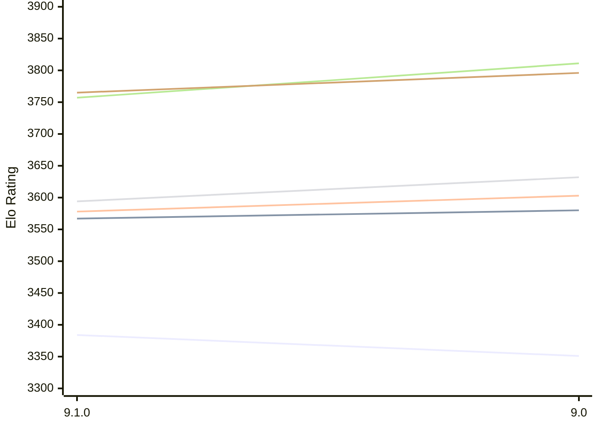
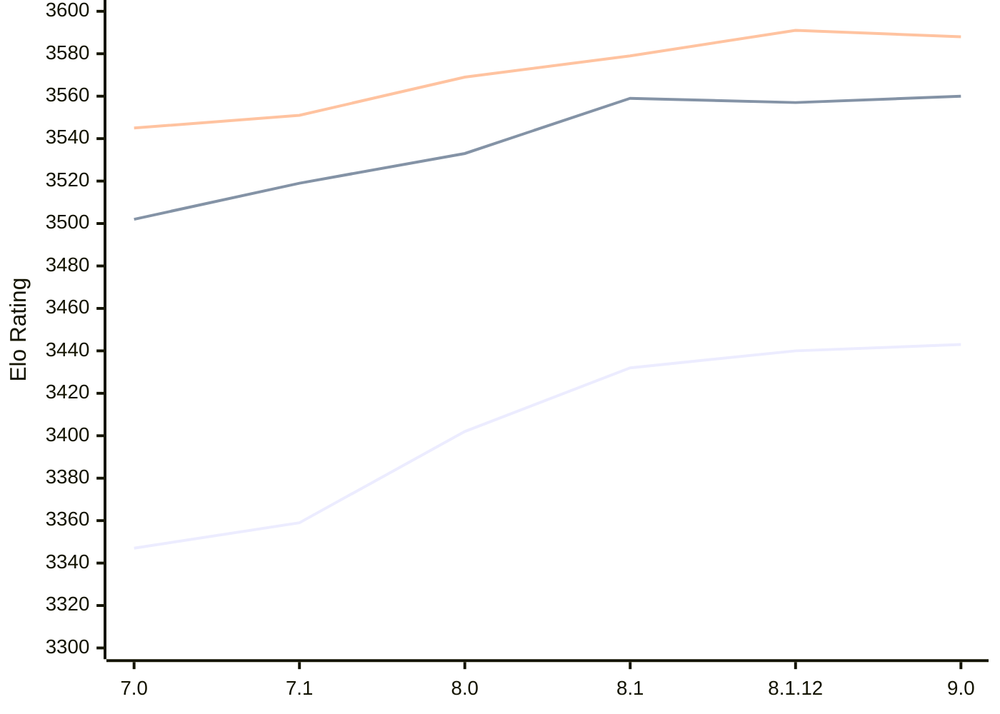

# Engine: Alexandria

Author: PGG106

Home: https://github.com/PGG106/Alexandria

## Elo Ratings E1

| Version | Published | STC 8.0+0.08s  | LTC 60.0+0.60s | VLTC 2m24s+1.12s | Comment |
| --- | --- | --- | --- | --- | --- |
| 9.1.0 | 2026-10-04 | 3384(+33) | 3567(-13) | 3578(-25) |  |
| 9.0 | 2026-02-27 | 3351 | 3580 | 3603 |  |
 | | | cElo (∆ prev) | cElo (∆ prev) | cElo (∆ prev) | 

## Elo Ratings P1

| Version | Published | STC 8.0+0.08s  | LTC 60.0+0.60s | VLTC 2m24s+1.12s | Comment |
| --- | --- | --- | --- | --- | --- |
| 9.1.0 | 2026-10-04 | 3632(+38) | 3811(+54) | 3796(+31) |  |
| 9.0 | 2026-02-27 | 3594 | 3757 | 3765 |  |
 | | | cElo (∆ prev) | cElo (∆ prev) | cElo (∆ prev) | 

## Elo Ratings T1

| Version | Published | STC 8.0+0.08s  | LTC 60.0+0.60s | VLTC 2m24s+1.12s | Comment |
| --- | --- | --- | --- | --- | --- |
| 9.0 | 2026-02-27 | 3443(+3) | 3560(+3) | 3588(-3) |  |
| 8.1.12 | 2025-11-09 | 3440(+8) | 3557(-2) | 3591(+12) |  |
| 8.1 | 2025-08-16 | 3432(+30) | 3559(+26) | 3579(+10) |  |
| 8.0 | 2025-03-03 | 3402(+43) | 3533(+14) | 3569(+18) |  |
| 7.1 | 2024-10-26 | 3359(+12) | 3519(+17) | 3551(+6) |  |
| 7.0 | 2024-05-25 | 3347 | 3502 | 3545 |  |
 | | | cElo (∆ prev) | cElo (∆ prev) | cElo (∆ prev) | 

<a href="https://github.com/computer-chess-index/cci/issues/new?template=submit-version.yml&title=[VERSION]+Alexandria+<version>&body=###%20Engine%20name%0AAlexandria%0A%0A###%20Version%0A9.0" target="_blank">Submit new version</a>

 Test Conditions:

GUI/CLI: <a href=https://github.com/cutechess/cutechess target="_blank">Cute-Chess</a> 
Elo Calculation: <a href=https://www.remi-coulom.fr/Bayesian-Elo/ target="_blank">Bayesian-Elo</a> 
CPU for P1: Intel(R) Core(TM) Ultra 7 265T (1.50 GHz) - P-Core 
CPU for E1: Intel(R) Core(TM) Ultra 7 265T (1.50 GHz) - E-Core 
CPU for T1: Intel(R) Core(TM) i5-7500T 2.70GHz 
Opening book: 8_moves_v3 
\* STC: 8.0+0.08s, LTC: 60.0+0.60s, VLTC: 2m24s+1.12s

 Lists:
Ratings: <a href=https://github.com/computer-chess-index/cci/blob/main/lists/CCIRatings.csv target="_blank">Complete list</a>

Generated: 2026-10-11 11:11:56

## Ratings Verlauf E1 / P1

```mermaid
%%{init: {"theme":"base","themeVariables":{"seriesColors:['#a3a3a3','#222221','#faa371']}}}%%
xychart-beta
  x-axis ["9.1.0", "9.0"]
  y-axis "Elo Rating" 3300 --> 3900
  line "E1: STC (8.0+0.08s)" [3384, 3351]
  line "E1: LTC (60.0+0.60s)" [3567, 3580]
  line "E1: VLTC (2m24s+1.12s)" [3578, 3603]
  line "P1: STC (8.0+0.08s)" [3594, 3632]
  line "P1: LTC (60.0+0.60s)" [3757, 3811]
  line "P1: VLTC (2m24s+1.12s)" [3765, 3796]
```

## Ratings Verlauf T1

```mermaid
%%{init: {"theme":"base","themeVariables":{"seriesColors:['#a3a3a3','#222221','#faa371']}}}%%
xychart-beta
  x-axis ["7.0", "7.1", "8.0", "8.1", "8.1.12", "9.0"]
  y-axis "Elo Rating" 3300 --> 3600
  line "T1: STC (8.0+0.08s)" [3347, 3359, 3402, 3432, 3440, 3443]
  line "T1: LTC (60.0+0.60s)" [3502, 3519, 3533, 3559, 3557, 3560]
  line "T1: VLTC (2m24s+1.12s)" [3545, 3551, 3569, 3579, 3591, 3588]
```

## Detailed Evaluation Results

| Version | Time Control | Elo  | Range +/- | Matches | Score | Average Opponent Elo | Draws |
| --- | --- | --- | --- | --- | --- | --- | --- |
| 9.1.0 | VLTC (2m24s+1.12s) | 3796 | 159 | 8 | 56% | 3764 | 88% |
| 9.1.0 | VLTC (2m24s+1.12s) | 3578 | 89 | 28 | 45% | 3614 | 82% |
| 9.1.0 | LTC (60.0+0.60s) | 3811 | 140 | 12 | 58% | 3757 | 67% |
| 9.1.0 | LTC (60.0+0.60s) | 3567 | 84 | 32 | 45% | 3596 | 84% |
| 9.1.0 | STC (8.0+0.08s) | 3632 | 118 | 16 | 53% | 3613 | 81% |
| --- | --- | --- | --- | --- | --- | --- | --- |
| 9.1.0 | STC (8.0+0.08s) | 3384 | 103 | 20 | 53% | 3371 | 95% |
| --- | --- | --- | --- | --- | --- | --- | --- |
| 9.0 | VLTC (2m24s+1.12s) | 3603 | 45 | 112 | 50% | 3603 | 89% |
| 9.0 | VLTC (2m24s+1.12s) | 3588 | 26 | 342 | 51% | 3576 | 88% |
| 9.0 | VLTC (2m24s+1.12s) | 3765 | 54 | 76 | 50% | 3764 | 92% |
| 9.0 | LTC (60.0+0.60s) | 3757 | 51 | 84 | 51% | 3754 | 92% |
| 9.0 | LTC (60.0+0.60s) | 3560 | 23 | 444 | 51% | 3555 | 90% |
| 9.0 | LTC (60.0+0.60s) | 3580 | 46 | 108 | 50% | 3576 | 88% |
| 9.0 | STC (8.0+0.08s) | 3594 | 38 | 170 | 49% | 3599 | 74% |
| --- | --- | --- | --- | --- | --- | --- | --- |
| 9.0 | STC (8.0+0.08s) | 3443 | 19 | 642 | 51% | 3437 | 77% |
| --- | --- | --- | --- | --- | --- | --- | --- |
| 9.0 | STC (8.0+0.08s) | 3351 | 30 | 268 | 46% | 3378 | 72% |
| --- | --- | --- | --- | --- | --- | --- | --- |
| 8.1.12 | VLTC (2m24s+1.12s) | 3591 | 34 | 202 | 51% | 3583 | 87% |
| 8.1.12 | LTC (60.0+0.60s) | 3557 | 30 | 256 | 49% | 3564 | 89% |
| 8.1.12 | STC (8.0+0.08s) | 3440 | 26 | 360 | 50% | 3438 | 77% |
| --- | --- | --- | --- | --- | --- | --- | --- |
| 8.1 | VLTC (2m24s+1.12s) | 3579 | 31 | 240 | 50% | 3578 | 90% |
| 8.1 | LTC (60.0+0.60s) | 3559 | 27 | 304 | 50% | 3559 | 89% |
| 8.1 | STC (8.0+0.08s) | 3432 | 26 | 348 | 50% | 3430 | 76% |
| --- | --- | --- | --- | --- | --- | --- | --- |
| 8.0 | VLTC (2m24s+1.12s) | 3569 | 26 | 348 | 51% | 3560 | 87% |
| 8.0 | LTC (60.0+0.60s) | 3533 | 23 | 428 | 50% | 3536 | 86% |
| 8.0 | STC (8.0+0.08s) | 3402 | 24 | 440 | 50% | 3403 | 75% |
| --- | --- | --- | --- | --- | --- | --- | --- |
| 7.1 | VLTC (2m24s+1.12s) | 3551 | 19 | 648 | 51% | 3544 | 87% |
| 7.1 | LTC (60.0+0.60s) | 3519 | 16 | 868 | 50% | 3519 | 83% |
| 7.1 | STC (8.0+0.08s) | 3359 | 16 | 964 | 50% | 3362 | 73% |
| --- | --- | --- | --- | --- | --- | --- | --- |
| 7.0 | VLTC (2m24s+1.12s) | 3545 | 30 | 268 | 56% | 3468 | 84% |
| 7.0 | LTC (60.0+0.60s) | 3502 | 33 | 212 | 51% | 3495 | 83% |
| 7.0 | STC (8.0+0.08s) | 3347 | 32 | 244 | 52% | 3328 | 68% |
| --- | --- | --- | --- | --- | --- | --- | --- |