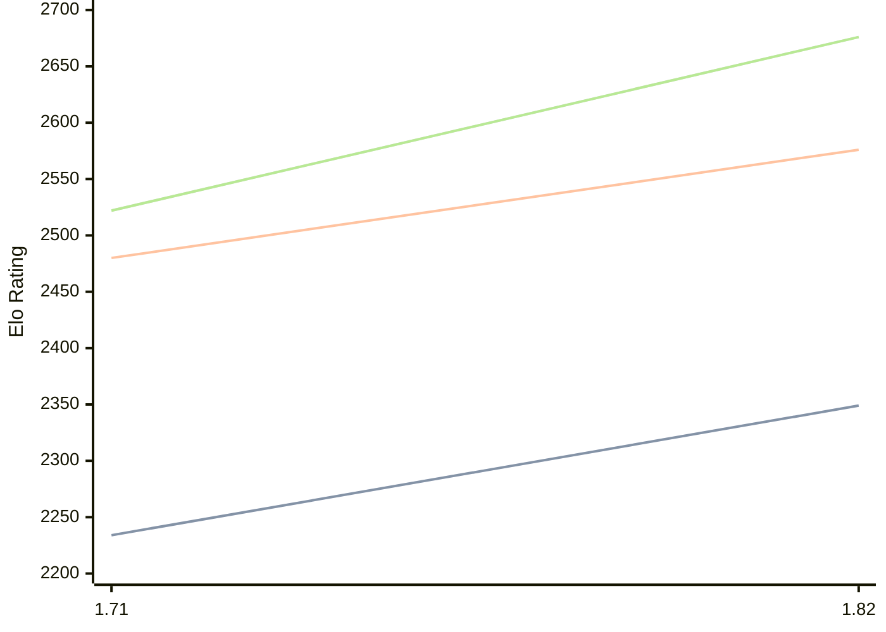

# Engine: Amira

Author: Fauzi Dabat Akram

Home: https://github.com/FauziAkram/amira

## Elo Ratings

| Version | Published | STC 8.0+0.08s  | LTC 60.0+0.60s | VLTC 2m24s+1.12s | Comment |
| --- | --- | --- | --- | --- | --- |
| 1.82 | 2026-01-02 | 2349(+115) | 2576(+96) | 2676(+154) |  |
| 1.71 | 2025-10-30 | 2234(+new) | 2480(+new) | 2522(+new) |  |
| 1.61 | 2025-09-08 |  |  |  |  |
| 1.4 | 2025-07-24 |  |  |  |  |
| 1.00 | 2025-06-29 |  |  |  |  |
 | | | cElo (∆ prev) | cElo (∆ prev) | cElo (∆ prev) | 

<a href="https://github.com/computer-chess-index/cci/issues/new?template=submit-version.yml&title=[VERSION]+Amira+<version>&body=###%20Engine%20name%0AAmira%0A%0A###%20Version%0A1.82" target="_blank">Submit new version</a>

 Test Conditions:

GUI/CLI: <a href=https://github.com/cutechess/cutechess target="_blank">Cute-Chess</a> 
Elo Calculation: <a href=https://www.remi-coulom.fr/Bayesian-Elo/ target="_blank">Bayesian-Elo</a> 
CPU: Intel(R) Core(TM) i5-7500T 2.70GHz 
Opening book: 8_moves_v3 
\* STC: 8.0+0.08s, LTC: 60.0+0.60s, VLTC: 2m24s+1.12s

 Lists:
Ratings: <a href=https://github.com/computer-chess-index/cci/blob/main/lists/CCIRatings.csv target="_blank">Complete list</a>

Generated: 2026-05-06 06:22:26

## Ratings Verlauf

⬛ STC (8.0+0.08s) &nbsp;&nbsp; 🟧 LTC (60.0+0.60s) &nbsp;&nbsp; 🟩 VLTC (2m24s+1.12s)

dark mode: 🟩STC (8.0+0.08s) 🟧LTC (60.0+0.60s) ⬜VLTC (2m24s+1.12s)

## Detailed Evaluation Results

| Version | Time Control | Elo  | Range +/- | Matches | Score | Average Opponent Elo | Draws |
| --- | --- | --- | --- | --- | --- | --- | --- |
| 1.82 | VLTC (2m24s+1.12s) | 2676 | 25 | 530 | 47% | 2699 | 29% |
| 1.82 | LTC (60.0+0.60s) | 2576 | 30 | 400 | 50% | 2570 | 25% |
| 1.82 | STC (8.0+0.08s) | 2349 | 26 | 528 | 50% | 2338 | 22% |
| --- | --- | --- | --- | --- | --- | --- | --- |
| 1.71 | VLTC (2m24s+1.12s) | 2522 | 40 | 220 | 51% | 2512 | 21% |
| 1.71 | LTC (60.0+0.60s) | 2480 | 39 | 248 | 52% | 2469 | 17% |
| 1.71 | STC (8.0+0.08s) | 2234 | 43 | 206 | 51% | 2225 | 12% |
| --- | --- | --- | --- | --- | --- | --- | --- |