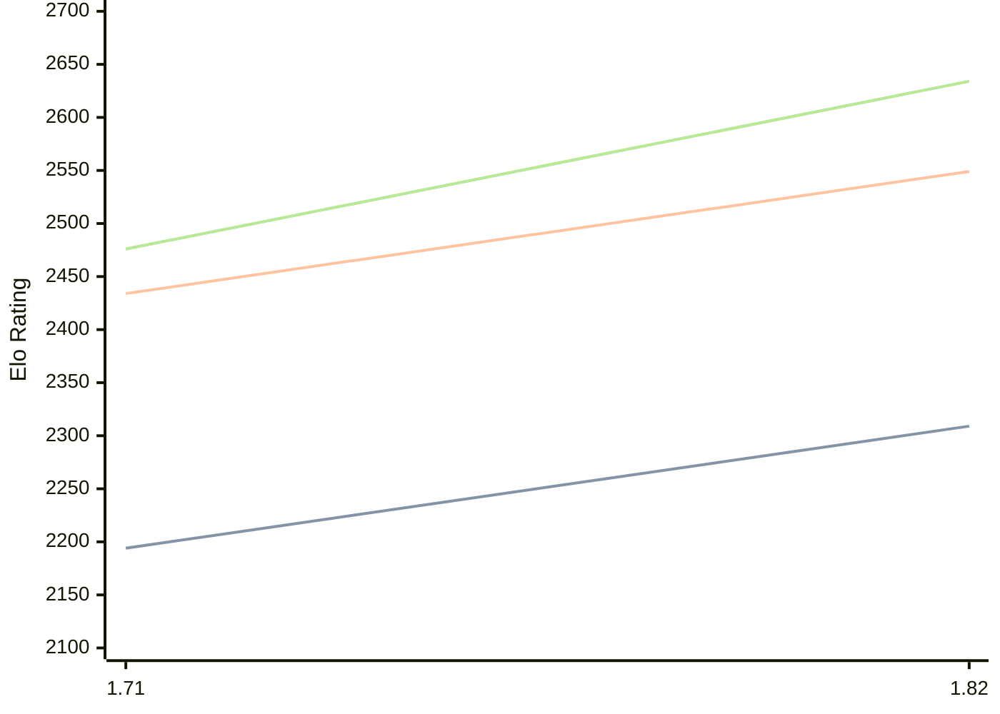

# Engine: Amira

Author: Fauzi Dabat Akram

Home: https://github.com/FauziAkram/amira

## Elo Ratings

| Version | Published | STC 8.0+0.08s  | LTC 60.0+0.60s | VLTC 2m24s+1.12s | Comment |
| --- | --- | --- | --- | --- | --- |
| 1.82 | 2026-01-02 | 2309(+115) | 2549(+115) | 2634(+158) |  |
| 1.71 | 2025-10-30 | 2194 | 2434 | 2476 |  |
 | | | cElo (∆ prev) | cElo (∆ prev) | cElo (∆ prev) | 

<a href="https://github.com/computer-chess-index/cci/issues/new?template=submit-version.yml&title=[VERSION]+Amira+<version>&body=###%20Engine%20name%0AAmira%0A%0A###%20Version%0A1.82" target="_blank">Submit new version</a>

 Test Conditions:

GUI/CLI: <a href=https://github.com/cutechess/cutechess target="_blank">Cute-Chess</a> 
Elo Calculation: <a href=https://www.remi-coulom.fr/Bayesian-Elo/ target="_blank">Bayesian-Elo</a> 
CPU: Intel(R) Core(TM) i5-7500T 2.70GHz 
Opening book: 8_moves_v3 
\* STC: 8.0+0.08s, LTC: 60.0+0.60s, VLTC: 2m24s+1.12s

 Lists:
Ratings: <a href=https://github.com/computer-chess-index/cci/blob/main/lists/CCIRatings.csv target="_blank">Complete list</a>

Generated: 2026-10-09 04:35:35

## Ratings Verlauf

```mermaid
%%{init: {"theme":"base","themeVariables":{"seriesColors:['#a3a3a3','#222221','#faa371']}}}%%
xychart-beta
  x-axis ["1.71", "1.82"]
  y-axis "Elo Rating" 2100 --> 2700
  line "" [2194, 2309]
  line "STC (8.0+0.08s)" [2194, 2309]
  line "LTC (60.0+0.60s)" [2434, 2549]
  line "" [2476, 2634]
  line "VLTC (2m24s+1.12s)" [2476, 2634]
```

## Detailed Evaluation Results

| Version | Time Control | Elo  | Range +/- | Matches | Score | Average Opponent Elo | Draws |
| --- | --- | --- | --- | --- | --- | --- | --- |
| 1.82 | VLTC (2m24s+1.12s) | 2634 | 22 | 710 | 48% | 2649 | 29% |
| 1.82 | LTC (60.0+0.60s) | 2549 | 25 | 552 | 51% | 2535 | 24% |
| 1.82 | STC (8.0+0.08s) | 2309 | 23 | 694 | 51% | 2295 | 23% |
| --- | --- | --- | --- | --- | --- | --- | --- |
| 1.71 | VLTC (2m24s+1.12s) | 2476 | 40 | 220 | 51% | 2466 | 21% |
| 1.71 | LTC (60.0+0.60s) | 2434 | 39 | 248 | 52% | 2425 | 17% |
| 1.71 | STC (8.0+0.08s) | 2194 | 43 | 206 | 51% | 2184 | 12% |
| --- | --- | --- | --- | --- | --- | --- | --- |