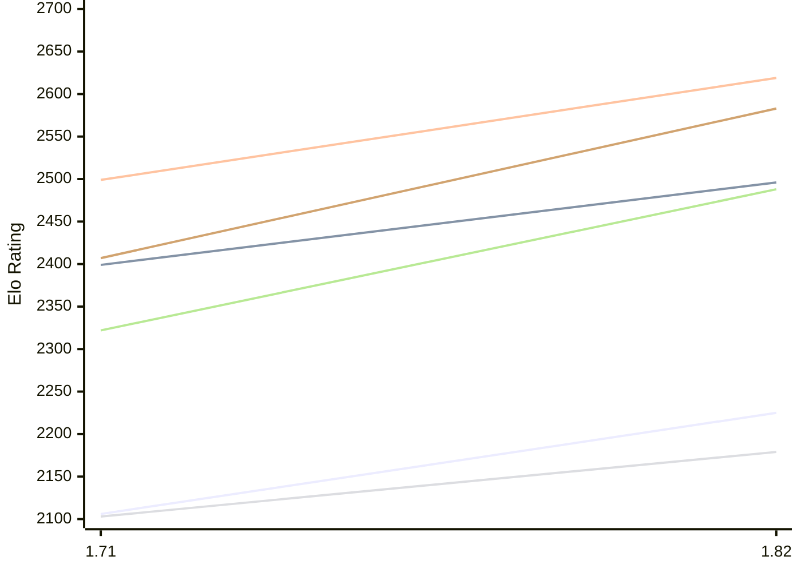
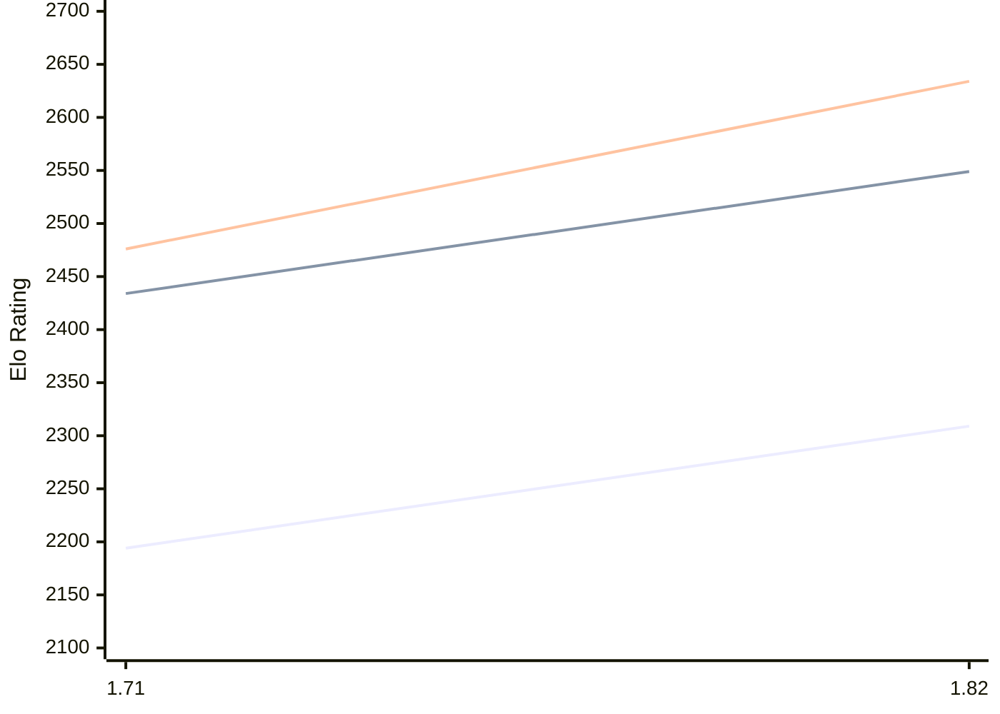

# Engine: Amira

Author: Fauzi Dabat Akram

Home: https://github.com/FauziAkram/amira

## Elo Ratings E1 (Ultra 7 265T (1.50 GHz) - E-Core)

| Version | Published | STC 8.0+0.08s  | LTC 60.0+0.60s | VLTC 2m24s+1.12s | Comment |
| --- | --- | --- | --- | --- | --- |
| 1.82 | 2026-01-02 | 2225(+119) | 2496(+97) | 2619(+120) |  |
| 1.71 | 2025-10-30 | 2106 | 2399 | 2499 |  |
 | | | cElo (∆ prev) | cElo (∆ prev) | cElo (∆ prev) | 

## Elo Ratings P1 (Ultra 7 265T (1.50 GHz) - P-Core)

| Version | Published | STC 8.0+0.08s  | LTC 60.0+0.60s | VLTC 2m24s+1.12s | Comment |
| --- | --- | --- | --- | --- | --- |
| 1.82 | 2026-01-02 | 2179(+76) | 2488(+166) | 2583(+176) |  |
| 1.71 | 2025-10-30 | 2103 | 2322 | 2407 |  |
 | | | cElo (∆ prev) | cElo (∆ prev) | cElo (∆ prev) | 

## Elo Ratings T1 (i5-7500T 2.70GHz)

| Version | Published | STC 8.0+0.08s  | LTC 60.0+0.60s | VLTC 2m24s+1.12s | Comment |
| --- | --- | --- | --- | --- | --- |
| 1.82 | 2026-01-02 | 2309(+115) | 2549(+115) | 2634(+158) |  |
| 1.71 | 2025-10-30 | 2194 | 2434 | 2476 |  |
 | | | cElo (∆ prev) | cElo (∆ prev) | cElo (∆ prev) | 

<a href="https://github.com/computer-chess-index/cci/issues/new?template=submit-version.yml&title=[VERSION]+Amira+<version>&body=###%20Engine%20name%0AAmira%0A%0A###%20Version%0A1.82" target="_blank">Submit new version</a>

 Test Conditions:

GUI/CLI: <a href=https://github.com/cutechess/cutechess target="_blank">Cute-Chess</a> 
Elo Calculation: <a href=https://www.remi-coulom.fr/Bayesian-Elo/ target="_blank">Bayesian-Elo</a> 
CPU for P1: Intel(R) Core(TM) Ultra 7 265T (1.50 GHz) - P-Core 
CPU for E1: Intel(R) Core(TM) Ultra 7 265T (1.50 GHz) - E-Core 
CPU for T1: Intel(R) Core(TM) i5-7500T 2.70GHz 
Opening book: 8_moves_v3 
\* STC: 8.0+0.08s, LTC: 60.0+0.60s, VLTC: 2m24s+1.12s

 Lists:
Ratings: <a href=https://github.com/computer-chess-index/cci/blob/main/lists/CCIRatings.csv target="_blank">Complete list</a>

Generated: 2026-11-18 05:35:36

## Ratings Verlauf E1 / P1

```mermaid
%%{init: {"theme":"base","themeVariables":{"seriesColors:['#a3a3a3','#222221','#faa371']}}}%%
xychart-beta
  x-axis ["1.71", "1.82"]
  y-axis "Elo Rating" 2100 --> 2700
  line "E1: STC (8.0+0.08s)" [2106, 2225]
  line "E1: LTC (60.0+0.60s)" [2399, 2496]
  line "E1: VLTC (2m24s+1.12s)" [2499, 2619]
  line "P1: STC (8.0+0.08s)" [2103, 2179]
  line "P1: LTC (60.0+0.60s)" [2322, 2488]
  line "P1: VLTC (2m24s+1.12s)" [2407, 2583]
```

## Ratings Verlauf T1

```mermaid
%%{init: {"theme":"base","themeVariables":{"seriesColors:['#a3a3a3','#222221','#faa371']}}}%%
xychart-beta
  x-axis ["1.71", "1.82"]
  y-axis "Elo Rating" 2100 --> 2700
  line "T1: STC (8.0+0.08s)" [2194, 2309]
  line "T1: LTC (60.0+0.60s)" [2434, 2549]
  line "T1: VLTC (2m24s+1.12s)" [2476, 2634]
```

## Detailed Evaluation Results

| Version | Time Control | Variant | Elo  | Range +/- | Matches | Score | Average Opponent Elo | Draws |
| --- | --- |--- | --- | --- | --- | --- | --- | --- |
| 1.82 | VLTC (2m24s+1.12s) | P1 | 2583 | 35 | 294 | 49% | 2593 | 25% |
|  |  | E1 | 2619 | 31 | 376 | 54% | 2570 | 23% |
|  |  | T1 | 2634 | 22 | 710 | 48% | 2649 | 29% |
|  | LTC (60.0+0.60s) | P1 | 2488 | 36 | 276 | 52% | 2484 | 27% |
|  |  | E1 | 2496 | 31 | 382 | 51% | 2480 | 24% |
|  |  | T1 | 2549 | 25 | 552 | 51% | 2535 | 24% |
|  | STC (8.0+0.08s) | P1 | 2179 | 36 | 280 | 51% | 2152 | 21% |
|  |  | E1 | 2225 | 31 | 380 | 50% | 2236 | 20% |
|  |  | T1 | 2309 | 23 | 694 | 51% | 2295 | 23% |
| --- | --- |--- | --- | --- | --- | --- | --- | --- |
| 1.71 | VLTC (2m24s+1.12s) | T1 | 2476 | 40 | 220 | 51% | 2466 | 21% |
|  |  | P1 | 2407 | 68 | 84 | 50% | 2383 | 21% |
|  |  | E1 | 2499 | 63 | 98 | 48% | 2495 | 17% |
|  | LTC (60.0+0.60s) | T1 | 2434 | 39 | 248 | 52% | 2425 | 17% |
|  |  | P1 | 2322 | 79 | 64 | 37% | 2502 | 20% |
|  |  | E1 | 2399 | 59 | 110 | 50% | 2392 | 19% |
|  | STC (8.0+0.08s) | T1 | 2194 | 43 | 206 | 51% | 2184 | 12% |
|  |  | P1 | 2103 | 66 | 96 | 48% | 2156 | 10% |
|  |  | E1 | 2106 | 55 | 138 | 43% | 2192 | 14% |