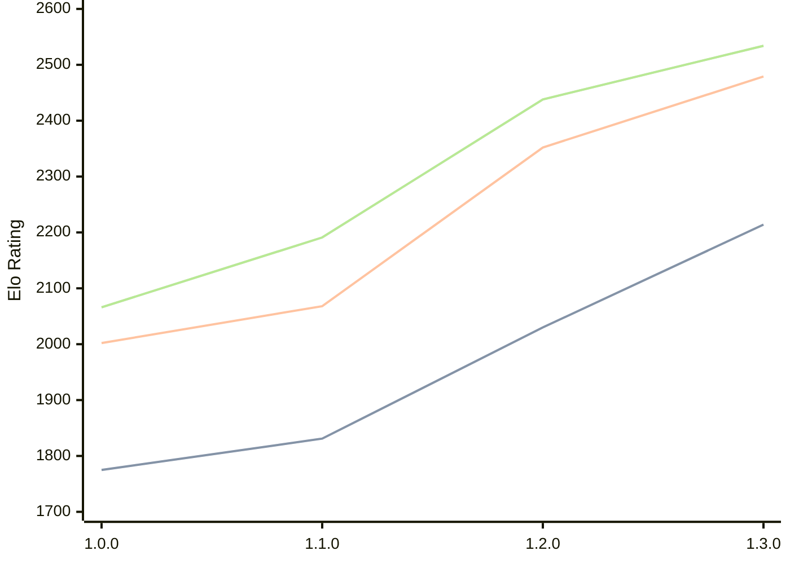

# Engine: Anodos

Author: Tom Cant

Home: https://github.com/tomcant/chess-rs

## Ratings nach Version

| Version | Published | STC 8.0+0.08s  | LTC 60.0+0.60s | VLTC 2m24s+1.12s | Comment |
| --- | --- | --- | --- | --- | --- |
| 1.3.0 | 2026-02-16 | 2214(+184) | 2479(+127) | 2534(+96) |  |
| 1.2.0 | 2026-02-01 | 2030(+199) | 2352(+284) | 2438(+247) |  |
| 1.1.0 | 2026-01-16 | 1831(+56) | 2068(+66) | 2191(+125) |  |
| 1.0.0 | 2026-01-02 | 1775(+new) | 2002(+new) | 2066(+new) | Previously: chess-rs |
| 0.7.0 | 2025-12-31 |  |  |  |  |
| 0.6.0 | 2025-11-11 |  |  |  |  |
| 0.5.1 | 2025-11-04 |  |  |  |  |
| 0.5.0 | 2025-11-03 |  |  |  |  |
| 0.4.2 | 2025-10-13 |  |  |  |  |
| 0.4.1 | 2025-10-09 |  |  |  |  |
| 0.4.0 | 2025-10-09 |  |  |  |  |
| 0.3.0 | 2025-10-05 |  |  |  |  |
| 0.2.0 | 2023-03-12 |  |  |  |  |
| 0.1.1 | 2022-12-03 |  |  |  |  |
| 0.1.0 | 2022-12-03 |  |  |  |  |
 | | | cElo (∆ prev) | cElo (∆ prev) | cElo (∆ prev) | 

 Test Conditions:

GUI/CLI: <a href=https://github.com/cutechess/cutechess target="_blank">Cute-Chess</a> 
Elo Calculation: <a href=https://www.remi-coulom.fr/Bayesian-Elo/ target="_blank">Bayesian-Elo</a> 
CPU: Intel(R) Core(TM) i5-7500T 2.70GHz 
Opening book: 8_moves_v3 
\* STC: 8.0+0.08s, LTC: 60.0+0.60s, VLTC: 2m24s+1.12s

 Lists:
Ratings: <a href=https://github.com/computer-chess-index/cci/blob/main/lists/CCIRatings.csv target="_blank">Complete list</a>

Generated: 2026-03-16 06:22:19

## Ratings Verlauf

⬛ STC (8.0+0.08s) &nbsp;&nbsp; 🟧 LTC (60.0+0.60s) &nbsp;&nbsp; 🟩 VLTC (2m24s+1.12s)

