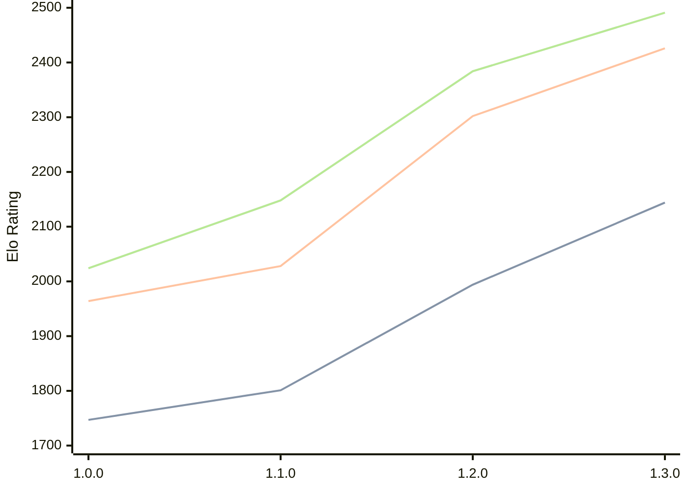

# Engine: Anodos

Author: Tom Cant

Home: https://github.com/tomcant/chess-rs

## Elo Ratings

| Version | Published | STC 8.0+0.08s  | LTC 60.0+0.60s | VLTC 2m24s+1.12s | Comment |
| --- | --- | --- | --- | --- | --- |
| 1.3.0 | 2026-02-16 | 2144(+150) | 2426(+124) | 2491(+107) |  |
| 1.2.0 | 2026-02-01 | 1994(+193) | 2302(+274) | 2384(+236) |  |
| 1.1.0 | 2026-01-16 | 1801(+54) | 2028(+64) | 2148(+124) |  |
| 1.0.0 | 2026-01-02 | 1747(+new) | 1964(+new) | 2024(+new) | Previously: chess-rs |
| 0.7.0 | 2025-12-31 |  |  |  |  |
| 0.6.0 | 2025-11-11 |  |  |  |  |
| 0.5.1 | 2025-11-04 |  |  |  |  |
| 0.5.0 | 2025-11-03 |  |  |  |  |
| 0.4.2 | 2025-10-13 |  |  |  |  |
| 0.4.1 | 2025-10-09 |  |  |  |  |
| 0.4.0 | 2025-10-09 |  |  |  |  |
| 0.3.0 | 2025-10-05 |  |  |  |  |
| 0.2.0 | 2023-03-12 |  |  |  |  |
| 0.1.1 | 2022-12-03 |  |  |  |  |
| 0.1.0 | 2022-12-03 |  |  |  |  |
 | | | cElo (∆ prev) | cElo (∆ prev) | cElo (∆ prev) | 

<a href="https://github.com/computer-chess-index/cci/issues/new?template=submit-version.yml&title=[VERSION]+Anodos+<version>&body=###%20Engine%20name%0AAnodos%0A%0A###%20Version%0A1.3.0" target="_blank">Submit new version</a>

 Test Conditions:

GUI/CLI: <a href=https://github.com/cutechess/cutechess target="_blank">Cute-Chess</a> 
Elo Calculation: <a href=https://www.remi-coulom.fr/Bayesian-Elo/ target="_blank">Bayesian-Elo</a> 
CPU: Intel(R) Core(TM) i5-7500T 2.70GHz 
Opening book: 8_moves_v3 
\* STC: 8.0+0.08s, LTC: 60.0+0.60s, VLTC: 2m24s+1.12s

 Lists:
Ratings: <a href=https://github.com/computer-chess-index/cci/blob/main/lists/CCIRatings.csv target="_blank">Complete list</a>

Generated: 2026-05-21 06:22:31

## Ratings Verlauf

⬛ STC (8.0+0.08s) &nbsp;&nbsp; 🟧 LTC (60.0+0.60s) &nbsp;&nbsp; 🟩 VLTC (2m24s+1.12s)

dark mode: 🟩STC (8.0+0.08s) 🟧LTC (60.0+0.60s) ⬜VLTC (2m24s+1.12s)

## Detailed Evaluation Results

| Version | Time Control | Elo  | Range +/- | Matches | Score | Average Opponent Elo | Draws |
| --- | --- | --- | --- | --- | --- | --- | --- |
| 1.3.0 | VLTC (2m24s+1.12s) | 2491 | 29 | 410 | 50% | 2491 | 25% |
| 1.3.0 | LTC (60.0+0.60s) | 2426 | 29 | 408 | 52% | 2410 | 27% |
| 1.3.0 | STC (8.0+0.08s) | 2144 | 26 | 508 | 48% | 2153 | 25% |
| --- | --- | --- | --- | --- | --- | --- | --- |
| 1.2.0 | VLTC (2m24s+1.12s) | 2384 | 38 | 244 | 52% | 2364 | 25% |
| 1.2.0 | LTC (60.0+0.60s) | 2302 | 41 | 196 | 49% | 2311 | 28% |
| 1.2.0 | STC (8.0+0.08s) | 1994 | 45 | 176 | 52% | 1976 | 20% |
| --- | --- | --- | --- | --- | --- | --- | --- |
| 1.1.0 | VLTC (2m24s+1.12s) | 2148 | 37 | 256 | 51% | 2136 | 22% |
| 1.1.0 | LTC (60.0+0.60s) | 2028 | 44 | 180 | 50% | 2026 | 22% |
| 1.1.0 | STC (8.0+0.08s) | 1801 | 40 | 228 | 50% | 1805 | 17% |
| --- | --- | --- | --- | --- | --- | --- | --- |
| 1.0.0 | VLTC (2m24s+1.12s) | 2024 | 45 | 192 | 44% | 2120 | 18% |
| 1.0.0 | LTC (60.0+0.60s) | 1964 | 49 | 156 | 48% | 1962 | 17% |
| 1.0.0 | STC (8.0+0.08s) | 1747 | 45 | 180 | 46% | 1796 | 20% |
| --- | --- | --- | --- | --- | --- | --- | --- |