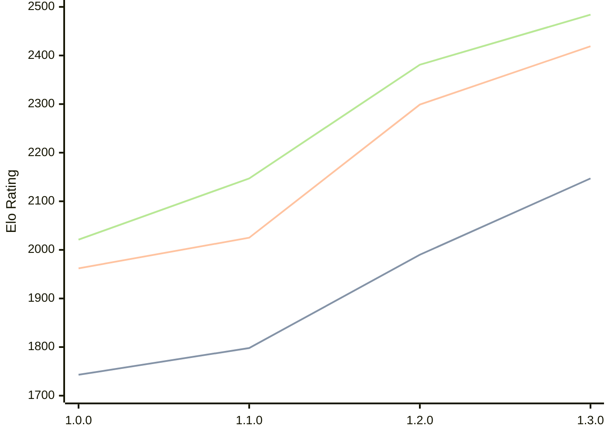

# Engine: Anodos

Author: Tom Cant

Home: https://github.com/tomcant/chess-rs

## Elo Ratings

| Version | Published | STC 8.0+0.08s  | LTC 60.0+0.60s | VLTC 2m24s+1.12s | Comment |
| --- | --- | --- | --- | --- | --- |
| 1.3.0 | 2026-02-16 | 2147(+157) | 2419(+120) | 2484(+103) |  |
| 1.2.0 | 2026-02-01 | 1990(+192) | 2299(+274) | 2381(+234) |  |
| 1.1.0 | 2026-01-16 | 1798(+55) | 2025(+63) | 2147(+126) |  |
| 1.0.0 | 2026-01-02 | 1743 | 1962 | 2021 | Previously: chess-rs |
 | | | cElo (∆ prev) | cElo (∆ prev) | cElo (∆ prev) | 

<a href="https://github.com/computer-chess-index/cci/issues/new?template=submit-version.yml&title=[VERSION]+Anodos+<version>&body=###%20Engine%20name%0AAnodos%0A%0A###%20Version%0A1.3.0" target="_blank">Submit new version</a>

 Test Conditions:

GUI/CLI: <a href=https://github.com/cutechess/cutechess target="_blank">Cute-Chess</a> 
Elo Calculation: <a href=https://www.remi-coulom.fr/Bayesian-Elo/ target="_blank">Bayesian-Elo</a> 
CPU: Intel(R) Core(TM) i5-7500T 2.70GHz 
Opening book: 8_moves_v3 
\* STC: 8.0+0.08s, LTC: 60.0+0.60s, VLTC: 2m24s+1.12s

 Lists:
Ratings: <a href=https://github.com/computer-chess-index/cci/blob/main/lists/CCIRatings.csv target="_blank">Complete list</a>

Generated: 2026-08-18 06:22:34

## Ratings Verlauf

⬛ STC (8.0+0.08s) &nbsp;&nbsp; 🟧 LTC (60.0+0.60s) &nbsp;&nbsp; 🟩 VLTC (2m24s+1.12s)

dark mode: 🟩STC (8.0+0.08s) 🟧LTC (60.0+0.60s) ⬜VLTC (2m24s+1.12s)

## Detailed Evaluation Results

| Version | Time Control | Elo  | Range +/- | Matches | Score | Average Opponent Elo | Draws |
| --- | --- | --- | --- | --- | --- | --- | --- |
| 1.3.0 | VLTC (2m24s+1.12s) | 2484 | 27 | 470 | 49% | 2493 | 26% |
| 1.3.0 | LTC (60.0+0.60s) | 2419 | 26 | 488 | 51% | 2412 | 27% |
| 1.3.0 | STC (8.0+0.08s) | 2147 | 25 | 572 | 49% | 2153 | 24% |
| --- | --- | --- | --- | --- | --- | --- | --- |
| 1.2.0 | VLTC (2m24s+1.12s) | 2381 | 38 | 244 | 52% | 2363 | 25% |
| 1.2.0 | LTC (60.0+0.60s) | 2299 | 41 | 196 | 49% | 2309 | 28% |
| 1.2.0 | STC (8.0+0.08s) | 1990 | 45 | 176 | 52% | 1972 | 20% |
| --- | --- | --- | --- | --- | --- | --- | --- |
| 1.1.0 | VLTC (2m24s+1.12s) | 2147 | 37 | 256 | 51% | 2134 | 22% |
| 1.1.0 | LTC (60.0+0.60s) | 2025 | 44 | 180 | 50% | 2024 | 22% |
| 1.1.0 | STC (8.0+0.08s) | 1798 | 40 | 228 | 50% | 1801 | 17% |
| --- | --- | --- | --- | --- | --- | --- | --- |
| 1.0.0 | VLTC (2m24s+1.12s) | 2021 | 45 | 192 | 44% | 2117 | 18% |
| 1.0.0 | LTC (60.0+0.60s) | 1962 | 49 | 156 | 48% | 1959 | 17% |
| 1.0.0 | STC (8.0+0.08s) | 1743 | 45 | 180 | 46% | 1793 | 20% |
| --- | --- | --- | --- | --- | --- | --- | --- |