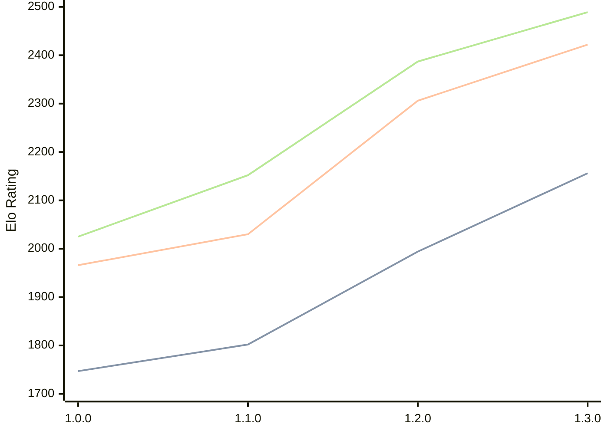

# Engine: Anodos

Author: Tom Cant

Home: https://github.com/tomcant/chess-rs

## Elo Ratings

| Version | Published | STC 8.0+0.08s  | LTC 60.0+0.60s | VLTC 2m24s+1.12s | Comment |
| --- | --- | --- | --- | --- | --- |
| 1.3.0 | 2026-02-16 | 2156(+162) | 2422(+116) | 2489(+102) |  |
| 1.2.0 | 2026-02-01 | 1994(+192) | 2306(+276) | 2387(+235) |  |
| 1.1.0 | 2026-01-16 | 1802(+55) | 2030(+64) | 2152(+127) |  |
| 1.0.0 | 2026-01-02 | 1747 | 1966 | 2025 | Previously: chess-rs |
 | | | cElo (∆ prev) | cElo (∆ prev) | cElo (∆ prev) | 

<a href="https://github.com/computer-chess-index/cci/issues/new?template=submit-version.yml&title=[VERSION]+Anodos+<version>&body=###%20Engine%20name%0AAnodos%0A%0A###%20Version%0A1.3.0" target="_blank">Submit new version</a>

 Test Conditions:

GUI/CLI: <a href=https://github.com/cutechess/cutechess target="_blank">Cute-Chess</a> 
Elo Calculation: <a href=https://www.remi-coulom.fr/Bayesian-Elo/ target="_blank">Bayesian-Elo</a> 
CPU: Intel(R) Core(TM) i5-7500T 2.70GHz 
Opening book: 8_moves_v3 
\* STC: 8.0+0.08s, LTC: 60.0+0.60s, VLTC: 2m24s+1.12s

 Lists:
Ratings: <a href=https://github.com/computer-chess-index/cci/blob/main/lists/CCIRatings.csv target="_blank">Complete list</a>

Generated: 2026-08-28 06:22:35

## Ratings Verlauf

## Detailed Evaluation Results

| Version | Time Control | Elo  | Range +/- | Matches | Score | Average Opponent Elo | Draws |
| --- | --- | --- | --- | --- | --- | --- | --- |
| 1.3.0 | VLTC (2m24s+1.12s) | 2489 | 27 | 482 | 49% | 2499 | 26% |
| 1.3.0 | LTC (60.0+0.60s) | 2422 | 26 | 496 | 51% | 2418 | 27% |
| 1.3.0 | STC (8.0+0.08s) | 2156 | 24 | 588 | 49% | 2159 | 24% |
| --- | --- | --- | --- | --- | --- | --- | --- |
| 1.2.0 | VLTC (2m24s+1.12s) | 2387 | 38 | 244 | 52% | 2367 | 25% |
| 1.2.0 | LTC (60.0+0.60s) | 2306 | 41 | 196 | 49% | 2314 | 28% |
| 1.2.0 | STC (8.0+0.08s) | 1994 | 45 | 176 | 52% | 1978 | 20% |
| --- | --- | --- | --- | --- | --- | --- | --- |
| 1.1.0 | VLTC (2m24s+1.12s) | 2152 | 37 | 256 | 51% | 2138 | 22% |
| 1.1.0 | LTC (60.0+0.60s) | 2030 | 44 | 180 | 50% | 2028 | 22% |
| 1.1.0 | STC (8.0+0.08s) | 1802 | 40 | 228 | 50% | 1806 | 17% |
| --- | --- | --- | --- | --- | --- | --- | --- |
| 1.0.0 | VLTC (2m24s+1.12s) | 2025 | 45 | 192 | 44% | 2122 | 18% |
| 1.0.0 | LTC (60.0+0.60s) | 1966 | 49 | 156 | 48% | 1964 | 17% |
| 1.0.0 | STC (8.0+0.08s) | 1747 | 45 | 180 | 46% | 1797 | 20% |
| --- | --- | --- | --- | --- | --- | --- | --- |