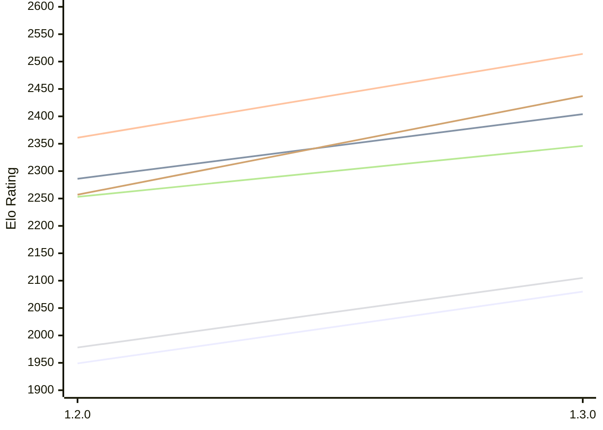
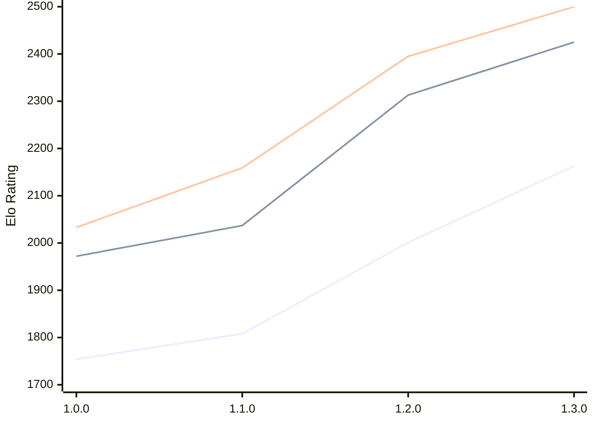

# Engine: Anodos

Author: Tom Cant

Home: https://github.com/tomcant/chess-rs

## Elo Ratings E1 (Ultra 7 265T (1.50 GHz) - E-Core)

| Version | Published | STC 8.0+0.08s  | LTC 60.0+0.60s | VLTC 2m24s+1.12s | Comment |
| --- | --- | --- | --- | --- | --- |
| 1.3.0 | 2026-02-16 | 2080(+131) | 2404(+118) | 2514(+153) |  |
| 1.2.0 | 2026-02-01 | 1949 | 2286 | 2361 |  |
 | | | cElo (∆ prev) | cElo (∆ prev) | cElo (∆ prev) | 

## Elo Ratings P1 (Ultra 7 265T (1.50 GHz) - P-Core)

| Version | Published | STC 8.0+0.08s  | LTC 60.0+0.60s | VLTC 2m24s+1.12s | Comment |
| --- | --- | --- | --- | --- | --- |
| 1.3.0 | 2026-02-16 | 2105(+127) | 2346(+93) | 2437(+180) |  |
| 1.2.0 | 2026-02-01 | 1978 | 2253 | 2257 |  |
 | | | cElo (∆ prev) | cElo (∆ prev) | cElo (∆ prev) | 

## Elo Ratings T1 (i5-7500T 2.70GHz)

| Version | Published | STC 8.0+0.08s  | LTC 60.0+0.60s | VLTC 2m24s+1.12s | Comment |
| --- | --- | --- | --- | --- | --- |
| 1.3.0 | 2026-02-16 | 2163(+162) | 2425(+112) | 2500(+105) |  |
| 1.2.0 | 2026-02-01 | 2001(+193) | 2313(+276) | 2395(+236) |  |
| 1.1.0 | 2026-01-16 | 1808(+54) | 2037(+65) | 2159(+126) |  |
| 1.0.0 | 2026-01-02 | 1754 | 1972 | 2033 | Previously: chess-rs |
 | | | cElo (∆ prev) | cElo (∆ prev) | cElo (∆ prev) | 

<a href="https://github.com/computer-chess-index/cci/issues/new?template=submit-version.yml&title=[VERSION]+Anodos+<version>&body=###%20Engine%20name%0AAnodos%0A%0A###%20Version%0A1.3.0" target="_blank">Submit new version</a>

 Test Conditions:

GUI/CLI: <a href=https://github.com/cutechess/cutechess target="_blank">Cute-Chess</a> 
Elo Calculation: <a href=https://www.remi-coulom.fr/Bayesian-Elo/ target="_blank">Bayesian-Elo</a> 
CPU for P1: Intel(R) Core(TM) Ultra 7 265T (1.50 GHz) - P-Core 
CPU for E1: Intel(R) Core(TM) Ultra 7 265T (1.50 GHz) - E-Core 
CPU for T1: Intel(R) Core(TM) i5-7500T 2.70GHz 
Opening book: 8_moves_v3 
\* STC: 8.0+0.08s, LTC: 60.0+0.60s, VLTC: 2m24s+1.12s

 Lists:
Ratings: <a href=https://github.com/computer-chess-index/cci/blob/main/lists/CCIRatings.csv target="_blank">Complete list</a>

Generated: 2026-11-20 05:35:44

## Ratings Verlauf E1 / P1

```mermaid
%%{init: {"theme":"base","themeVariables":{"seriesColors:['#a3a3a3','#222221','#faa371']}}}%%
xychart-beta
  x-axis ["1.2.0", "1.3.0"]
  y-axis "Elo Rating" 1900 --> 2600
  line "E1: STC (8.0+0.08s)" [1949, 2080]
  line "E1: LTC (60.0+0.60s)" [2286, 2404]
  line "E1: VLTC (2m24s+1.12s)" [2361, 2514]
  line "P1: STC (8.0+0.08s)" [1978, 2105]
  line "P1: LTC (60.0+0.60s)" [2253, 2346]
  line "P1: VLTC (2m24s+1.12s)" [2257, 2437]
```

## Ratings Verlauf T1

```mermaid
%%{init: {"theme":"base","themeVariables":{"seriesColors:['#a3a3a3','#222221','#faa371']}}}%%
xychart-beta
  x-axis ["1.0.0", "1.1.0", "1.2.0", "1.3.0"]
  y-axis "Elo Rating" 1700 --> 2500
  line "T1: STC (8.0+0.08s)" [1754, 1808, 2001, 2163]
  line "T1: LTC (60.0+0.60s)" [1972, 2037, 2313, 2425]
  line "T1: VLTC (2m24s+1.12s)" [2033, 2159, 2395, 2500]
```

## Detailed Evaluation Results

| Version | Time Control | Variant | Elo  | Range +/- | Matches | Score | Average Opponent Elo | Draws |
| --- | --- |--- | --- | --- | --- | --- | --- | --- |
| 1.3.0 | VLTC (2m24s+1.12s) | E1 | 2514 | 30 | 388 | 48% | 2543 | 29% |
|  |  | T1 | 2500 | 26 | 494 | 49% | 2507 | 26% |
|  |  | P1 | 2437 | 37 | 264 | 53% | 2422 | 23% |
|  | LTC (60.0+0.60s) | E1 | 2404 | 31 | 374 | 49% | 2419 | 28% |
|  |  | T1 | 2425 | 26 | 520 | 50% | 2427 | 27% |
|  |  | P1 | 2346 | 38 | 256 | 51% | 2326 | 24% |
|  | STC (8.0+0.08s) | T1 | 2163 | 24 | 608 | 49% | 2167 | 24% |
|  |  | P1 | 2105 | 40 | 236 | 53% | 2067 | 23% |
|  |  | E1 | 2080 | 31 | 394 | 46% | 2132 | 20% |
| --- | --- |--- | --- | --- | --- | --- | --- | --- |
| 1.2.0 | VLTC (2m24s+1.12s) | T1 | 2395 | 38 | 244 | 52% | 2375 | 25% |
|  |  | P1 | 2257 | 72 | 74 | 37% | 2437 | 20% |
|  |  | E1 | 2361 | 66 | 82 | 51% | 2344 | 24% |
|  | LTC (60.0+0.60s) | T1 | 2313 | 41 | 196 | 49% | 2322 | 28% |
|  |  | P1 | 2253 | 70 | 70 | 44% | 2356 | 30% |
|  |  | E1 | 2286 | 55 | 119 | 51% | 2284 | 24% |
|  | STC (8.0+0.08s) | T1 | 2001 | 45 | 176 | 52% | 1983 | 20% |
|  |  | P1 | 1978 | 62 | 96 | 57% | 1871 | 23% |
|  |  | E1 | 1949 | 65 | 92 | 45% | 2020 | 20% |
| --- | --- |--- | --- | --- | --- | --- | --- | --- |
| 1.1.0 | VLTC (2m24s+1.12s) | T1 | 2159 | 37 | 256 | 51% | 2147 | 22% |
|  | LTC (60.0+0.60s) | T1 | 2037 | 44 | 180 | 50% | 2036 | 22% |
|  | STC (8.0+0.08s) | T1 | 1808 | 40 | 228 | 50% | 1812 | 17% |
| --- | --- |--- | --- | --- | --- | --- | --- | --- |
| 1.0.0 | VLTC (2m24s+1.12s) | T1 | 2033 | 45 | 192 | 44% | 2129 | 18% |
|  | LTC (60.0+0.60s) | T1 | 1972 | 49 | 156 | 48% | 1971 | 17% |
|  | STC (8.0+0.08s) | T1 | 1754 | 45 | 180 | 46% | 1802 | 20% |