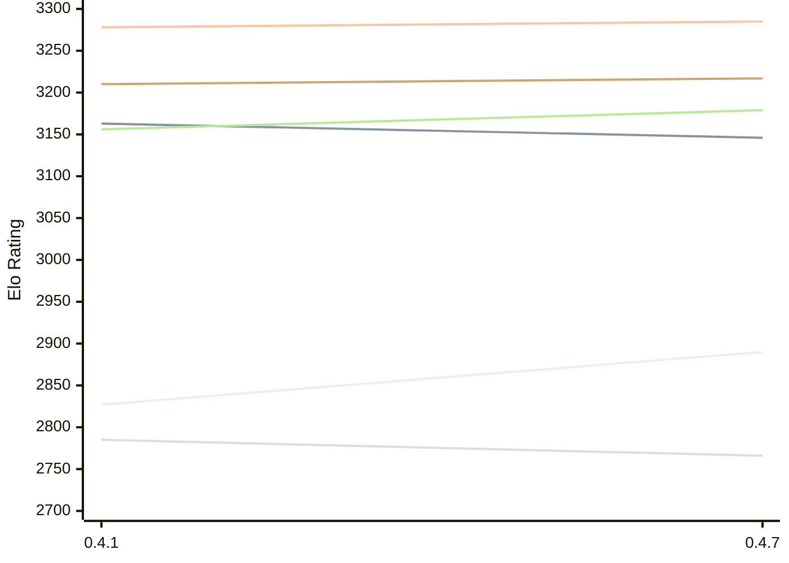

# Engine: Arabica

Author: Genio Mo

Home: https://github.com/geniomdev/arabica-chess

## Elo Ratings E1 (Ultra 7 265T (1.50 GHz) - E-Core)

| Version | Published | STC 8.0+0.08s  | LTC 60.0+0.60s | VLTC 2m24s+1.12s | Comment |
| --- | --- | --- | --- | --- | --- |
| 0.4.7 | 2026-11-11 | 2890(+63) | 3146(-17) | 3285(+7) |  |
| 0.4.1 | 2026-11-01 | 2827 | 3163 | 3278 |  |
 | | | cElo (∆ prev) | cElo (∆ prev) | cElo (∆ prev) | 

## Elo Ratings P1 (Ultra 7 265T (1.50 GHz) - P-Core)

| Version | Published | STC 8.0+0.08s  | LTC 60.0+0.60s | VLTC 2m24s+1.12s | Comment |
| --- | --- | --- | --- | --- | --- |
| 0.4.7 | 2026-11-11 | 2766(-19) | 3179(+23) | 3217(+7) |  |
| 0.4.1 | 2026-11-01 | 2785 | 3156 | 3210 |  |
 | | | cElo (∆ prev) | cElo (∆ prev) | cElo (∆ prev) | 

## Elo Ratings T1 (i5-7500T 2.70GHz)

| Version | Published | STC 8.0+0.08s  | LTC 60.0+0.60s | VLTC 2m24s+1.12s | Comment |
| --- | --- | --- | --- | --- | --- |
| 0.4.1 | 2026-11-01 | 2785 | 3156 | 3210 |  |
 | | | cElo (∆ prev) | cElo (∆ prev) | cElo (∆ prev) | 

<a href="https://github.com/computer-chess-index/cci/issues/new?template=submit-version.yml&title=[VERSION]+Arabica+<version>&body=###%20Engine%20name%0AArabica%0A%0A###%20Version%0A0.4.7" target="_blank">Submit new version</a>

 Test Conditions:

GUI/CLI: <a href=https://github.com/cutechess/cutechess target="_blank">Cute-Chess</a> 
Elo Calculation: <a href=https://www.remi-coulom.fr/Bayesian-Elo/ target="_blank">Bayesian-Elo</a> 
CPU for P1: Intel(R) Core(TM) Ultra 7 265T (1.50 GHz) - P-Core 
CPU for E1: Intel(R) Core(TM) Ultra 7 265T (1.50 GHz) - E-Core 
CPU for T1: Intel(R) Core(TM) i5-7500T 2.70GHz 
Opening book: 8_moves_v3 
\* STC: 8.0+0.08s, LTC: 60.0+0.60s, VLTC: 2m24s+1.12s

 Lists:
Ratings: <a href=https://github.com/computer-chess-index/cci/blob/main/lists/CCIRatings.csv target="_blank">Complete list</a>

Generated: 2026-11-17 05:35:52

## Ratings Verlauf E1 / P1

```mermaid
%%{init: {"theme":"base","themeVariables":{"seriesColors:['#a3a3a3','#222221','#faa371']}}}%%
xychart-beta
  x-axis ["0.4.1", "0.4.7"]
  y-axis "Elo Rating" 2700 --> 3300
  line "E1: STC (8.0+0.08s)" [2827, 2890]
  line "E1: LTC (60.0+0.60s)" [3163, 3146]
  line "E1: VLTC (2m24s+1.12s)" [3278, 3285]
  line "P1: STC (8.0+0.08s)" [2785, 2766]
  line "P1: LTC (60.0+0.60s)" [3156, 3179]
  line "P1: VLTC (2m24s+1.12s)" [3210, 3217]
```

## Detailed Evaluation Results

| Version | Time Control | Variant | Elo  | Range +/- | Matches | Score | Average Opponent Elo | Draws |
| --- | --- |--- | --- | --- | --- | --- | --- | --- |
| 0.4.7 | VLTC (2m24s+1.12s) | P1 | 3217 | 99 | 28 | 43% | 3274 | 50% |
|  |  | E1 | 3285 | 69 | 56 | 49% | 3293 | 55% |
|  | LTC (60.0+0.60s) | P1 | 3179 | 91 | 32 | 48% | 3190 | 53% |
|  |  | E1 | 3146 | 72 | 56 | 47% | 3167 | 45% |
|  | STC (8.0+0.08s) | P1 | 2766 | 84 | 40 | 46% | 2797 | 48% |
|  |  | E1 | 2890 | 71 | 60 | 51% | 2882 | 38% |
| --- | --- |--- | --- | --- | --- | --- | --- | --- |
| 0.4.1 | VLTC (2m24s+1.12s) | P1 | 3210 | 34 | 240 | 51% | 3187 | 57% |
|  |  | E1 | 3278 | 32 | 270 | 51% | 3260 | 56% |
|  | LTC (60.0+0.60s) | E1 | 3163 | 29 | 358 | 56% | 3090 | 54% |
|  |  | P1 | 3156 | 35 | 240 | 53% | 3102 | 53% |
|  | STC (8.0+0.08s) | E1 | 2827 | 30 | 384 | 57% | 2726 | 33% |
|  |  | P1 | 2785 | 38 | 224 | 52% | 2736 | 38% |