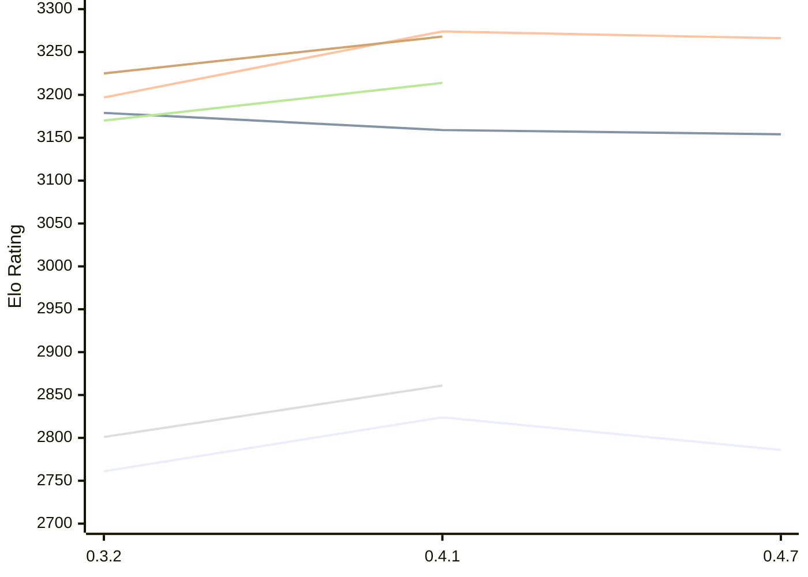

# Engine: Arabica

Author: Genio Mo

Home: https://github.com/geniomdev/arabica-chess

## Elo Ratings E1 (Ultra 7 265T (1.50 GHz) - E-Core)

| Version | Published | STC 8.0+0.08s  | LTC 60.0+0.60s | VLTC 2m24s+1.12s | Comment |
| --- | --- | --- | --- | --- | --- |
| 0.4.7 | 2026-11-11 | 2786(-38) | 3154(-5) | 3266(-8) |  |
| 0.4.1 | 2026-11-01 | 2824(+63) | 3159(-20) | 3274(+77) |  |
| 0.3.2 | 2026-10-27 | 2761 | 3179 | 3197 |  |
 | | | cElo (∆ prev) | cElo (∆ prev) | cElo (∆ prev) | 

## Elo Ratings P1 (Ultra 7 265T (1.50 GHz) - P-Core)

| Version | Published | STC 8.0+0.08s  | LTC 60.0+0.60s | VLTC 2m24s+1.12s | Comment |
| --- | --- | --- | --- | --- | --- |
| 0.4.7 | 2026-11-11 | 2861(+60) | 3214(+44) | 3268(+43) |  |
| 0.4.1 | 2026-11-01 | 2801 | 3170 | 3225 |  |
 | | | cElo (∆ prev) | cElo (∆ prev) | cElo (∆ prev) | 

## Elo Ratings T1 (i5-7500T 2.70GHz)

| Version | Published | STC 8.0+0.08s  | LTC 60.0+0.60s | VLTC 2m24s+1.12s | Comment |
| --- | --- | --- | --- | --- | --- |
| 0.4.1 | 2026-11-01 | 2801 | 3170 | 3225 |  |
 | | | cElo (∆ prev) | cElo (∆ prev) | cElo (∆ prev) | 

<a href="https://github.com/computer-chess-index/cci/issues/new?template=submit-version.yml&title=[VERSION]+Arabica+<version>&body=###%20Engine%20name%0AArabica%0A%0A###%20Version%0A0.4.7" target="_blank">Submit new version</a>

 Test Conditions:

GUI/CLI: <a href=https://github.com/cutechess/cutechess target="_blank">Cute-Chess</a> 
Elo Calculation: <a href=https://www.remi-coulom.fr/Bayesian-Elo/ target="_blank">Bayesian-Elo</a> 
CPU for P1: Intel(R) Core(TM) Ultra 7 265T (1.50 GHz) - P-Core 
CPU for E1: Intel(R) Core(TM) Ultra 7 265T (1.50 GHz) - E-Core 
CPU for T1: Intel(R) Core(TM) i5-7500T 2.70GHz 
Opening book: 8_moves_v3 
\* STC: 8.0+0.08s, LTC: 60.0+0.60s, VLTC: 2m24s+1.12s

 Lists:
Ratings: <a href=https://github.com/computer-chess-index/cci/blob/main/lists/CCIRatings.csv target="_blank">Complete list</a>

Generated: 2026-11-22 05:35:48

## Ratings Verlauf E1 / P1

```mermaid
%%{init: {"theme":"base","themeVariables":{"seriesColors:['#a3a3a3','#222221','#faa371']}}}%%
xychart-beta
  x-axis ["0.3.2", "0.4.1", "0.4.7"]
  y-axis "Elo Rating" 2700 --> 3300
  line "E1: STC (8.0+0.08s)" [2761, 2824, 2786]
  line "E1: LTC (60.0+0.60s)" [3179, 3159, 3154]
  line "E1: VLTC (2m24s+1.12s)" [3197, 3274, 3266]
  line "P1: STC (8.0+0.08s)" [2801, 2861]
  line "P1: LTC (60.0+0.60s)" [3170, 3214]
  line "P1: VLTC (2m24s+1.12s)" [3225, 3268]
```

## Detailed Evaluation Results

| Version | Time Control | Variant | Elo  | Range +/- | Matches | Score | Average Opponent Elo | Draws |
| --- | --- |--- | --- | --- | --- | --- | --- | --- |
| 0.4.7 | VLTC (2m24s+1.12s) | E1 | 3266 | 33 | 248 | 49% | 3279 | 56% |
|  |  | P1 | 3268 | 44 | 138 | 51% | 3263 | 57% |
|  | LTC (60.0+0.60s) | E1 | 3154 | 41 | 176 | 50% | 3155 | 47% |
|  |  | P1 | 3214 | 48 | 116 | 52% | 3202 | 55% |
|  | STC (8.0+0.08s) | E1 | 2786 | 34 | 270 | 45% | 2834 | 41% |
|  |  | P1 | 2861 | 40 | 180 | 53% | 2838 | 47% |
| --- | --- |--- | --- | --- | --- | --- | --- | --- |
| 0.4.1 | VLTC (2m24s+1.12s) | P1 | 3225 | 34 | 240 | 51% | 3204 | 57% |
|  |  | E1 | 3274 | 32 | 270 | 51% | 3258 | 56% |
|  | LTC (60.0+0.60s) | P1 | 3170 | 34 | 252 | 52% | 3121 | 53% |
|  |  | E1 | 3159 | 29 | 358 | 56% | 3086 | 54% |
|  | STC (8.0+0.08s) | P1 | 2801 | 37 | 232 | 52% | 2754 | 39% |
|  |  | E1 | 2824 | 30 | 384 | 57% | 2723 | 33% |
| --- | --- |--- | --- | --- | --- | --- | --- | --- |
| 0.3.2 | VLTC (2m24s+1.12s) | E1 | 3197 | 38 | 198 | 48% | 3213 | 53% |
|  | LTC (60.0+0.60s) | E1 | 3179 | 50 | 114 | 52% | 3162 | 48% |
|  | STC (8.0+0.08s) | E1 | 2761 | 39 | 212 | 45% | 2811 | 34% |