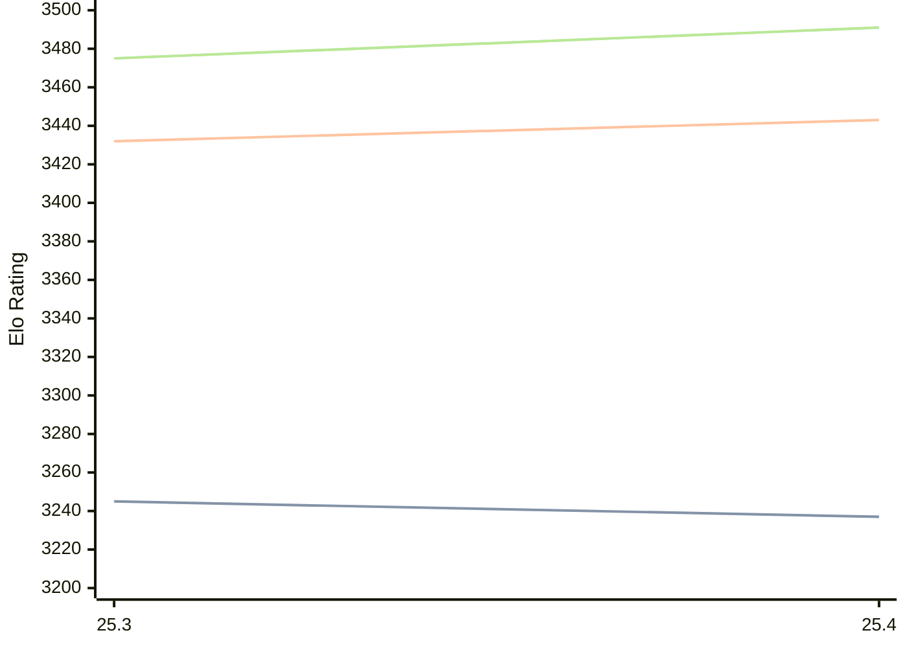

# Engine: Arasan

Author: Jon Dart

Home: https://github.com/jdart1/arasan-chess

## Elo Ratings

| Version | Published | STC 8.0+0.08s  | LTC 60.0+0.60s | VLTC 2m24s+1.12s | Comment |
| --- | --- | --- | --- | --- | --- |
| 25.4 | 2026-04-15 | 3237(-8) | 3443(+11) | 3491(+16) |  |
| 25.3 | 2025-12-28 | 3245(+new) | 3432(+new) | 3475(+new) |  |
| 25.2 | 2025-07-15 |  |  |  |  |
 | | | cElo (∆ prev) | cElo (∆ prev) | cElo (∆ prev) | 

<a href="https://github.com/computer-chess-index/cci/issues/new?template=submit-version.yml&title=[VERSION]+Arasan+<version>&body=###%20Engine%20name%0AArasan%0A%0A###%20Version%0A25.4" target="_blank">Submit new version</a>

 Test Conditions:

GUI/CLI: <a href=https://github.com/cutechess/cutechess target="_blank">Cute-Chess</a> 
Elo Calculation: <a href=https://www.remi-coulom.fr/Bayesian-Elo/ target="_blank">Bayesian-Elo</a> 
CPU: Intel(R) Core(TM) i5-7500T 2.70GHz 
Opening book: 8_moves_v3 
\* STC: 8.0+0.08s, LTC: 60.0+0.60s, VLTC: 2m24s+1.12s

 Lists:
Ratings: <a href=https://github.com/computer-chess-index/cci/blob/main/lists/CCIRatings.csv target="_blank">Complete list</a>

Generated: 2026-05-19 06:22:47

## Ratings Verlauf

⬛ STC (8.0+0.08s) &nbsp;&nbsp; 🟧 LTC (60.0+0.60s) &nbsp;&nbsp; 🟩 VLTC (2m24s+1.12s)

dark mode: 🟩STC (8.0+0.08s) 🟧LTC (60.0+0.60s) ⬜VLTC (2m24s+1.12s)

## Detailed Evaluation Results

| Version | Time Control | Elo  | Range +/- | Matches | Score | Average Opponent Elo | Draws |
| --- | --- | --- | --- | --- | --- | --- | --- |
| 25.4 | VLTC (2m24s+1.12s) | 3491 | 27 | 304 | 50% | 3495 | 88% |
| 25.4 | LTC (60.0+0.60s) | 3443 | 27 | 328 | 50% | 3441 | 80% |
| 25.4 | STC (8.0+0.08s) | 3237 | 27 | 368 | 51% | 3229 | 63% |
| --- | --- | --- | --- | --- | --- | --- | --- |
| 25.3 | VLTC (2m24s+1.12s) | 3475 | 26 | 356 | 51% | 3470 | 82% |
| 25.3 | LTC (60.0+0.60s) | 3432 | 26 | 360 | 51% | 3425 | 78% |
| 25.3 | STC (8.0+0.08s) | 3245 | 24 | 488 | 52% | 3229 | 59% |
| --- | --- | --- | --- | --- | --- | --- | --- |