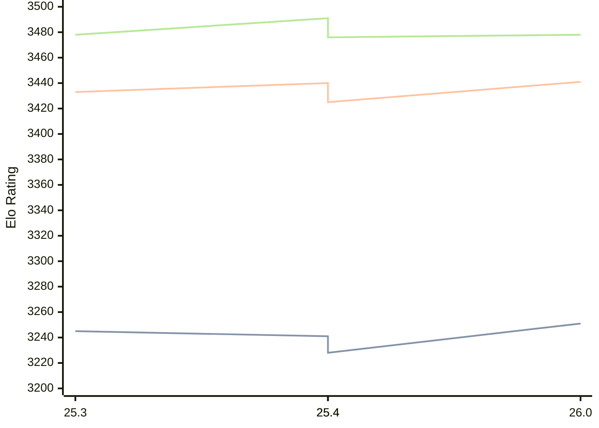

# Engine: Arasan

Author: Jon Dart

Home: https://github.com/jdart1/arasan-chess

## Elo Ratings

| Version | Published | STC 8.0+0.08s  | LTC 60.0+0.60s | VLTC 2m24s+1.12s | Comment |
| --- | --- | --- | --- | --- | --- |
| 26.0 | 2026-07-24 | 3251(+10) | 3441(+1) | 3478(-13) |  |
| 25.4 | 2026-04-15 | 3241(+13) | 3440(+15) | 3491(+15) |  |
| 25.4 | 2026-04-15 | 3228(-17) | 3425(-8) | 3476(-2) |  |
| 25.3 | 2025-12-28 | 3245 | 3433 | 3478 |  |
 | | | cElo (∆ prev) | cElo (∆ prev) | cElo (∆ prev) | 

<a href="https://github.com/computer-chess-index/cci/issues/new?template=submit-version.yml&title=[VERSION]+Arasan+<version>&body=###%20Engine%20name%0AArasan%0A%0A###%20Version%0A26.0" target="_blank">Submit new version</a>

 Test Conditions:

GUI/CLI: <a href=https://github.com/cutechess/cutechess target="_blank">Cute-Chess</a> 
Elo Calculation: <a href=https://www.remi-coulom.fr/Bayesian-Elo/ target="_blank">Bayesian-Elo</a> 
CPU: Intel(R) Core(TM) i5-7500T 2.70GHz 
Opening book: 8_moves_v3 
\* STC: 8.0+0.08s, LTC: 60.0+0.60s, VLTC: 2m24s+1.12s

 Lists:
Ratings: <a href=https://github.com/computer-chess-index/cci/blob/main/lists/CCIRatings.csv target="_blank">Complete list</a>

Generated: 2026-09-12 04:35:43

## Ratings Verlauf

## Detailed Evaluation Results

| Version | Time Control | Elo  | Range +/- | Matches | Score | Average Opponent Elo | Draws |
| --- | --- | --- | --- | --- | --- | --- | --- |
| 26.0 | VLTC (2m24s+1.12s) | 3478 | 28 | 288 | 51% | 3476 | 85% |
| 26.0 | LTC (60.0+0.60s) | 3441 | 28 | 308 | 51% | 3436 | 79% |
| 26.0 | STC (8.0+0.08s) | 3251 | 27 | 368 | 49% | 3258 | 65% |
| --- | --- | --- | --- | --- | --- | --- | --- |
| 25.4 | VLTC (2m24s+1.12s) | 3491 | 24 | 408 | 49% | 3497 | 86% |
| 25.4 | LTC (60.0+0.60s) | 3440 | 24 | 404 | 50% | 3441 | 78% |
| 25.4 | STC (8.0+0.08s) | 3241 | 24 | 450 | 51% | 3225 | 63% |
| --- | --- | --- | --- | --- | --- | --- | --- |
| 25.4 | VLTC (2m24s+1.12s) | 3476 | 24 | 408 | 49% | 3480 | 86% |
| 25.4 | LTC (60.0+0.60s) | 3425 | 24 | 404 | 50% | 3426 | 78% |
| 25.4 | STC (8.0+0.08s) | 3228 | 24 | 450 | 51% | 3212 | 63% |
| --- | --- | --- | --- | --- | --- | --- | --- |
| 25.3 | VLTC (2m24s+1.12s) | 3478 | 26 | 356 | 51% | 3472 | 82% |
| 25.3 | LTC (60.0+0.60s) | 3433 | 26 | 360 | 51% | 3426 | 78% |
| 25.3 | STC (8.0+0.08s) | 3245 | 24 | 488 | 52% | 3229 | 59% |
| --- | --- | --- | --- | --- | --- | --- | --- |