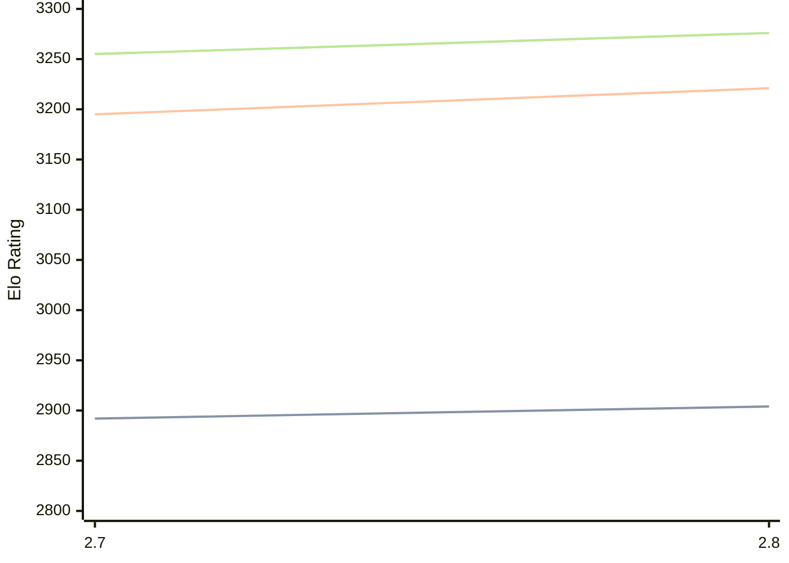

# Engine: Arcanum

Author: Lars Aurud

Home: https://github.com/LarsAur/Arcanum

## Elo Ratings

| Version | Published | STC 8.0+0.08s  | LTC 60.0+0.60s | VLTC 2m24s+1.12s | Comment |
| --- | --- | --- | --- | --- | --- |
| 2.8 | 2026-05-16 | 2904(+12) | 3221(+26) | 3276(+21) |  |
| 2.7 | 2025-10-18 | 2892 | 3195 | 3255 |  |
 | | | cElo (∆ prev) | cElo (∆ prev) | cElo (∆ prev) | 

<a href="https://github.com/computer-chess-index/cci/issues/new?template=submit-version.yml&title=[VERSION]+Arcanum+<version>&body=###%20Engine%20name%0AArcanum%0A%0A###%20Version%0A2.8" target="_blank">Submit new version</a>

 Test Conditions:

GUI/CLI: <a href=https://github.com/cutechess/cutechess target="_blank">Cute-Chess</a> 
Elo Calculation: <a href=https://www.remi-coulom.fr/Bayesian-Elo/ target="_blank">Bayesian-Elo</a> 
CPU: Intel(R) Core(TM) i5-7500T 2.70GHz 
Opening book: 8_moves_v3 
\* STC: 8.0+0.08s, LTC: 60.0+0.60s, VLTC: 2m24s+1.12s

 Lists:
Ratings: <a href=https://github.com/computer-chess-index/cci/blob/main/lists/CCIRatings.csv target="_blank">Complete list</a>

Generated: 2026-08-18 06:22:42

## Ratings Verlauf

⬛ STC (8.0+0.08s) &nbsp;&nbsp; 🟧 LTC (60.0+0.60s) &nbsp;&nbsp; 🟩 VLTC (2m24s+1.12s)

dark mode: 🟩STC (8.0+0.08s) 🟧LTC (60.0+0.60s) ⬜VLTC (2m24s+1.12s)

## Detailed Evaluation Results

| Version | Time Control | Elo  | Range +/- | Matches | Score | Average Opponent Elo | Draws |
| --- | --- | --- | --- | --- | --- | --- | --- |
| 2.8 | VLTC (2m24s+1.12s) | 3276 | 26 | 396 | 50% | 3279 | 64% |
| 2.8 | LTC (60.0+0.60s) | 3221 | 27 | 392 | 50% | 3217 | 56% |
| 2.8 | STC (8.0+0.08s) | 2904 | 26 | 456 | 49% | 2913 | 44% |
| --- | --- | --- | --- | --- | --- | --- | --- |
| 2.7 | VLTC (2m24s+1.12s) | 3255 | 27 | 394 | 54% | 3221 | 56% |
| 2.7 | LTC (60.0+0.60s) | 3195 | 26 | 424 | 50% | 3177 | 57% |
| 2.7 | STC (8.0+0.08s) | 2892 | 23 | 554 | 49% | 2890 | 44% |
| --- | --- | --- | --- | --- | --- | --- | --- |