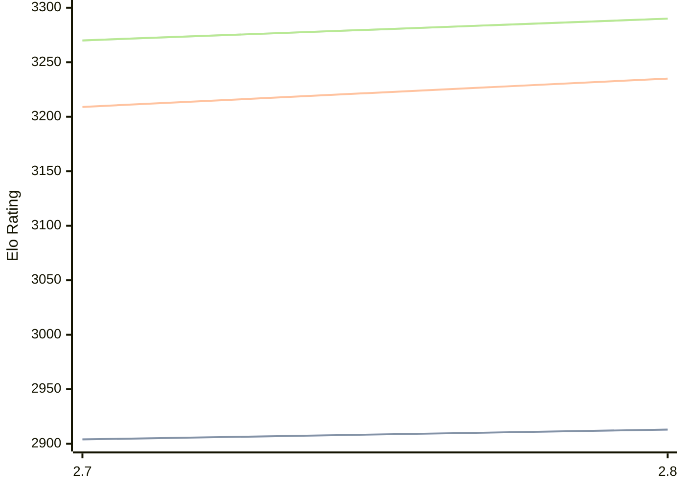

# Engine: Arcanum

Author: Lars Aurud

Home: https://github.com/LarsAur/Arcanum

## Elo Ratings

| Version | Published | STC 8.0+0.08s  | LTC 60.0+0.60s | VLTC 2m24s+1.12s | Comment |
| --- | --- | --- | --- | --- | --- |
| 2.8 | 2026-05-16 | 2913(+9) | 3235(+26) | 3290(+20) |  |
| 2.7 | 2025-10-18 | 2904 | 3209 | 3270 |  |
 | | | cElo (∆ prev) | cElo (∆ prev) | cElo (∆ prev) | 

<a href="https://github.com/computer-chess-index/cci/issues/new?template=submit-version.yml&title=[VERSION]+Arcanum+<version>&body=###%20Engine%20name%0AArcanum%0A%0A###%20Version%0A2.8" target="_blank">Submit new version</a>

 Test Conditions:

GUI/CLI: <a href=https://github.com/cutechess/cutechess target="_blank">Cute-Chess</a> 
Elo Calculation: <a href=https://www.remi-coulom.fr/Bayesian-Elo/ target="_blank">Bayesian-Elo</a> 
CPU: Intel(R) Core(TM) i5-7500T 2.70GHz 
Opening book: 8_moves_v3 
\* STC: 8.0+0.08s, LTC: 60.0+0.60s, VLTC: 2m24s+1.12s

 Lists:
Ratings: <a href=https://github.com/computer-chess-index/cci/blob/main/lists/CCIRatings.csv target="_blank">Complete list</a>

Generated: 2026-10-02 04:35:52

## Ratings Verlauf

```mermaid
%%{init: {"theme":"base","themeVariables":{"seriesColors:['#a3a3a3','#222221','#faa371']}}}%%
xychart-beta
  x-axis ["2.7", "2.8"]
  y-axis "Elo Rating" 2900 --> 3300
  line "" [2904, 2913]
  line "STC (8.0+0.08s)" [2904, 2913]
  line "LTC (60.0+0.60s)" [3209, 3235]
  line "" [3270, 3290]
  line "VLTC (2m24s+1.12s)" [3270, 3290]
```

## Detailed Evaluation Results

| Version | Time Control | Elo  | Range +/- | Matches | Score | Average Opponent Elo | Draws |
| --- | --- | --- | --- | --- | --- | --- | --- |
| 2.8 | VLTC (2m24s+1.12s) | 3290 | 24 | 448 | 50% | 3293 | 66% |
| 2.8 | LTC (60.0+0.60s) | 3235 | 26 | 414 | 50% | 3232 | 57% |
| 2.8 | STC (8.0+0.08s) | 2913 | 24 | 504 | 49% | 2925 | 44% |
| --- | --- | --- | --- | --- | --- | --- | --- |
| 2.7 | VLTC (2m24s+1.12s) | 3270 | 27 | 394 | 54% | 3236 | 56% |
| 2.7 | LTC (60.0+0.60s) | 3209 | 26 | 424 | 50% | 3191 | 57% |
| 2.7 | STC (8.0+0.08s) | 2904 | 23 | 554 | 49% | 2904 | 44% |
| --- | --- | --- | --- | --- | --- | --- | --- |