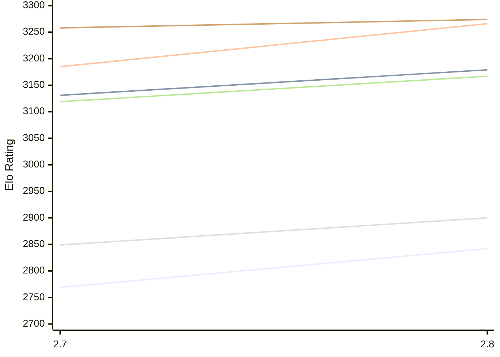
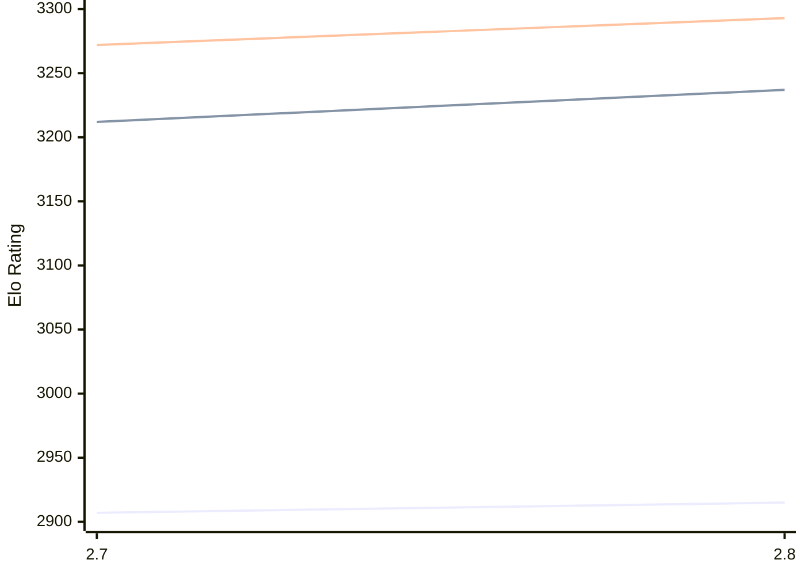

# Engine: Arcanum

Author: Lars Aurud

Home: https://github.com/LarsAur/Arcanum

## Elo Ratings E1 (Ultra 7 265T (1.50 GHz) - E-Core)

| Version | Published | STC 8.0+0.08s  | LTC 60.0+0.60s | VLTC 2m24s+1.12s | Comment |
| --- | --- | --- | --- | --- | --- |
| 2.8 | 2026-05-16 | 2842(+73) | 3179(+48) | 3266(+81) |  |
| 2.7 | 2025-10-18 | 2769 | 3131 | 3185 |  |
 | | | cElo (∆ prev) | cElo (∆ prev) | cElo (∆ prev) | 

## Elo Ratings P1 (Ultra 7 265T (1.50 GHz) - P-Core)

| Version | Published | STC 8.0+0.08s  | LTC 60.0+0.60s | VLTC 2m24s+1.12s | Comment |
| --- | --- | --- | --- | --- | --- |
| 2.8 | 2026-05-16 | 2900(+51) | 3167(+48) | 3274(+16) |  |
| 2.7 | 2025-10-18 | 2849 | 3119 | 3258 |  |
 | | | cElo (∆ prev) | cElo (∆ prev) | cElo (∆ prev) | 

## Elo Ratings T1 (i5-7500T 2.70GHz)

| Version | Published | STC 8.0+0.08s  | LTC 60.0+0.60s | VLTC 2m24s+1.12s | Comment |
| --- | --- | --- | --- | --- | --- |
| 2.8 | 2026-05-16 | 2915(+8) | 3237(+25) | 3293(+21) |  |
| 2.7 | 2025-10-18 | 2907 | 3212 | 3272 |  |
 | | | cElo (∆ prev) | cElo (∆ prev) | cElo (∆ prev) | 

<a href="https://github.com/computer-chess-index/cci/issues/new?template=submit-version.yml&title=[VERSION]+Arcanum+<version>&body=###%20Engine%20name%0AArcanum%0A%0A###%20Version%0A2.8" target="_blank">Submit new version</a>

 Test Conditions:

GUI/CLI: <a href=https://github.com/cutechess/cutechess target="_blank">Cute-Chess</a> 
Elo Calculation: <a href=https://www.remi-coulom.fr/Bayesian-Elo/ target="_blank">Bayesian-Elo</a> 
CPU for P1: Intel(R) Core(TM) Ultra 7 265T (1.50 GHz) - P-Core 
CPU for E1: Intel(R) Core(TM) Ultra 7 265T (1.50 GHz) - E-Core 
CPU for T1: Intel(R) Core(TM) i5-7500T 2.70GHz 
Opening book: 8_moves_v3 
\* STC: 8.0+0.08s, LTC: 60.0+0.60s, VLTC: 2m24s+1.12s

 Lists:
Ratings: <a href=https://github.com/computer-chess-index/cci/blob/main/lists/CCIRatings.csv target="_blank">Complete list</a>

Generated: 2026-11-25 05:35:58

## Ratings Verlauf E1 / P1

```mermaid
%%{init: {"theme":"base","themeVariables":{"seriesColors:['#a3a3a3','#222221','#faa371']}}}%%
xychart-beta
  x-axis ["2.7", "2.8"]
  y-axis "Elo Rating" 2700 --> 3300
  line "E1: STC (8.0+0.08s)" [2769, 2842]
  line "E1: LTC (60.0+0.60s)" [3131, 3179]
  line "E1: VLTC (2m24s+1.12s)" [3185, 3266]
  line "P1: STC (8.0+0.08s)" [2849, 2900]
  line "P1: LTC (60.0+0.60s)" [3119, 3167]
  line "P1: VLTC (2m24s+1.12s)" [3258, 3274]
```

## Ratings Verlauf T1

```mermaid
%%{init: {"theme":"base","themeVariables":{"seriesColors:['#a3a3a3','#222221','#faa371']}}}%%
xychart-beta
  x-axis ["2.7", "2.8"]
  y-axis "Elo Rating" 2900 --> 3300
  line "T1: STC (8.0+0.08s)" [2907, 2915]
  line "T1: LTC (60.0+0.60s)" [3212, 3237]
  line "T1: VLTC (2m24s+1.12s)" [3272, 3293]
```

## Detailed Evaluation Results

| Version | Time Control | Variant | Elo  | Range +/- | Matches | Score | Average Opponent Elo | Draws |
| --- | --- |--- | --- | --- | --- | --- | --- | --- |
| 2.8 | VLTC (2m24s+1.12s) | E1 | 3266 | 27 | 376 | 51% | 3229 | 60% |
|  |  | T1 | 3293 | 24 | 448 | 50% | 3295 | 66% |
|  |  | P1 | 3274 | 33 | 236 | 53% | 3243 | 66% |
|  | LTC (60.0+0.60s) | T1 | 3237 | 26 | 416 | 50% | 3233 | 57% |
|  |  | P1 | 3167 | 34 | 238 | 50% | 3162 | 60% |
|  |  | E1 | 3179 | 28 | 348 | 53% | 3140 | 62% |
|  | STC (8.0+0.08s) | T1 | 2915 | 24 | 504 | 49% | 2928 | 44% |
|  |  | P1 | 2900 | 32 | 278 | 47% | 2921 | 46% |
|  |  | E1 | 2842 | 28 | 382 | 46% | 2871 | 49% |
| --- | --- |--- | --- | --- | --- | --- | --- | --- |
| 2.7 | VLTC (2m24s+1.12s) | T1 | 3272 | 27 | 394 | 54% | 3237 | 56% |
|  |  | P1 | 3258 | 111 | 26 | 71% | 3019 | 50% |
|  |  | E1 | 3185 | 84 | 42 | 63% | 3047 | 55% |
|  | LTC (60.0+0.60s) | T1 | 3212 | 26 | 424 | 50% | 3193 | 57% |
|  |  | P1 | 3119 | 102 | 24 | 42% | 3189 | 67% |
|  |  | E1 | 3131 | 89 | 40 | 56% | 3066 | 33% |
|  | STC (8.0+0.08s) | T1 | 2907 | 23 | 554 | 49% | 2905 | 44% |
|  |  | P1 | 2849 | 111 | 28 | 41% | 2901 | 32% |
|  |  | E1 | 2769 | 82 | 50 | 59% | 2687 | 26% |