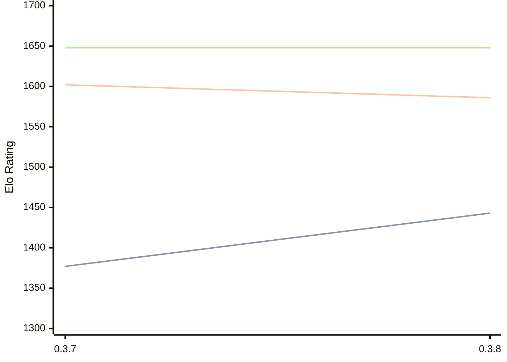

# Engine: Arche

Author: Andrew Wright

Home: https://github.com/aywrite/arche

## Elo Ratings

| Version | Published | STC 8.0+0.08s  | LTC 60.0+0.60s | VLTC 2m24s+1.12s | Comment |
| --- | --- | --- | --- | --- | --- |
| 0.3.9 | 2026-08-04 |  |  |  |  |
| 0.3.8 | 2026-08-01 | 1443(+66) | 1586(-16) | 1648(0) |  |
| 0.3.7 | 2026-07-31 | 1377(+new) | 1602(+new) | 1648(+new) |  |
| 0.3.6 | 2022-10-04 |  |  |  |  |
| 0.3.5 | 2022-09-25 |  |  |  |  |
| 0.3.4 | 2022-09-20 |  |  |  |  |
| 0.3.3 | 2022-09-17 |  |  |  |  |
| 0.3.2 | 2022-09-17 |  |  |  |  |
| 0.3.0 | 2022-09-16 |  |  |  |  |
 | | | cElo (∆ prev) | cElo (∆ prev) | cElo (∆ prev) | 

<a href="https://github.com/computer-chess-index/cci/issues/new?template=submit-version.yml&title=[VERSION]+Arche+<version>&body=###%20Engine%20name%0AArche%0A%0A###%20Version%0A0.3.9" target="_blank">Submit new version</a>

 Test Conditions:

GUI/CLI: <a href=https://github.com/cutechess/cutechess target="_blank">Cute-Chess</a> 
Elo Calculation: <a href=https://www.remi-coulom.fr/Bayesian-Elo/ target="_blank">Bayesian-Elo</a> 
CPU: Intel(R) Core(TM) i5-7500T 2.70GHz 
Opening book: 8_moves_v3 
\* STC: 8.0+0.08s, LTC: 60.0+0.60s, VLTC: 2m24s+1.12s

 Lists:
Ratings: <a href=https://github.com/computer-chess-index/cci/blob/main/lists/CCIRatings.csv target="_blank">Complete list</a>

Generated: 2026-08-06 06:22:48

## Ratings Verlauf

⬛ STC (8.0+0.08s) &nbsp;&nbsp; 🟧 LTC (60.0+0.60s) &nbsp;&nbsp; 🟩 VLTC (2m24s+1.12s)

dark mode: 🟩STC (8.0+0.08s) 🟧LTC (60.0+0.60s) ⬜VLTC (2m24s+1.12s)

## Detailed Evaluation Results

| Version | Time Control | Elo  | Range +/- | Matches | Score | Average Opponent Elo | Draws |
| --- | --- | --- | --- | --- | --- | --- | --- |
| 0.3.8 | VLTC (2m24s+1.12s) | 1648 | 45 | 174 | 52% | 1627 | 23% |
| 0.3.8 | LTC (60.0+0.60s) | 1586 | 54 | 116 | 50% | 1584 | 23% |
| 0.3.8 | STC (8.0+0.08s) | 1443 | 50 | 144 | 53% | 1409 | 19% |
| --- | --- | --- | --- | --- | --- | --- | --- |
| 0.3.7 | VLTC (2m24s+1.12s) | 1648 | 39 | 246 | 47% | 1701 | 20% |
| 0.3.7 | LTC (60.0+0.60s) | 1602 | 37 | 272 | 47% | 1651 | 21% |
| 0.3.7 | STC (8.0+0.08s) | 1377 | 37 | 290 | 43% | 1467 | 18% |
| --- | --- | --- | --- | --- | --- | --- | --- |