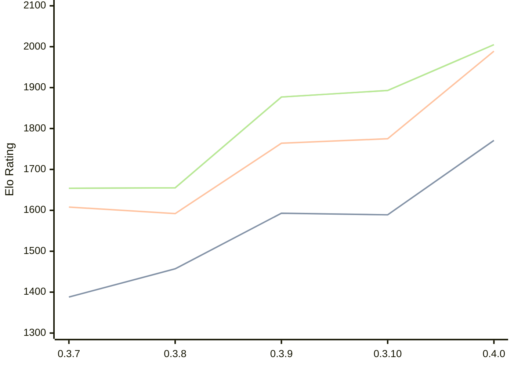

# Engine: Arche

Author: Andrew Wright

Home: https://github.com/aywrite/arche

## Elo Ratings

| Version | Published | STC 8.0+0.08s  | LTC 60.0+0.60s | VLTC 2m24s+1.12s | Comment |
| --- | --- | --- | --- | --- | --- |
| 0.4.0 | 2026-08-28 | 1771(+182) | 1989(+214) | 2005(+112) |  |
| 0.3.10 | 2026-08-22 | 1589(-4) | 1775(+11) | 1893(+16) |  |
| 0.3.9 | 2026-08-04 | 1593(+136) | 1764(+172) | 1877(+222) |  |
| 0.3.8 | 2026-08-01 | 1457(+69) | 1592(-16) | 1655(+1) |  |
| 0.3.7 | 2026-07-31 | 1388 | 1608 | 1654 |  |
 | | | cElo (∆ prev) | cElo (∆ prev) | cElo (∆ prev) | 

<a href="https://github.com/computer-chess-index/cci/issues/new?template=submit-version.yml&title=[VERSION]+Arche+<version>&body=###%20Engine%20name%0AArche%0A%0A###%20Version%0A0.4.0" target="_blank">Submit new version</a>

 Test Conditions:

GUI/CLI: <a href=https://github.com/cutechess/cutechess target="_blank">Cute-Chess</a> 
Elo Calculation: <a href=https://www.remi-coulom.fr/Bayesian-Elo/ target="_blank">Bayesian-Elo</a> 
CPU: Intel(R) Core(TM) i5-7500T 2.70GHz 
Opening book: 8_moves_v3 
\* STC: 8.0+0.08s, LTC: 60.0+0.60s, VLTC: 2m24s+1.12s

 Lists:
Ratings: <a href=https://github.com/computer-chess-index/cci/blob/main/lists/CCIRatings.csv target="_blank">Complete list</a>

Generated: 2026-08-30 13:06:39

## Ratings Verlauf

## Detailed Evaluation Results

| Version | Time Control | Elo  | Range +/- | Matches | Score | Average Opponent Elo | Draws |
| --- | --- | --- | --- | --- | --- | --- | --- |
| 0.4.0 | VLTC (2m24s+1.12s) | 2005 | 48 | 136 | 47% | 2026 | 35% |
| 0.4.0 | LTC (60.0+0.60s) | 1989 | 55 | 120 | 55% | 1939 | 20% |
| 0.4.0 | STC (8.0+0.08s) | 1771 | 53 | 128 | 52% | 1754 | 18% |
| --- | --- | --- | --- | --- | --- | --- | --- |
| 0.3.10 | VLTC (2m24s+1.12s) | 1893 | 38 | 242 | 50% | 1889 | 25% |
| 0.3.10 | LTC (60.0+0.60s) | 1775 | 37 | 260 | 51% | 1764 | 20% |
| 0.3.10 | STC (8.0+0.08s) | 1589 | 36 | 280 | 46% | 1624 | 23% |
| --- | --- | --- | --- | --- | --- | --- | --- |
| 0.3.9 | VLTC (2m24s+1.12s) | 1877 | 33 | 334 | 55% | 1824 | 18% |
| 0.3.9 | LTC (60.0+0.60s) | 1764 | 38 | 248 | 50% | 1767 | 16% |
| 0.3.9 | STC (8.0+0.08s) | 1593 | 34 | 302 | 51% | 1573 | 22% |
| --- | --- | --- | --- | --- | --- | --- | --- |
| 0.3.8 | VLTC (2m24s+1.12s) | 1655 | 44 | 178 | 52% | 1636 | 23% |
| 0.3.8 | LTC (60.0+0.60s) | 1592 | 54 | 120 | 50% | 1590 | 23% |
| 0.3.8 | STC (8.0+0.08s) | 1457 | 48 | 156 | 53% | 1426 | 20% |
| --- | --- | --- | --- | --- | --- | --- | --- |
| 0.3.7 | VLTC (2m24s+1.12s) | 1654 | 39 | 246 | 47% | 1706 | 20% |
| 0.3.7 | LTC (60.0+0.60s) | 1608 | 37 | 272 | 47% | 1658 | 21% |
| 0.3.7 | STC (8.0+0.08s) | 1388 | 37 | 290 | 43% | 1477 | 18% |
| --- | --- | --- | --- | --- | --- | --- | --- |