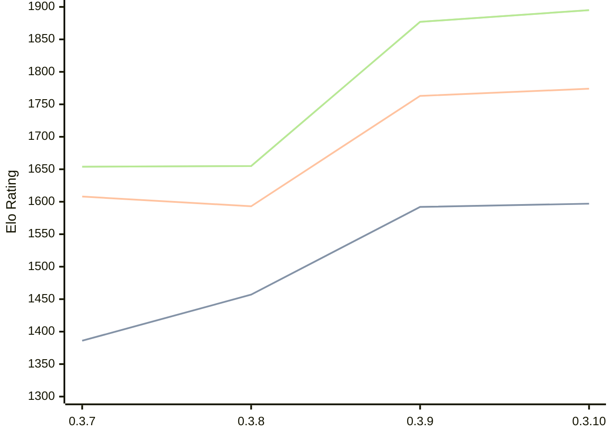

# Engine: Arche

Author: Andrew Wright

Home: https://github.com/aywrite/arche

## Elo Ratings

| Version | Published | STC 8.0+0.08s  | LTC 60.0+0.60s | VLTC 2m24s+1.12s | Comment |
| --- | --- | --- | --- | --- | --- |
| 0.3.10 | 2026-08-22 | 1597(+5) | 1774(+11) | 1895(+18) |  |
| 0.3.9 | 2026-08-04 | 1592(+135) | 1763(+170) | 1877(+222) |  |
| 0.3.8 | 2026-08-01 | 1457(+71) | 1593(-15) | 1655(+1) |  |
| 0.3.7 | 2026-07-31 | 1386 | 1608 | 1654 |  |
 | | | cElo (∆ prev) | cElo (∆ prev) | cElo (∆ prev) | 

<a href="https://github.com/computer-chess-index/cci/issues/new?template=submit-version.yml&title=[VERSION]+Arche+<version>&body=###%20Engine%20name%0AArche%0A%0A###%20Version%0A0.3.10" target="_blank">Submit new version</a>

 Test Conditions:

GUI/CLI: <a href=https://github.com/cutechess/cutechess target="_blank">Cute-Chess</a> 
Elo Calculation: <a href=https://www.remi-coulom.fr/Bayesian-Elo/ target="_blank">Bayesian-Elo</a> 
CPU: Intel(R) Core(TM) i5-7500T 2.70GHz 
Opening book: 8_moves_v3 
\* STC: 8.0+0.08s, LTC: 60.0+0.60s, VLTC: 2m24s+1.12s

 Lists:
Ratings: <a href=https://github.com/computer-chess-index/cci/blob/main/lists/CCIRatings.csv target="_blank">Complete list</a>

Generated: 2026-08-25 06:22:45

## Ratings Verlauf

⬛ STC (8.0+0.08s) &nbsp;&nbsp; 🟧 LTC (60.0+0.60s) &nbsp;&nbsp; 🟩 VLTC (2m24s+1.12s)

dark mode: 🟩STC (8.0+0.08s) 🟧LTC (60.0+0.60s) ⬜VLTC (2m24s+1.12s)

## Detailed Evaluation Results

| Version | Time Control | Elo  | Range +/- | Matches | Score | Average Opponent Elo | Draws |
| --- | --- | --- | --- | --- | --- | --- | --- |
| 0.3.10 | VLTC (2m24s+1.12s) | 1895 | 40 | 208 | 50% | 1894 | 26% |
| 0.3.10 | LTC (60.0+0.60s) | 1774 | 39 | 236 | 51% | 1762 | 21% |
| 0.3.10 | STC (8.0+0.08s) | 1597 | 38 | 248 | 47% | 1627 | 22% |
| --- | --- | --- | --- | --- | --- | --- | --- |
| 0.3.9 | VLTC (2m24s+1.12s) | 1877 | 33 | 334 | 55% | 1823 | 18% |
| 0.3.9 | LTC (60.0+0.60s) | 1763 | 39 | 248 | 50% | 1766 | 16% |
| 0.3.9 | STC (8.0+0.08s) | 1592 | 34 | 302 | 51% | 1571 | 22% |
| --- | --- | --- | --- | --- | --- | --- | --- |
| 0.3.8 | VLTC (2m24s+1.12s) | 1655 | 44 | 178 | 52% | 1636 | 23% |
| 0.3.8 | LTC (60.0+0.60s) | 1593 | 54 | 120 | 50% | 1590 | 23% |
| 0.3.8 | STC (8.0+0.08s) | 1457 | 48 | 156 | 53% | 1424 | 20% |
| --- | --- | --- | --- | --- | --- | --- | --- |
| 0.3.7 | VLTC (2m24s+1.12s) | 1654 | 39 | 246 | 47% | 1706 | 20% |
| 0.3.7 | LTC (60.0+0.60s) | 1608 | 37 | 272 | 47% | 1659 | 21% |
| 0.3.7 | STC (8.0+0.08s) | 1386 | 37 | 290 | 43% | 1476 | 18% |
| --- | --- | --- | --- | --- | --- | --- | --- |