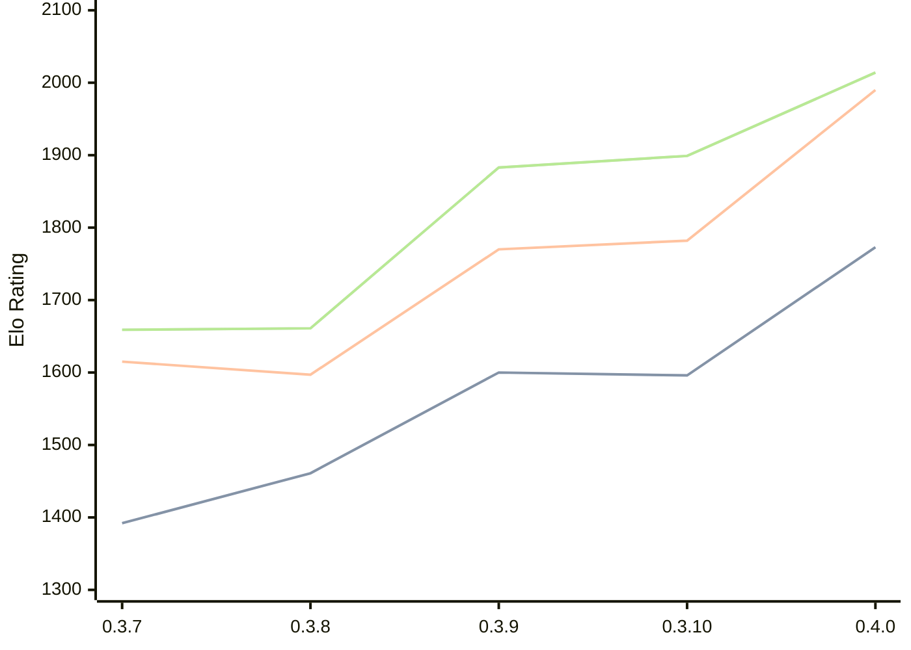

# Engine: Arche

Author: Andrew Wright

Home: https://github.com/aywrite/arche

## Elo Ratings

| Version | Published | STC 8.0+0.08s  | LTC 60.0+0.60s | VLTC 2m24s+1.12s | Comment |
| --- | --- | --- | --- | --- | --- |
| 0.4.8 | 2026-10-04 |  |  |  |  |
| 0.4.7 | 2026-09-27 |  |  |  |  |
| 0.4.6 | 2026-09-23 |  |  |  |  |
| 0.4.5 | 2026-09-19 |  |  |  |  |
| 0.4.4 | 2026-09-14 |  |  |  |  |
| 0.4.3 | 2026-09-12 |  |  |  |  |
| 0.4.2 | 2026-09-07 |  |  |  |  |
| 0.4.1 | 2026-09-04 |  |  |  |  |
| 0.4.0 | 2026-08-28 | 1773(+177) | 1990(+208) | 2014(+115) |  |
| 0.3.10 | 2026-08-22 | 1596(-4) | 1782(+12) | 1899(+16) |  |
| 0.3.9 | 2026-08-04 | 1600(+139) | 1770(+173) | 1883(+222) |  |
| 0.3.8 | 2026-08-01 | 1461(+69) | 1597(-18) | 1661(+2) |  |
| 0.3.7 | 2026-07-31 | 1392 | 1615 | 1659 |  |
 | | | cElo (∆ prev) | cElo (∆ prev) | cElo (∆ prev) | 

<a href="https://github.com/computer-chess-index/cci/issues/new?template=submit-version.yml&title=[VERSION]+Arche+<version>&body=###%20Engine%20name%0AArche%0A%0A###%20Version%0A0.4.8" target="_blank">Submit new version</a>

 Test Conditions:

GUI/CLI: <a href=https://github.com/cutechess/cutechess target="_blank">Cute-Chess</a> 
Elo Calculation: <a href=https://www.remi-coulom.fr/Bayesian-Elo/ target="_blank">Bayesian-Elo</a> 
CPU: Intel(R) Core(TM) i5-7500T 2.70GHz 
Opening book: 8_moves_v3 
\* STC: 8.0+0.08s, LTC: 60.0+0.60s, VLTC: 2m24s+1.12s

 Lists:
Ratings: <a href=https://github.com/computer-chess-index/cci/blob/main/lists/CCIRatings.csv target="_blank">Complete list</a>

Generated: 2026-10-09 04:35:52

## Ratings Verlauf

```mermaid
%%{init: {"theme":"base","themeVariables":{"seriesColors:['#a3a3a3','#222221','#faa371']}}}%%
xychart-beta
  x-axis ["0.3.7", "0.3.8", "0.3.9", "0.3.10", "0.4.0"]
  y-axis "Elo Rating" 1300 --> 2100
  line "" [1392, 1461, 1600, 1596, 1773]
  line "STC (8.0+0.08s)" [1392, 1461, 1600, 1596, 1773]
  line "LTC (60.0+0.60s)" [1615, 1597, 1770, 1782, 1990]
  line "" [1659, 1661, 1883, 1899, 2014]
  line "VLTC (2m24s+1.12s)" [1659, 1661, 1883, 1899, 2014]
```

## Detailed Evaluation Results

| Version | Time Control | Elo  | Range +/- | Matches | Score | Average Opponent Elo | Draws |
| --- | --- | --- | --- | --- | --- | --- | --- |
| 0.4.0 | VLTC (2m24s+1.12s) | 2014 | 37 | 232 | 48% | 2026 | 33% |
| 0.4.0 | LTC (60.0+0.60s) | 1990 | 39 | 228 | 52% | 1966 | 22% |
| 0.4.0 | STC (8.0+0.08s) | 1773 | 37 | 268 | 49% | 1779 | 18% |
| --- | --- | --- | --- | --- | --- | --- | --- |
| 0.3.10 | VLTC (2m24s+1.12s) | 1899 | 38 | 242 | 50% | 1895 | 25% |
| 0.3.10 | LTC (60.0+0.60s) | 1782 | 37 | 260 | 51% | 1770 | 20% |
| 0.3.10 | STC (8.0+0.08s) | 1596 | 36 | 280 | 46% | 1632 | 23% |
| --- | --- | --- | --- | --- | --- | --- | --- |
| 0.3.9 | VLTC (2m24s+1.12s) | 1883 | 33 | 334 | 55% | 1829 | 18% |
| 0.3.9 | LTC (60.0+0.60s) | 1770 | 38 | 248 | 50% | 1773 | 16% |
| 0.3.9 | STC (8.0+0.08s) | 1600 | 34 | 302 | 51% | 1580 | 22% |
| --- | --- | --- | --- | --- | --- | --- | --- |
| 0.3.8 | VLTC (2m24s+1.12s) | 1661 | 44 | 178 | 52% | 1643 | 23% |
| 0.3.8 | LTC (60.0+0.60s) | 1597 | 54 | 120 | 50% | 1594 | 23% |
| 0.3.8 | STC (8.0+0.08s) | 1461 | 48 | 156 | 53% | 1430 | 20% |
| --- | --- | --- | --- | --- | --- | --- | --- |
| 0.3.7 | VLTC (2m24s+1.12s) | 1659 | 39 | 246 | 47% | 1713 | 20% |
| 0.3.7 | LTC (60.0+0.60s) | 1615 | 37 | 272 | 47% | 1665 | 21% |
| 0.3.7 | STC (8.0+0.08s) | 1392 | 37 | 290 | 43% | 1482 | 18% |
| --- | --- | --- | --- | --- | --- | --- | --- |