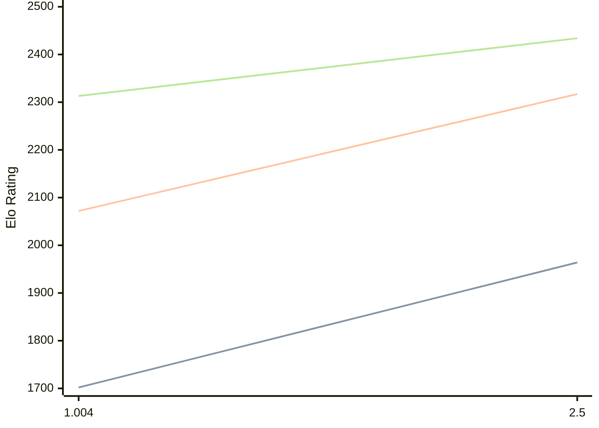

# Engine: Ares

Author: Charles Roberson

Home: 

## Elo Ratings

| Version | Published | STC 8.0+0.08s  | LTC 60.0+0.60s | VLTC 2m24s+1.12s | Comment |
| --- | --- | --- | --- | --- | --- |
| 2.5 | 2024-02-06 | 1964(+262) | 2317(+245) | 2434(+121) |  |
| 1.004 | 2009-10-31 | 1702 | 2072 | 2313 |  |
 | | | cElo (∆ prev) | cElo (∆ prev) | cElo (∆ prev) | 

<a href="https://github.com/computer-chess-index/cci/issues/new?template=submit-version.yml&title=[VERSION]+Ares+<version>&body=###%20Engine%20name%0AAres%0A%0A###%20Version%0A2.5" target="_blank">Submit new version</a>

 Test Conditions:

GUI/CLI: <a href=https://github.com/cutechess/cutechess target="_blank">Cute-Chess</a> 
Elo Calculation: <a href=https://www.remi-coulom.fr/Bayesian-Elo/ target="_blank">Bayesian-Elo</a> 
CPU: Intel(R) Core(TM) i5-7500T 2.70GHz 
Opening book: 8_moves_v3 
\* STC: 8.0+0.08s, LTC: 60.0+0.60s, VLTC: 2m24s+1.12s

 Lists:
Ratings: <a href=https://github.com/computer-chess-index/cci/blob/main/lists/CCIRatings.csv target="_blank">Complete list</a>

Generated: 2026-05-22 06:22:43

## Ratings Verlauf

⬛ STC (8.0+0.08s) &nbsp;&nbsp; 🟧 LTC (60.0+0.60s) &nbsp;&nbsp; 🟩 VLTC (2m24s+1.12s)

dark mode: 🟩STC (8.0+0.08s) 🟧LTC (60.0+0.60s) ⬜VLTC (2m24s+1.12s)

## Detailed Evaluation Results

| Version | Time Control | Elo  | Range +/- | Matches | Score | Average Opponent Elo | Draws |
| --- | --- | --- | --- | --- | --- | --- | --- |
| 2.5 | VLTC (2m24s+1.12s) | 2434 | 30 | 378 | 50% | 2431 | 25% |
| 2.5 | LTC (60.0+0.60s) | 2317 | 27 | 480 | 52% | 2294 | 24% |
| 2.5 | STC (8.0+0.08s) | 1964 | 24 | 630 | 51% | 1948 | 24% |
| --- | --- | --- | --- | --- | --- | --- | --- |
| 1.004 | VLTC (2m24s+1.12s) | 2313 | 45 | 176 | 47% | 2377 | 27% |
| 1.004 | LTC (60.0+0.60s) | 2072 | 79 | 60 | 49% | 2086 | 15% |
| 1.004 | STC (8.0+0.08s) | 1702 | 50 | 184 | 33% | 1998 | 14% |
| --- | --- | --- | --- | --- | --- | --- | --- |