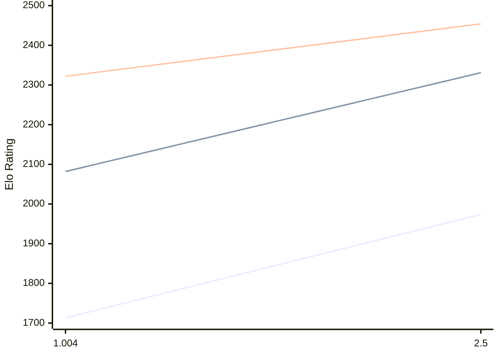

# Engine: Ares

Author: Charles Roberson

Home: 

## Elo Ratings E1 (Ultra 7 265T (1.50 GHz) - E-Core)

| Version | Published | STC 8.0+0.08s  | LTC 60.0+0.60s | VLTC 2m24s+1.12s | Comment |
| --- | --- | --- | --- | --- | --- |
| 2.5 | 2024-02-06 | 1978(-24) | 2233(+new) | 2437(+39) |  |
| 1.004 | 2009-10-31 | 2002 |  | 2398 |  |
 | | | cElo (∆ prev) | cElo (∆ prev) | cElo (∆ prev) | 

## Elo Ratings P1 (Ultra 7 265T (1.50 GHz) - P-Core)

| Version | Published | STC 8.0+0.08s  | LTC 60.0+0.60s | VLTC 2m24s+1.12s | Comment |
| --- | --- | --- | --- | --- | --- |
| 2.5 | 2024-02-06 | 1914(-71) | 2218(-385) | 2329(-154) |  |
| 1.004 | 2009-10-31 | 1985 | 2603 | 2483 |  |
 | | | cElo (∆ prev) | cElo (∆ prev) | cElo (∆ prev) | 

## Elo Ratings T1 (i5-7500T 2.70GHz)

| Version | Published | STC 8.0+0.08s  | LTC 60.0+0.60s | VLTC 2m24s+1.12s | Comment |
| --- | --- | --- | --- | --- | --- |
| 2.5 | 2024-02-06 | 1974(+261) | 2331(+249) | 2454(+132) |  |
| 1.004 | 2009-10-31 | 1713 | 2082 | 2322 |  |
 | | | cElo (∆ prev) | cElo (∆ prev) | cElo (∆ prev) | 

<a href="https://github.com/computer-chess-index/cci/issues/new?template=submit-version.yml&title=[VERSION]+Ares+<version>&body=###%20Engine%20name%0AAres%0A%0A###%20Version%0A2.5" target="_blank">Submit new version</a>

 Test Conditions:

GUI/CLI: <a href=https://github.com/cutechess/cutechess target="_blank">Cute-Chess</a> 
Elo Calculation: <a href=https://www.remi-coulom.fr/Bayesian-Elo/ target="_blank">Bayesian-Elo</a> 
CPU for P1: Intel(R) Core(TM) Ultra 7 265T (1.50 GHz) - P-Core 
CPU for E1: Intel(R) Core(TM) Ultra 7 265T (1.50 GHz) - E-Core 
CPU for T1: Intel(R) Core(TM) i5-7500T 2.70GHz 
Opening book: 8_moves_v3 
\* STC: 8.0+0.08s, LTC: 60.0+0.60s, VLTC: 2m24s+1.12s

 Lists:
Ratings: <a href=https://github.com/computer-chess-index/cci/blob/main/lists/CCIRatings.csv target="_blank">Complete list</a>

Generated: 2026-11-13 05:35:53

## Ratings Verlauf T1

```mermaid
%%{init: {"theme":"base","themeVariables":{"seriesColors:['#a3a3a3','#222221','#faa371']}}}%%
xychart-beta
  x-axis ["1.004", "2.5"]
  y-axis "Elo Rating" 1700 --> 2500
  line "T1: STC (8.0+0.08s)" [1713, 1974]
  line "T1: LTC (60.0+0.60s)" [2082, 2331]
  line "T1: VLTC (2m24s+1.12s)" [2322, 2454]
```

## Detailed Evaluation Results

| Version | Time Control | Variant | Elo  | Range +/- | Matches | Score | Average Opponent Elo | Draws |
| --- | --- |--- | --- | --- | --- | --- | --- | --- |
| 2.5 | VLTC (2m24s+1.12s) | E1 | 2437 | 35 | 296 | 51% | 2444 | 25% |
|  |  | T1 | 2454 | 27 | 458 | 50% | 2452 | 26% |
|  |  | P1 | 2329 | 37 | 272 | 43% | 2415 | 25% |
|  | LTC (60.0+0.60s) | T1 | 2331 | 24 | 588 | 52% | 2311 | 24% |
|  |  | P1 | 2218 | 35 | 282 | 53% | 2203 | 26% |
|  |  | E1 | 2233 | 35 | 296 | 50% | 2237 | 24% |
|  | STC (8.0+0.08s) | T1 | 1974 | 22 | 770 | 51% | 1963 | 22% |
|  |  | P1 | 1914 | 40 | 220 | 54% | 1872 | 20% |
|  |  | E1 | 1978 | 32 | 336 | 50% | 1991 | 22% |
| --- | --- |--- | --- | --- | --- | --- | --- | --- |
| 1.004 | VLTC (2m24s+1.12s) | P1 | 2483 | 162 | 12 | 50% | 2510 | 17% |
|  |  | E1 | 2398 | 137 | 20 | 38% | 2535 | 15% |
|  |  | T1 | 2322 | 45 | 176 | 47% | 2388 | 27% |
|  | LTC (60.0+0.60s) | P1 | 2603 | 309 | 4 | 100% | 2214 | 0% |
|  |  | T1 | 2082 | 79 | 60 | 49% | 2097 | 15% |
|  | STC (8.0+0.08s) | T1 | 1713 | 50 | 184 | 33% | 2012 | 14% |
|  |  | E1 | 2002 | 260 | 16 | 25% | 2429 | 0% |
|  |  | P1 | 1985 | 172 | 12 | 25% | 2260 | 33% |