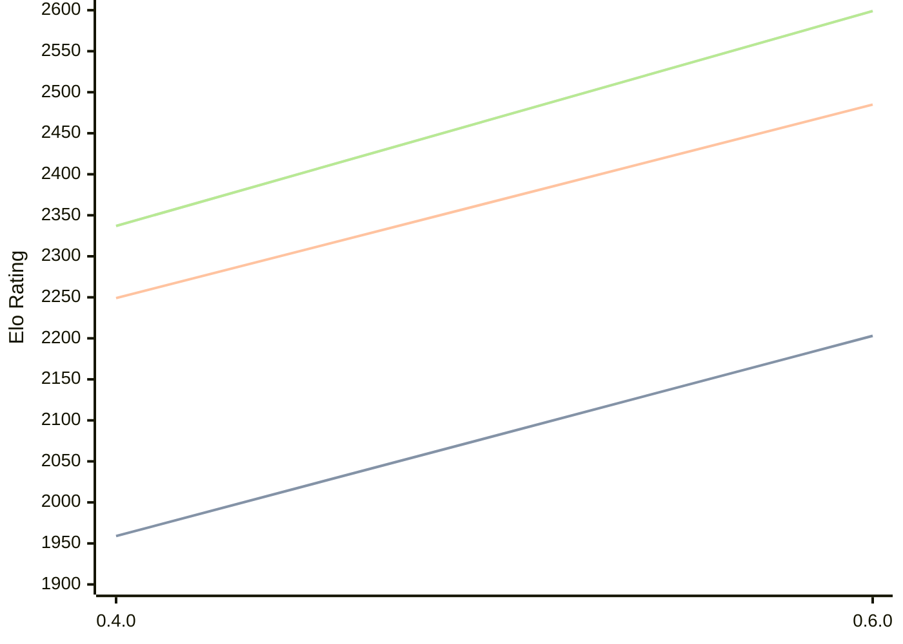

# Engine: Ariadne

Author: Liam Galvin

Home: https://github.com/liamg/ariadne

## Elo Ratings

| Version | Published | STC 8.0+0.08s  | LTC 60.0+0.60s | VLTC 2m24s+1.12s | Comment |
| --- | --- | --- | --- | --- | --- |
| 0.6.0 | 2026-08-29 | 2203(+new) | 2485(+new) | 2599(+new) |  |
| 0.5.0 | 2026-08-29 |  |  |  |  |
| 0.4.0 | 2026-08-16 | 1959(+new) | 2249(+new) | 2337(+new) |  |
| 0.3.0 | 2026-08-15 |  |  |  |  |
| 0.2.0 | 2026-08-14 |  |  |  |  |
| 0.1.0 | 2026-08-12 |  |  |  |  |
 | | | cElo (∆ prev) | cElo (∆ prev) | cElo (∆ prev) | 

<a href="https://github.com/computer-chess-index/cci/issues/new?template=submit-version.yml&title=[VERSION]+Ariadne+<version>&body=###%20Engine%20name%0AAriadne%0A%0A###%20Version%0A0.6.0" target="_blank">Submit new version</a>

 Test Conditions:

GUI/CLI: <a href=https://github.com/cutechess/cutechess target="_blank">Cute-Chess</a> 
Elo Calculation: <a href=https://www.remi-coulom.fr/Bayesian-Elo/ target="_blank">Bayesian-Elo</a> 
CPU: Intel(R) Core(TM) i5-7500T 2.70GHz 
Opening book: 8_moves_v3 
\* STC: 8.0+0.08s, LTC: 60.0+0.60s, VLTC: 2m24s+1.12s

 Lists:
Ratings: <a href=https://github.com/computer-chess-index/cci/blob/main/lists/CCIRatings.csv target="_blank">Complete list</a>

Generated: 2026-09-14 04:35:54

## Ratings Verlauf

## Detailed Evaluation Results

| Version | Time Control | Elo  | Range +/- | Matches | Score | Average Opponent Elo | Draws |
| --- | --- | --- | --- | --- | --- | --- | --- |
| 0.6.0 | VLTC (2m24s+1.12s) | 2599 | 36 | 240 | 51% | 2584 | 35% |
| 0.6.0 | LTC (60.0+0.60s) | 2485 | 36 | 260 | 48% | 2510 | 30% |
| 0.6.0 | STC (8.0+0.08s) | 2203 | 34 | 304 | 47% | 2232 | 24% |
| --- | --- | --- | --- | --- | --- | --- | --- |
| 0.4.0 | VLTC (2m24s+1.12s) | 2337 | 34 | 296 | 51% | 2329 | 25% |
| 0.4.0 | LTC (60.0+0.60s) | 2249 | 35 | 280 | 50% | 2248 | 23% |
| 0.4.0 | STC (8.0+0.08s) | 1959 | 37 | 256 | 50% | 1956 | 21% |
| --- | --- | --- | --- | --- | --- | --- | --- |