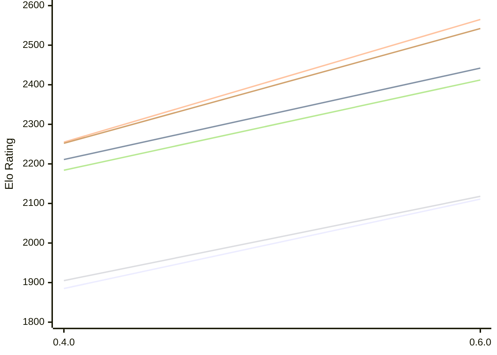
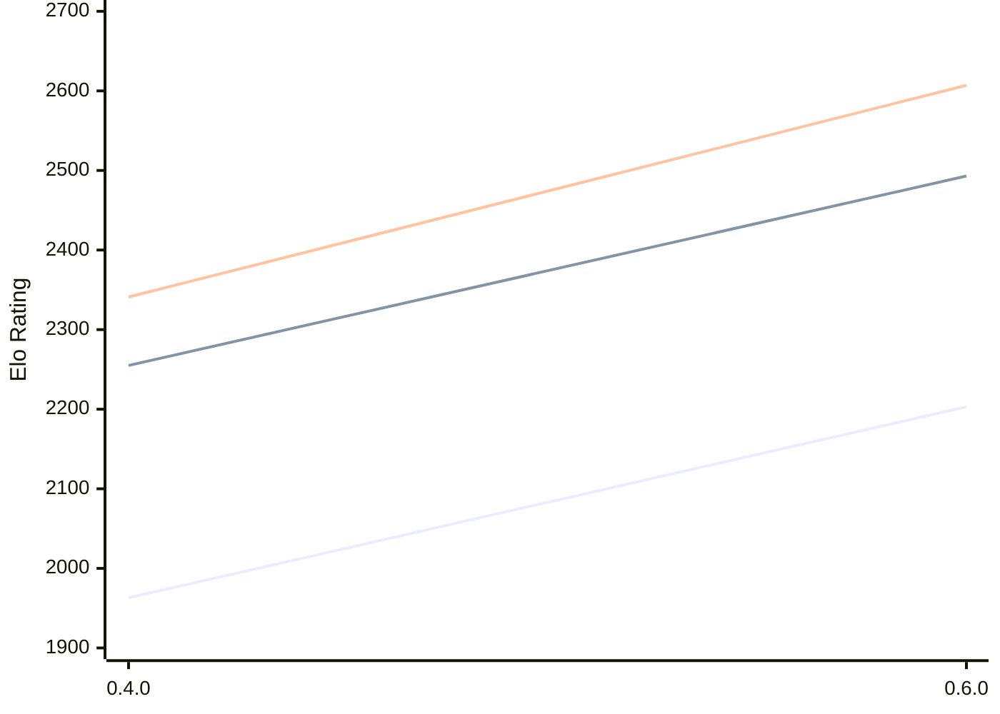

# Engine: Ariadne

Author: Liam Galvin

Home: https://github.com/liamg/ariadne

## Elo Ratings E1 (Ultra 7 265T (1.50 GHz) - E-Core)

| Version | Published | STC 8.0+0.08s  | LTC 60.0+0.60s | VLTC 2m24s+1.12s | Comment |
| --- | --- | --- | --- | --- | --- |
| 0.6.0 | 2026-08-29 | 2111(+226) | 2442(+231) | 2565(+310) |  |
| 0.4.0 | 2026-08-16 | 1885 | 2211 | 2255 |  |
 | | | cElo (∆ prev) | cElo (∆ prev) | cElo (∆ prev) | 

## Elo Ratings P1 (Ultra 7 265T (1.50 GHz) - P-Core)

| Version | Published | STC 8.0+0.08s  | LTC 60.0+0.60s | VLTC 2m24s+1.12s | Comment |
| --- | --- | --- | --- | --- | --- |
| 0.6.0 | 2026-08-29 | 2118(+213) | 2412(+228) | 2542(+290) |  |
| 0.4.0 | 2026-08-16 | 1905 | 2184 | 2252 |  |
 | | | cElo (∆ prev) | cElo (∆ prev) | cElo (∆ prev) | 

## Elo Ratings T1 (i5-7500T 2.70GHz)

| Version | Published | STC 8.0+0.08s  | LTC 60.0+0.60s | VLTC 2m24s+1.12s | Comment |
| --- | --- | --- | --- | --- | --- |
| 0.6.0 | 2026-08-29 | 2203(+240) | 2493(+238) | 2607(+266) |  |
| 0.4.0 | 2026-08-16 | 1963 | 2255 | 2341 |  |
 | | | cElo (∆ prev) | cElo (∆ prev) | cElo (∆ prev) | 

<a href="https://github.com/computer-chess-index/cci/issues/new?template=submit-version.yml&title=[VERSION]+Ariadne+<version>&body=###%20Engine%20name%0AAriadne%0A%0A###%20Version%0A0.6.0" target="_blank">Submit new version</a>

 Test Conditions:

GUI/CLI: <a href=https://github.com/cutechess/cutechess target="_blank">Cute-Chess</a> 
Elo Calculation: <a href=https://www.remi-coulom.fr/Bayesian-Elo/ target="_blank">Bayesian-Elo</a> 
CPU for P1: Intel(R) Core(TM) Ultra 7 265T (1.50 GHz) - P-Core 
CPU for E1: Intel(R) Core(TM) Ultra 7 265T (1.50 GHz) - E-Core 
CPU for T1: Intel(R) Core(TM) i5-7500T 2.70GHz 
Opening book: 8_moves_v3 
\* STC: 8.0+0.08s, LTC: 60.0+0.60s, VLTC: 2m24s+1.12s

 Lists:
Ratings: <a href=https://github.com/computer-chess-index/cci/blob/main/lists/CCIRatings.csv target="_blank">Complete list</a>

Generated: 2026-11-27 05:36:05

## Ratings Verlauf E1 / P1

```mermaid
%%{init: {"theme":"base","themeVariables":{"seriesColors:['#a3a3a3','#222221','#faa371']}}}%%
xychart-beta
  x-axis ["0.4.0", "0.6.0"]
  y-axis "Elo Rating" 1800 --> 2600
  line "E1: STC (8.0+0.08s)" [1885, 2111]
  line "E1: LTC (60.0+0.60s)" [2211, 2442]
  line "E1: VLTC (2m24s+1.12s)" [2255, 2565]
  line "P1: STC (8.0+0.08s)" [1905, 2118]
  line "P1: LTC (60.0+0.60s)" [2184, 2412]
  line "P1: VLTC (2m24s+1.12s)" [2252, 2542]
```

## Ratings Verlauf T1

```mermaid
%%{init: {"theme":"base","themeVariables":{"seriesColors:['#a3a3a3','#222221','#faa371']}}}%%
xychart-beta
  x-axis ["0.4.0", "0.6.0"]
  y-axis "Elo Rating" 1900 --> 2700
  line "T1: STC (8.0+0.08s)" [1963, 2203]
  line "T1: LTC (60.0+0.60s)" [2255, 2493]
  line "T1: VLTC (2m24s+1.12s)" [2341, 2607]
```

## Detailed Evaluation Results

| Version | Time Control | Variant | Elo  | Range +/- | Matches | Score | Average Opponent Elo | Draws |
| --- | --- |--- | --- | --- | --- | --- | --- | --- |
| 0.6.0 | VLTC (2m24s+1.12s) | T1 | 2607 | 35 | 264 | 51% | 2593 | 34% |
|  |  | P1 | 2542 | 33 | 314 | 46% | 2601 | 27% |
|  |  | E1 | 2565 | 26 | 508 | 47% | 2599 | 26% |
|  | LTC (60.0+0.60s) | T1 | 2493 | 35 | 264 | 48% | 2515 | 31% |
|  |  | P1 | 2412 | 34 | 282 | 49% | 2427 | 34% |
|  |  | E1 | 2442 | 29 | 406 | 47% | 2480 | 28% |
|  | STC (8.0+0.08s) | T1 | 2203 | 34 | 308 | 46% | 2237 | 24% |
|  |  | P1 | 2118 | 36 | 276 | 50% | 2133 | 22% |
|  |  | E1 | 2111 | 28 | 474 | 47% | 2175 | 26% |
| --- | --- |--- | --- | --- | --- | --- | --- | --- |
| 0.4.0 | VLTC (2m24s+1.12s) | T1 | 2341 | 34 | 296 | 51% | 2333 | 25% |
|  |  | P1 | 2252 | 58 | 112 | 41% | 2327 | 29% |
|  |  | E1 | 2255 | 51 | 140 | 43% | 2309 | 24% |
|  | LTC (60.0+0.60s) | T1 | 2255 | 35 | 280 | 50% | 2253 | 23% |
|  |  | P1 | 2184 | 57 | 136 | 56% | 2093 | 14% |
|  |  | E1 | 2211 | 57 | 122 | 53% | 2132 | 18% |
|  | STC (8.0+0.08s) | P1 | 1905 | 56 | 128 | 50% | 1948 | 20% |
|  |  | E1 | 1885 | 50 | 156 | 53% | 1854 | 21% |
|  |  | T1 | 1963 | 37 | 256 | 50% | 1962 | 21% |