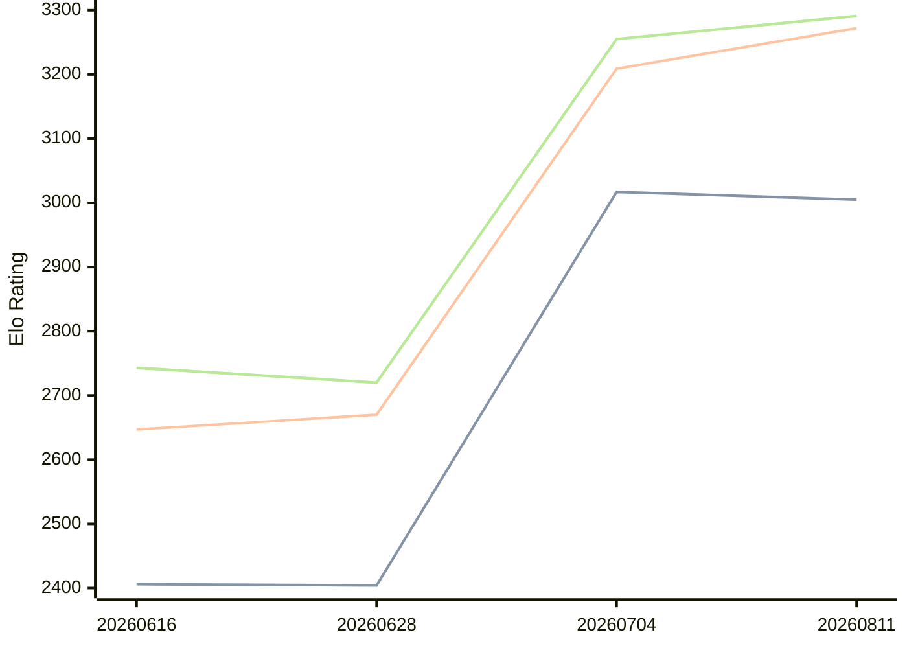

# Engine: Askaig

Author: Nguyen Van Thang

Home: https://github.com/sophiathedev/askaig

## Elo Ratings

| Version | Published | STC 8.0+0.08s  | LTC 60.0+0.60s | VLTC 2m24s+1.12s | Comment |
| --- | --- | --- | --- | --- | --- |
| 20260811 | 2026-08-11 | 3005(-12) | 3272(+63) | 3291(+36) |  |
| 20260704 | 2026-07-04 | 3017(+613) | 3209(+539) | 3255(+535) |  |
| 20260628 | 2026-06-28 | 2404(-2) | 2670(+23) | 2720(-23) |  |
| 20260616 | 2026-06-16 | 2406(+new) | 2647(+new) | 2743(+new) |  |
| 20260615 | 2026-06-15 |  |  |  |  |
| 20260614 | 2026-06-14 |  |  |  |  |
 | | | cElo (∆ prev) | cElo (∆ prev) | cElo (∆ prev) | 

<a href="https://github.com/computer-chess-index/cci/issues/new?template=submit-version.yml&title=[VERSION]+Askaig+<version>&body=###%20Engine%20name%0AAskaig%0A%0A###%20Version%0A20260811" target="_blank">Submit new version</a>

 Test Conditions:

GUI/CLI: <a href=https://github.com/cutechess/cutechess target="_blank">Cute-Chess</a> 
Elo Calculation: <a href=https://www.remi-coulom.fr/Bayesian-Elo/ target="_blank">Bayesian-Elo</a> 
CPU: Intel(R) Core(TM) i5-7500T 2.70GHz 
Opening book: 8_moves_v3 
\* STC: 8.0+0.08s, LTC: 60.0+0.60s, VLTC: 2m24s+1.12s

 Lists:
Ratings: <a href=https://github.com/computer-chess-index/cci/blob/main/lists/CCIRatings.csv target="_blank">Complete list</a>

Generated: 2026-08-30 13:06:43

## Ratings Verlauf

## Detailed Evaluation Results

| Version | Time Control | Elo  | Range +/- | Matches | Score | Average Opponent Elo | Draws |
| --- | --- | --- | --- | --- | --- | --- | --- |
| 20260811 | VLTC (2m24s+1.12s) | 3291 | 31 | 286 | 50% | 3289 | 53% |
| 20260811 | LTC (60.0+0.60s) | 3272 | 30 | 328 | 50% | 3268 | 49% |
| 20260811 | STC (8.0+0.08s) | 3005 | 30 | 356 | 53% | 2977 | 37% |
| --- | --- | --- | --- | --- | --- | --- | --- |
| 20260704 | VLTC (2m24s+1.12s) | 3255 | 31 | 312 | 54% | 3218 | 50% |
| 20260704 | LTC (60.0+0.60s) | 3209 | 30 | 320 | 53% | 3179 | 52% |
| 20260704 | STC (8.0+0.08s) | 3017 | 32 | 312 | 53% | 2988 | 36% |
| --- | --- | --- | --- | --- | --- | --- | --- |
| 20260628 | VLTC (2m24s+1.12s) | 2720 | 46 | 148 | 51% | 2709 | 35% |
| 20260628 | LTC (60.0+0.60s) | 2670 | 53 | 116 | 49% | 2680 | 31% |
| 20260628 | STC (8.0+0.08s) | 2404 | 53 | 116 | 50% | 2403 | 31% |
| --- | --- | --- | --- | --- | --- | --- | --- |
| 20260616 | VLTC (2m24s+1.12s) | 2743 | 47 | 144 | 51% | 2731 | 36% |
| 20260616 | LTC (60.0+0.60s) | 2647 | 47 | 148 | 46% | 2681 | 34% |
| 20260616 | STC (8.0+0.08s) | 2406 | 41 | 196 | 44% | 2465 | 30% |
| --- | --- | --- | --- | --- | --- | --- | --- |