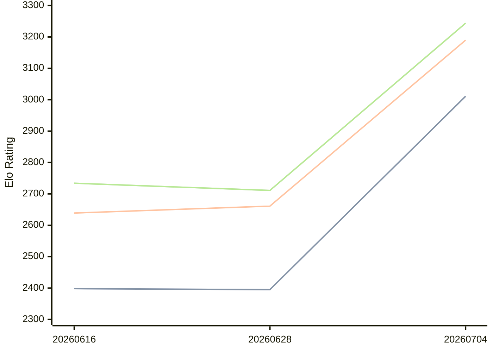

# Engine: Askaig

Author: Nguyen Van Thang

Home: https://github.com/sophiathedev/askaig

## Elo Ratings

| Version | Published | STC 8.0+0.08s  | LTC 60.0+0.60s | VLTC 2m24s+1.12s | Comment |
| --- | --- | --- | --- | --- | --- |
| 20260704 | 2026-07-04 | 3011(+616) | 3190(+529) | 3244(+533) |  |
| 20260628 | 2026-06-28 | 2395(-3) | 2661(+22) | 2711(-23) |  |
| 20260616 | 2026-06-16 | 2398(+new) | 2639(+new) | 2734(+new) |  |
| 20260615 | 2026-06-15 |  |  |  |  |
| 20260614 | 2026-06-14 |  |  |  |  |
 | | | cElo (∆ prev) | cElo (∆ prev) | cElo (∆ prev) | 

<a href="https://github.com/computer-chess-index/cci/issues/new?template=submit-version.yml&title=[VERSION]+Askaig+<version>&body=###%20Engine%20name%0AAskaig%0A%0A###%20Version%0A20260704" target="_blank">Submit new version</a>

 Test Conditions:

GUI/CLI: <a href=https://github.com/cutechess/cutechess target="_blank">Cute-Chess</a> 
Elo Calculation: <a href=https://www.remi-coulom.fr/Bayesian-Elo/ target="_blank">Bayesian-Elo</a> 
CPU: Intel(R) Core(TM) i5-7500T 2.70GHz 
Opening book: 8_moves_v3 
\* STC: 8.0+0.08s, LTC: 60.0+0.60s, VLTC: 2m24s+1.12s

 Lists:
Ratings: <a href=https://github.com/computer-chess-index/cci/blob/main/lists/CCIRatings.csv target="_blank">Complete list</a>

Generated: 2026-07-30 06:22:49

## Ratings Verlauf

⬛ STC (8.0+0.08s) &nbsp;&nbsp; 🟧 LTC (60.0+0.60s) &nbsp;&nbsp; 🟩 VLTC (2m24s+1.12s)

dark mode: 🟩STC (8.0+0.08s) 🟧LTC (60.0+0.60s) ⬜VLTC (2m24s+1.12s)

## Detailed Evaluation Results

| Version | Time Control | Elo  | Range +/- | Matches | Score | Average Opponent Elo | Draws |
| --- | --- | --- | --- | --- | --- | --- | --- |
| 20260704 | VLTC (2m24s+1.12s) | 3244 | 33 | 276 | 54% | 3204 | 49% |
| 20260704 | LTC (60.0+0.60s) | 3190 | 31 | 292 | 52% | 3166 | 52% |
| 20260704 | STC (8.0+0.08s) | 3011 | 34 | 284 | 53% | 2977 | 33% |
| --- | --- | --- | --- | --- | --- | --- | --- |
| 20260628 | VLTC (2m24s+1.12s) | 2711 | 46 | 148 | 51% | 2700 | 35% |
| 20260628 | LTC (60.0+0.60s) | 2661 | 53 | 116 | 49% | 2670 | 31% |
| 20260628 | STC (8.0+0.08s) | 2395 | 53 | 116 | 50% | 2394 | 31% |
| --- | --- | --- | --- | --- | --- | --- | --- |
| 20260616 | VLTC (2m24s+1.12s) | 2734 | 47 | 144 | 51% | 2723 | 36% |
| 20260616 | LTC (60.0+0.60s) | 2639 | 47 | 148 | 46% | 2673 | 34% |
| 20260616 | STC (8.0+0.08s) | 2398 | 41 | 196 | 44% | 2457 | 30% |
| --- | --- | --- | --- | --- | --- | --- | --- |