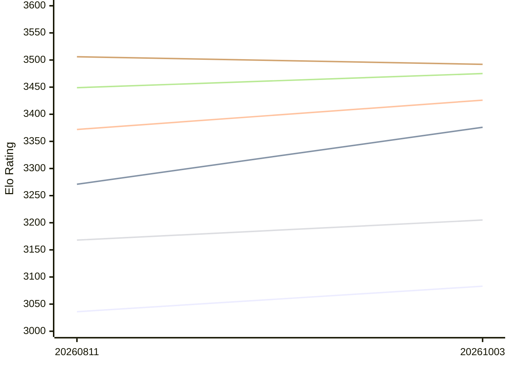
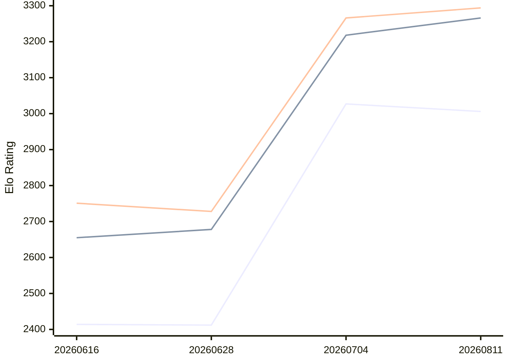

# Engine: Askaig

Author: Nguyen Van Thang

Home: https://github.com/sophiathedev/askaig

## Elo Ratings E1 (Ultra 7 265T (1.50 GHz) - E-Core)

| Version | Published | STC 8.0+0.08s  | LTC 60.0+0.60s | VLTC 2m24s+1.12s | Comment |
| --- | --- | --- | --- | --- | --- |
| 20261003 | 2026-10-03 | 3083(+47) | 3376(+105) | 3426(+54) |  |
| 20260811 | 2026-08-11 | 3036 | 3271 | 3372 |  |
 | | | cElo (∆ prev) | cElo (∆ prev) | cElo (∆ prev) | 

## Elo Ratings P1 (Ultra 7 265T (1.50 GHz) - P-Core)

| Version | Published | STC 8.0+0.08s  | LTC 60.0+0.60s | VLTC 2m24s+1.12s | Comment |
| --- | --- | --- | --- | --- | --- |
| 20261003 | 2026-10-03 | 3205(+37) | 3475(+26) | 3492(-14) |  |
| 20260811 | 2026-08-11 | 3168 | 3449 | 3506 |  |
 | | | cElo (∆ prev) | cElo (∆ prev) | cElo (∆ prev) | 

## Elo Ratings T1 (i5-7500T 2.70GHz)

| Version | Published | STC 8.0+0.08s  | LTC 60.0+0.60s | VLTC 2m24s+1.12s | Comment |
| --- | --- | --- | --- | --- | --- |
| 20260811 | 2026-08-11 | 3006(-21) | 3266(+48) | 3294(+28) |  |
| 20260704 | 2026-07-04 | 3027(+615) | 3218(+540) | 3266(+538) |  |
| 20260628 | 2026-06-28 | 2412(-2) | 2678(+23) | 2728(-23) |  |
| 20260616 | 2026-06-16 | 2414 | 2655 | 2751 |  |
 | | | cElo (∆ prev) | cElo (∆ prev) | cElo (∆ prev) | 

<a href="https://github.com/computer-chess-index/cci/issues/new?template=submit-version.yml&title=[VERSION]+Askaig+<version>&body=###%20Engine%20name%0AAskaig%0A%0A###%20Version%0A20260811" target="_blank">Submit new version</a>

 Test Conditions:

GUI/CLI: <a href=https://github.com/cutechess/cutechess target="_blank">Cute-Chess</a> 
Elo Calculation: <a href=https://www.remi-coulom.fr/Bayesian-Elo/ target="_blank">Bayesian-Elo</a> 
CPU for P1: Intel(R) Core(TM) Ultra 7 265T (1.50 GHz) - P-Core 
CPU for E1: Intel(R) Core(TM) Ultra 7 265T (1.50 GHz) - E-Core 
CPU for T1: Intel(R) Core(TM) i5-7500T 2.70GHz 
Opening book: 8_moves_v3 
\* STC: 8.0+0.08s, LTC: 60.0+0.60s, VLTC: 2m24s+1.12s

 Lists:
Ratings: <a href=https://github.com/computer-chess-index/cci/blob/main/lists/CCIRatings.csv target="_blank">Complete list</a>

Generated: 2026-11-12 05:35:57

## Ratings Verlauf E1 / P1

```mermaid
%%{init: {"theme":"base","themeVariables":{"seriesColors:['#a3a3a3','#222221','#faa371']}}}%%
xychart-beta
  x-axis ["20260811", "20261003"]
  y-axis "Elo Rating" 3000 --> 3600
  line "E1: STC (8.0+0.08s)" [3036, 3083]
  line "E1: LTC (60.0+0.60s)" [3271, 3376]
  line "E1: VLTC (2m24s+1.12s)" [3372, 3426]
  line "P1: STC (8.0+0.08s)" [3168, 3205]
  line "P1: LTC (60.0+0.60s)" [3449, 3475]
  line "P1: VLTC (2m24s+1.12s)" [3506, 3492]
```

## Ratings Verlauf T1

```mermaid
%%{init: {"theme":"base","themeVariables":{"seriesColors:['#a3a3a3','#222221','#faa371']}}}%%
xychart-beta
  x-axis ["20260616", "20260628", "20260704", "20260811"]
  y-axis "Elo Rating" 2400 --> 3300
  line "T1: STC (8.0+0.08s)" [2414, 2412, 3027, 3006]
  line "T1: LTC (60.0+0.60s)" [2655, 2678, 3218, 3266]
  line "T1: VLTC (2m24s+1.12s)" [2751, 2728, 3266, 3294]
```

## Detailed Evaluation Results

| Version | Time Control | Variant | Elo  | Range +/- | Matches | Score | Average Opponent Elo | Draws |
| --- | --- |--- | --- | --- | --- | --- | --- | --- |
| 20261003 | VLTC (2m24s+1.12s) | P1 | 3492 | 34 | 252 | 52% | 3476 | 45% |
|  |  | E1 | 3426 | 27 | 396 | 51% | 3420 | 48% |
|  | LTC (60.0+0.60s) | P1 | 3475 | 34 | 240 | 50% | 3476 | 53% |
|  |  | E1 | 3376 | 27 | 398 | 53% | 3355 | 44% |
|  | STC (8.0+0.08s) | P1 | 3205 | 37 | 218 | 51% | 3200 | 45% |
|  |  | E1 | 3083 | 33 | 288 | 51% | 3071 | 33% |
| --- | --- |--- | --- | --- | --- | --- | --- | --- |
| 20260811 | VLTC (2m24s+1.12s) | P1 | 3506 | 39 | 188 | 50% | 3507 | 51% |
|  |  | E1 | 3372 | 33 | 259 | 49% | 3380 | 54% |
|  |  | T1 | 3294 | 29 | 338 | 49% | 3299 | 54% |
|  | LTC (60.0+0.60s) | P1 | 3449 | 37 | 212 | 48% | 3470 | 44% |
|  |  | E1 | 3271 | 31 | 316 | 48% | 3290 | 43% |
|  |  | T1 | 3266 | 28 | 376 | 48% | 3278 | 49% |
|  | STC (8.0+0.08s) | E1 | 3036 | 33 | 292 | 49% | 3035 | 35% |
|  |  | T1 | 3006 | 27 | 428 | 51% | 2992 | 36% |
|  |  | P1 | 3168 | 37 | 232 | 54% | 3131 | 37% |
| --- | --- |--- | --- | --- | --- | --- | --- | --- |
| 20260704 | VLTC (2m24s+1.12s) | T1 | 3266 | 31 | 312 | 54% | 3229 | 50% |
|  | LTC (60.0+0.60s) | T1 | 3218 | 30 | 320 | 53% | 3190 | 52% |
|  | STC (8.0+0.08s) | T1 | 3027 | 32 | 312 | 53% | 2997 | 36% |
| --- | --- |--- | --- | --- | --- | --- | --- | --- |
| 20260628 | VLTC (2m24s+1.12s) | T1 | 2728 | 46 | 148 | 51% | 2718 | 35% |
|  | LTC (60.0+0.60s) | T1 | 2678 | 53 | 116 | 49% | 2688 | 31% |
|  | STC (8.0+0.08s) | T1 | 2412 | 53 | 116 | 50% | 2411 | 31% |
| --- | --- |--- | --- | --- | --- | --- | --- | --- |
| 20260616 | VLTC (2m24s+1.12s) | T1 | 2751 | 47 | 144 | 51% | 2739 | 36% |
|  | LTC (60.0+0.60s) | T1 | 2655 | 47 | 148 | 46% | 2689 | 34% |
|  | STC (8.0+0.08s) | T1 | 2414 | 41 | 196 | 44% | 2473 | 30% |