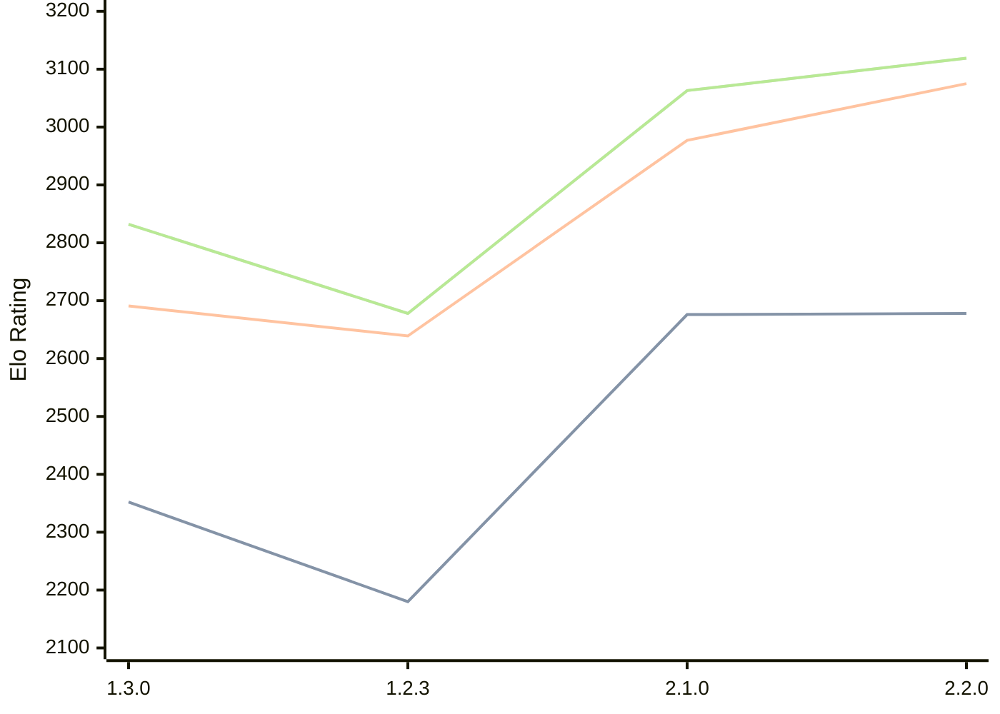

# Engine: Aspen

Author: 

Home: https://github.com/ATheofanis/aspen-chess

## Elo Ratings

| Version | Published | STC 8.0+0.08s  | LTC 60.0+0.60s | VLTC 2m24s+1.12s | Comment |
| --- | --- | --- | --- | --- | --- |
| 2.3.0 | 2026-05-23 |  |  |  |  |
| 2.2.0 | 2026-05-22 | 2678(+2) | 3075(+98) | 3119(+56) |  |
| 2.1.0 | 2026-05-21 | 2676(+new) | 2977(+new) | 3063(+new) |  |
| 2.0.0 | 2026-05-21 |  |  |  |  |
| 1.3.0 | 2026-05-20 | 2352(+172) | 2691(+52) | 2832(+154) |  |
| 1.2.3 | 2026-05-20 | 2180(+new) | 2639(+new) | 2678(+new) |  |
| 1.2.2 | 2026-05-19 |  |  |  |  |
| 1.2.1 | 2026-05-19 |  |  |  |  |
| 1.2.0 | 2026-05-19 |  |  |  |  |
| 1.0.1 | 2026-05-14 |  |  |  |  |
| 1.0.0 | 2026-05-12 |  |  |  |  |
| 0.2.0 | 2026-05-09 |  |  |  |  |
| 0.1.0 | 2026-05-02 |  |  |  |  |
 | | | cElo (∆ prev) | cElo (∆ prev) | cElo (∆ prev) | 

<a href="https://github.com/computer-chess-index/cci/issues/new?template=submit-version.yml&title=[VERSION]+Aspen+<version>&body=###%20Engine%20name%0AAspen%0A%0A###%20Version%0A2.3.0" target="_blank">Submit new version</a>

 Test Conditions:

GUI/CLI: <a href=https://github.com/cutechess/cutechess target="_blank">Cute-Chess</a> 
Elo Calculation: <a href=https://www.remi-coulom.fr/Bayesian-Elo/ target="_blank">Bayesian-Elo</a> 
CPU: Intel(R) Core(TM) i5-7500T 2.70GHz 
Opening book: 8_moves_v3 
\* STC: 8.0+0.08s, LTC: 60.0+0.60s, VLTC: 2m24s+1.12s

 Lists:
Ratings: <a href=https://github.com/computer-chess-index/cci/blob/main/lists/CCIRatings.csv target="_blank">Complete list</a>

Generated: 2026-06-30 22:13:22

## Ratings Verlauf

## Ratings Verlauf

⬛ STC (8.0+0.08s) &nbsp;&nbsp; 🟧 LTC (60.0+0.60s) &nbsp;&nbsp; 🟩 VLTC (2m24s+1.12s)

dark mode: 🟩STC (8.0+0.08s) 🟧LTC (60.0+0.60s) ⬜VLTC (2m24s+1.12s)

## Detailed Evaluation Results

| Version | Time Control | Elo  | Range +/- | Matches | Score | Average Opponent Elo | Draws |
| --- | --- | --- | --- | --- | --- | --- | --- |
| 2.2.0 | VLTC (2m24s+1.12s) | 3119 | 52 | 104 | 51% | 3112 | 52% |
| 2.2.0 | LTC (60.0+0.60s) | 3075 | 49 | 112 | 51% | 3069 | 59% |
| 2.2.0 | STC (8.0+0.08s) | 2678 | 61 | 80 | 49% | 2685 | 43% |
| --- | --- | --- | --- | --- | --- | --- | --- |
| 2.1.0 | VLTC (2m24s+1.12s) | 3063 | 31 | 318 | 52% | 3050 | 45% |
| 2.1.0 | LTC (60.0+0.60s) | 2977 | 28 | 382 | 51% | 2969 | 47% |
| 2.1.0 | STC (8.0+0.08s) | 2676 | 32 | 304 | 54% | 2639 | 38% |
| --- | --- | --- | --- | --- | --- | --- | --- |
| 1.3.0 | VLTC (2m24s+1.12s) | 2832 | 59 | 92 | 54% | 2793 | 33% |
| 1.3.0 | LTC (60.0+0.60s) | 2691 | 48 | 140 | 53% | 2662 | 32% |
| 1.3.0 | STC (8.0+0.08s) | 2352 | 47 | 158 | 45% | 2400 | 24% |
| --- | --- | --- | --- | --- | --- | --- | --- |
| 1.2.3 | VLTC (2m24s+1.12s) | 2678 | 111 | 28 | 55% | 2624 | 18% |
| 1.2.3 | LTC (60.0+0.60s) | 2639 | 101 | 36 | 67% | 2483 | 22% |
| 1.2.3 | STC (8.0+0.08s) | 2180 | 84 | 48 | 50% | 2186 | 25% |
| --- | --- | --- | --- | --- | --- | --- | --- |