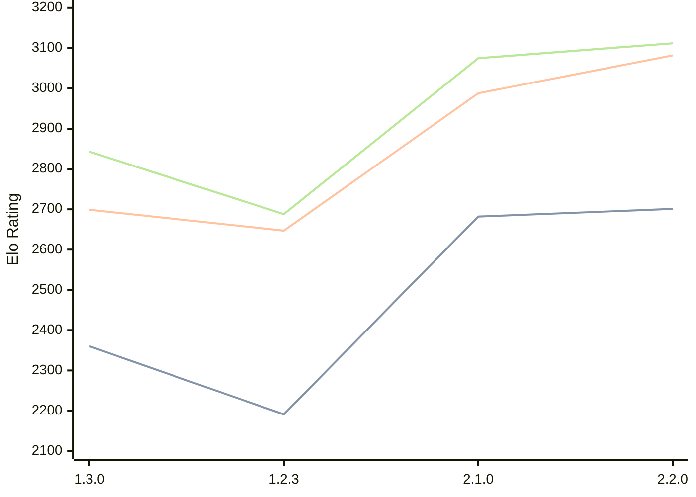

# Engine: Aspen

Author: A. Theofanis

Home: https://github.com/ATheofanis/aspen-chess

## Elo Ratings

| Version | Published | STC 8.0+0.08s  | LTC 60.0+0.60s | VLTC 2m24s+1.12s | Comment |
| --- | --- | --- | --- | --- | --- |
| 2.3.0 | 2026-05-23 |  |  |  |  |
| 2.2.0 | 2026-05-22 | 2701(+19) | 3082(+94) | 3112(+37) |  |
| 2.1.0 | 2026-05-21 | 2682(+new) | 2988(+new) | 3075(+new) |  |
| 2.0.0 | 2026-05-21 |  |  |  |  |
| 1.3.0 | 2026-05-20 | 2360(+169) | 2699(+52) | 2843(+155) |  |
| 1.2.3 | 2026-05-20 | 2191(+new) | 2647(+new) | 2688(+new) |  |
| 1.2.2 | 2026-05-19 |  |  |  |  |
| 1.2.1 | 2026-05-19 |  |  |  |  |
| 1.2.0 | 2026-05-19 |  |  |  |  |
| 1.0.1 | 2026-05-14 |  |  |  |  |
| 1.0.0 | 2026-05-12 |  |  |  |  |
| 0.2.0 | 2026-05-09 |  |  |  |  |
| 0.1.0 | 2026-05-02 |  |  |  |  |
 | | | cElo (∆ prev) | cElo (∆ prev) | cElo (∆ prev) | 

<a href="https://github.com/computer-chess-index/cci/issues/new?template=submit-version.yml&title=[VERSION]+Aspen+<version>&body=###%20Engine%20name%0AAspen%0A%0A###%20Version%0A2.3.0" target="_blank">Submit new version</a>

 Test Conditions:

GUI/CLI: <a href=https://github.com/cutechess/cutechess target="_blank">Cute-Chess</a> 
Elo Calculation: <a href=https://www.remi-coulom.fr/Bayesian-Elo/ target="_blank">Bayesian-Elo</a> 
CPU: Intel(R) Core(TM) i5-7500T 2.70GHz 
Opening book: 8_moves_v3 
\* STC: 8.0+0.08s, LTC: 60.0+0.60s, VLTC: 2m24s+1.12s

 Lists:
Ratings: <a href=https://github.com/computer-chess-index/cci/blob/main/lists/CCIRatings.csv target="_blank">Complete list</a>

Generated: 2026-08-30 15:47:13

## Ratings Verlauf

## Detailed Evaluation Results

| Version | Time Control | Elo  | Range +/- | Matches | Score | Average Opponent Elo | Draws |
| --- | --- | --- | --- | --- | --- | --- | --- |
| 2.2.0 | VLTC (2m24s+1.12s) | 3112 | 34 | 244 | 49% | 3121 | 56% |
| 2.2.0 | LTC (60.0+0.60s) | 3082 | 34 | 238 | 50% | 3081 | 59% |
| 2.2.0 | STC (8.0+0.08s) | 2701 | 31 | 326 | 50% | 2703 | 41% |
| --- | --- | --- | --- | --- | --- | --- | --- |
| 2.1.0 | VLTC (2m24s+1.12s) | 3075 | 31 | 318 | 52% | 3062 | 45% |
| 2.1.0 | LTC (60.0+0.60s) | 2988 | 28 | 382 | 51% | 2979 | 47% |
| 2.1.0 | STC (8.0+0.08s) | 2682 | 32 | 304 | 54% | 2646 | 38% |
| --- | --- | --- | --- | --- | --- | --- | --- |
| 1.3.0 | VLTC (2m24s+1.12s) | 2843 | 59 | 92 | 54% | 2803 | 33% |
| 1.3.0 | LTC (60.0+0.60s) | 2699 | 48 | 140 | 53% | 2670 | 32% |
| 1.3.0 | STC (8.0+0.08s) | 2360 | 47 | 158 | 45% | 2410 | 24% |
| --- | --- | --- | --- | --- | --- | --- | --- |
| 1.2.3 | VLTC (2m24s+1.12s) | 2688 | 111 | 28 | 55% | 2634 | 18% |
| 1.2.3 | LTC (60.0+0.60s) | 2647 | 101 | 36 | 67% | 2491 | 22% |
| 1.2.3 | STC (8.0+0.08s) | 2191 | 84 | 48 | 50% | 2196 | 25% |
| --- | --- | --- | --- | --- | --- | --- | --- |